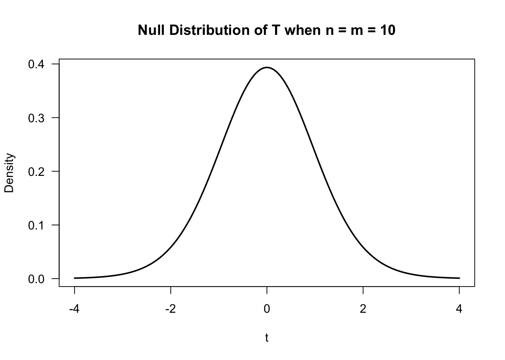
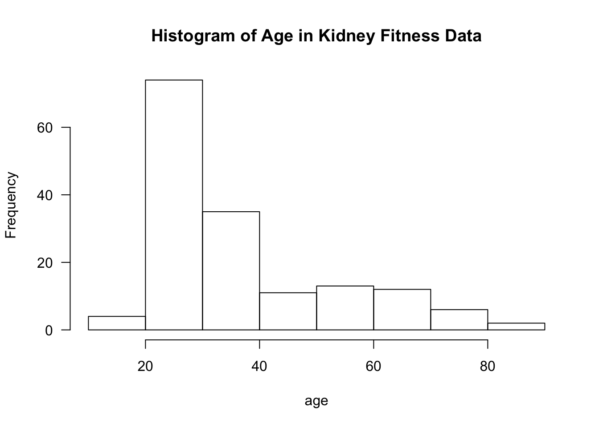
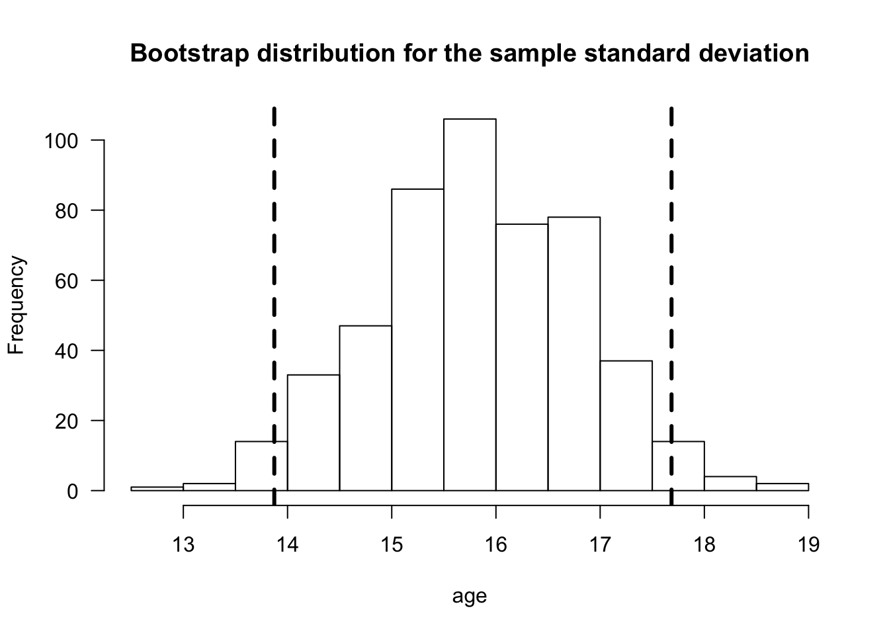
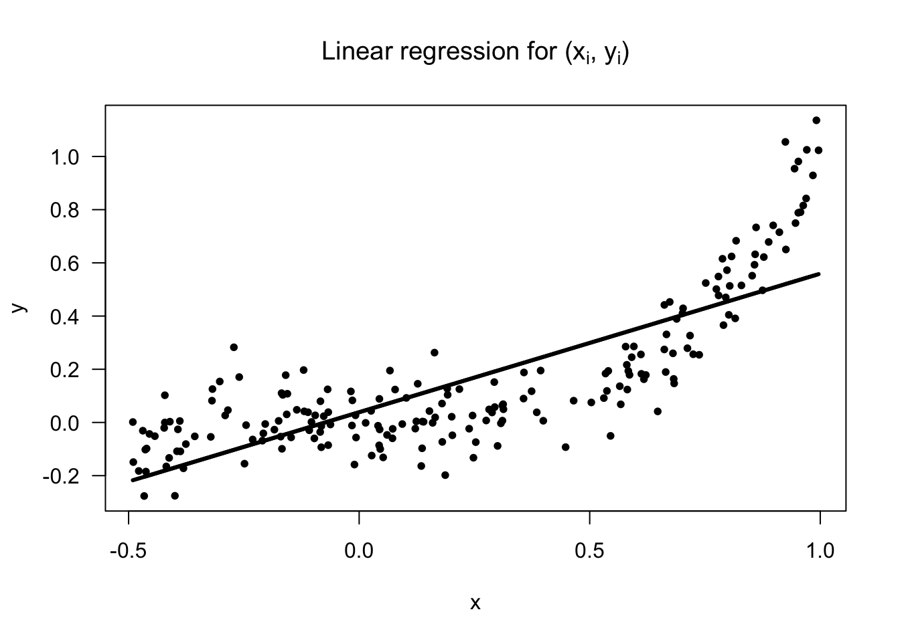
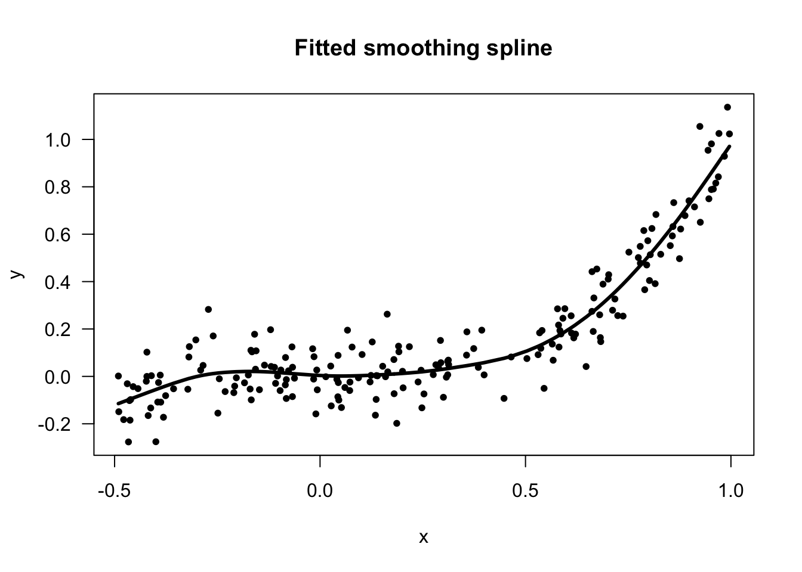

# Introduction {#intro}

---
  
---
  
## What is Nonparametric Statistics? {#sec:whatisnonpar}
  
  **What is Parametric Statistics?**
  
  * Parametric models refer to probability distributions that can 
be fully described by a fixed number of parameters that do not change
with the sample size.

* Typical examples include
   + Gaussian 
   + Poisson
   + Exponential
   + Beta

* Could also refer to a regression setting where the mean function
is described by a fixed number of parameters.

**What is Nonparametric Statistics?**
  
  * It is difficult to give a concise, all-encompassing definition, but nonparametric
statistics generally refers to statistical methods where there is not a clear parametric component.

* A more practical definition is that nonparametric statistics refers to flexible statistical procedures where
very few assumptions are made regarding the distribution of the data or the form 
of a regression model.

* The uses of nonparametric methods in several common statistical contexts are described in Sections \@ref(sec:example-nonpar-tests) - \@ref(sec:example-nonpar-regress2).

## Outline of Course {#sec:course-outline}

This course is roughly divided into the following 5 categories.

1. **Nonparametric Testing**
  + Rank-based Tests
+ Permutation Tests
1. **Estimation of Basic Nonparametric Quantities** 
  + The Empirical Distribution Function
+ Density Estimation
1. **Nonparametric Confidence Intervals**
  + Bootstrap 
+ Jacknife
1. **Nonparametric Regression Part I (Smoothing Methods)**
  + Kernel Methods
+ Splines
+ Local Regression
1. **Nonparametric Regression Part II (Machine Learning Methods)**
  + Decision Trees/CART
+ Ensemble Methods

## Example 1: Nonparametric vs. Parametric Two-Sample Testing {#sec:example-nonpar-tests}

Suppose we have data from two groups. For example, outcomes from 
two different treatments.

* **Group 1 outcomes**: $X_{1}, \ldots, X_{n}$ an i.i.d (independent and identically distributed) sample from distribution function $F_{X}$. 
This means that 
\begin{equation}
F_{X}(t) = P( X_{i} \leq t) \quad \textrm{ for any } 1 \leq i \leq n  \nonumber
\end{equation}

* **Group 2 outcomes**: $Y_{1}, \ldots, Y_{m}$ an i.i.d. sample from distribution function $F_{Y}$.
\begin{equation}
F_{Y}(t) = P( Y_{i} \leq t) \quad \textrm{ for any } 1 \leq i \leq n  \nonumber
\end{equation}

* To test the impact of a new treatment, we usually want to test whether or not $F_{X}$ differs from $F_{Y}$ in some way.
This can be stated in hypothesis testing language as
\begin{eqnarray}
H_{0}&:& F_{X} = F_{Y} \quad \textrm{( populations are the same)} \nonumber \\
H_{A}&:& F_{X} \neq F_{Y} \quad \textrm{( populations are different)} (\#eq:nonpar-twosample-hypothesis)
                                                                        \end{eqnarray}
    
**Parametric Tests**
                                                                          
* Perhaps the most common parametric test for \@ref(eq:nonpar-twosample-hypothesis) is the **t-test**. The t-test assumes that
\begin{equation}
F_{X} = \textrm{Normal}(\mu_{x}, \sigma^{2}) \quad \textrm{ and } \quad F_{Y} = \textrm{Normal}(\mu_{y}, \sigma^{2})
\end{equation}
                                                                        
* Under this parametric assumption, the hypothesis test \@ref(eq:nonpar-twosample-hypothesis) reduces to 
\begin{equation}
H_{0}: \mu_{x} = \mu_{y}  \quad \textrm{ vs. } \quad H_{A}: \mu_{x} \neq \mu_{y}
\end{equation}
                                                                        
* The standard t-statistic (with a pooled estimate of $\sigma^{2}$) is the following
\begin{equation}
T = \frac{\bar{X} - \bar{Y}}{ s_{p}\sqrt{\frac{1}{n} + \frac{1}{m}}  },
\end{equation}
where $\bar{X} = \frac{1}{n}\sum_{i=1}^{n} X_{i}$ and $\bar{Y} = \frac{1}{m}\sum_{i=1}^{m} Y_{i}$ are
the group-specific sample means and $s_{p}^{2}$ is the pooled estimate of $\sigma^{2}$
\begin{equation}
s_{p}^{2} = \frac{1}{m + n - 2}\Big\{ \sum_{i=1}^{n} (X_{i} - \bar{X})^{2} + \sum_{i=1}^{m} (Y_{i} - \bar{Y})^{2}   \Big\}
\end{equation}

---

* The t-test is based on the **null distribution** of $T$ - the distribution of $T$ under the null hypothesis.

* Under the assumption of normality, the null distribution of $T$ is a t distribution with $n + m - 2$ degrees of freedom.
                                                                        

* Notice that the null distribution of $T$ depends on the parametric assumption that both $F_{X} = \textrm{Normal}(\mu_{x}, \sigma^{2})$
and $F_{Y} = \textrm{Normal}(\mu_{y}, \sigma^{2})$. Appealing to the Central Limit Theorem, one could
argue that is a quite reasonable assumption.

* In addition to using the assumption that $F_{X} = \textrm{Normal}(\mu_{x}, \sigma^{2})$ and $F_{Y} = \textrm{Normal}(\mu_{y}, \sigma^{2})$, we used this parametric assumption (at least implicitly) in the formulation of the hypothesis test itself because we assumed that any difference between $F_{X}$ and $F_{Y}$ would be fully described by difference in $\mu_{x}$ and $\mu_{y}$.

* So, in a sense, you are using the assumption of normality twice in the construction of the two-sample t-test.

---

**Nonparametric Tests** 

* Two-sample nonparametric tests are meant to be "distribution-free". This means the null distribution of the test statistic does not depend on any parametric
assumptions about the two populations $F_{X}$ and $F_{Y}$. 

* Many such tests are based on **ranks**. The distribution of the ranks under the assumption that $F_{X} = F_{Y}$ do 
not depend on the form of $F_{X}$ (assuming $F_{X}$ is continuous).

* Also, the statements of hypotheses tests for nonparametric tests should not rely on any parametric assumptions about $F_{X}$ and $F_{Y}$.

* For example, $H_{A}: F_{X} \neq F_{Y}$ or $H_{A}: F_{X} \geq F_{Y}$.

---

* Nonparametric tests usually tradeoff power for greater robustness.

* In general, if the parametric assumptions are correct, a nonparametric test will have less power than its parametric counterpart.

* If the parametric assumptions are not correct, parametric tests might have inappropriate type-I error control
or lose power.

## Example 2: Nonparametric Estimation {#sec:example-nonpar-estimation}

* Suppose we have $n$ observations $(X_{1}, \ldots, X_{n})$ which are assumed to be i.i.d. (independent and identically distributed).
The distribution function of $X_{i}$ is $F_{X}$.

* Suppose we are interested in estimating the entire distribution function $F_{X}$ rather than specific features
of the distribution of $X_{i}$ such as the mean or standard deviation. 

* In a **parametric** approach to estimating $F_{X}$, we would assume the distribution of $X_{i}$ belongs to some parametric family of distributions.
For example,
    + $X_{i} \sim \textrm{Normal}(\mu, \sigma^{2})$ 
    + $X_{i} \sim \textrm{Exponential}(\lambda)$
    + $X_{i} \sim \textrm{Beta}(\alpha, \beta)$

---

* If we assume that $X_{i} \sim \textrm{Normal}( \mu, \sigma^{2} )$, we only need to estimate 2 parameters to
fully describe the distribution of $X_{i}$, and the number of parameters will not depend on the sample size. 
                                                                        
* In a nonparametric approach to characterizing the distribution of $X_{i}$, we need to instead 
estimate the entire distribution function $F_{X}$ or density function $f_{X}$.

* The distribution function $F_{X}$ is usually estimated by the **empirical distribution function**
\begin{equation}
\hat{F}_{n}(t) = \frac{1}{n}\sum_{i=1}^{n} I( X_{i} \leq t),
\end{equation}
where $I()$ denotes the indicator function. That is, $I( X_{i} \leq t) = 1$ if $X_{i} \leq t$,
and $I(X_{i} \leq t) = 0$ if $X_{i} > t$.

* The empirical distribution function is a discrete distribution function, 
and it can be thought of as an estimate having $n$ "parameters.

* The density function of $X_{i}$ is often estimated by a kernel density estimator (KDE). This
is defined as
\begin{equation}
\hat{f}_{n}(t) = \frac{1}{n h_{n}} \sum_{i=1}^{n} K\Big( \frac{t - X_{i}}{ h_{n} } \Big).
\end{equation}

* $K()$ - the kernel function
* $h_{n}$ - the bandwidth

* The KDE is a type of smoothing procedure.

                                                              
## Example 3: Confidence Intervals {#sec:example-nonpar-confint}

* Inference for a wide range of statistical procedures is based on the following argument
\begin{equation}
\hat{\theta}_{n} \textrm{ has an approximate Normal}\Big( \theta, \widehat{\textrm{Var}(\hat{\theta}_{n})} \Big) \textrm{ distribution }
(\#eq:normal-approx)
\end{equation}

* Above, $\hat{\theta}_{n}$ is an estimate of a parameter $\theta$, and $\widehat{\textrm{Var}(\hat{\theta}_{n})}$ is an estimate of the variance of $\hat{\theta}_{n}$.

* $se_{n} = \sqrt{\widehat{\textrm{Var}(\hat{\theta}_{n})}}$ is usually referred to as the **standard error**.

* $95\%$ confidence intervals are reported using the following formula
\begin{equation}
[\hat{\theta}_{n} - 1.96 se_{n}, \hat{\theta}_{n} + 1.96 se_{n}  ]
\end{equation}

* Common examples of this include:
    1. $\hat{\theta}_{n} = \bar{X}_{n}$. 
    
    In this case, appeals to the Central Limit Theorem would justify approximation \@ref(eq:normal-approx). The variance of $\hat{\theta}_{n}$ would be $\sigma^{2}$, and the standard error would typically be $se_{n} = \hat{\sigma}/\sqrt{n}$. 
    
    2. $\hat{\theta}_{n} = \textrm{Maximum Likelihood Estimate of } \theta$. 
      
    In this case, asymptotics would justify the approximate distribution $\hat{\theta}_{n} \sim \textrm{Normal}(\theta, \frac{1}{nI(\theta)} )$, where $I(\theta)$ denotes the Fisher information. The standard error in this context is often $se_{n} = \{ n I(\hat{\theta}_{n}) \}^{-1/2}$.
                                                                          
---

* Confidence intervals using \@ref(eq:normal-approx) rely on a parametric approximation to the
sampling distribution of the statistic $\hat{\theta}_{n}$.

* Moreover, even if one wanted to use something like \@ref(eq:normal-approx), working out 
standard error formulas can be a great challenge in more complicated situations.

---

* The **bootstrap** is a simulation-based approach for computing standard errors and
confidence intervals.

* The bootstrap does not rely on any particular parametric assumptions and
can be applied in almost any context 
(though bootstrap confidence intervals can fail to work as desired in some situations).

* Through resampling from the original dataset, the bootstrap uses many possible alternative datasets to
assess the variability in $\hat{\theta}_{n}$. 

<!-- html table generated in R 3.6.2 by xtable 1.8-4 package -->
<!-- Sat Jan  4 17:21:35 2020 -->
<table border=1>
<tr> <th>  </th> <th> OriginalDat </th> <th> Dat1 </th> <th> Dat2 </th> <th> Dat3 </th> <th> Dat4 </th>  </tr>
  <tr> <td align="center"> Obs. 1 </td> <td align="center"> 0.20 </td> <td align="center"> 0.20 </td> <td align="center"> 0.80 </td> <td align="center"> 0.20 </td> <td align="center"> 0.30 </td> </tr>
  <tr> <td align="center"> Obs. 2 </td> <td align="center"> 0.50 </td> <td align="center"> 0.20 </td> <td align="center"> 0.80 </td> <td align="center"> 0.20 </td> <td align="center"> 0.70 </td> </tr>
  <tr> <td align="center"> Obs. 3 </td> <td align="center"> 0.30 </td> <td align="center"> 0.30 </td> <td align="center"> 0.50 </td> <td align="center"> 0.80 </td> <td align="center"> 0.20 </td> </tr>
  <tr> <td align="center"> Obs. 4 </td> <td align="center"> 0.80 </td> <td align="center"> 0.30 </td> <td align="center"> 0.70 </td> <td align="center"> 0.50 </td> <td align="center"> 0.50 </td> </tr>
  <tr> <td align="center"> Obs. 5 </td> <td align="center"> 0.70 </td> <td align="center"> 0.70 </td> <td align="center"> 0.20 </td> <td align="center"> 0.30 </td> <td align="center"> 0.20 </td> </tr>
  <tr> <td align="center"> theta.hat </td> <td align="center"> 0.50 </td> <td align="center"> 0.34 </td> <td align="center"> 0.60 </td> <td align="center"> 0.40 </td> <td align="center"> 0.38 </td> </tr>
   </table>

---

* In the above example, we have 4 **boostrap replications** for the statistic $\hat{\theta}$: 
\begin{eqnarray}
\hat{\theta}^{(1)} &=& 0.34 \\ 
\hat{\theta}^{(2)} &=& 0.60 \\
\hat{\theta}^{(3)} &=& 0.40 \\ 
\hat{\theta}^{(4)} &=& 0.38
\end{eqnarray}

* In the above example, the bootstrap standard error for $\hat{\theta}_{n}$ would be
the standard deviation of the bootstrap replications
\begin{eqnarray}
se_{boot} &=& \Big( \frac{1}{3} \sum_{b=1}^{4} \{ \hat{\theta}^{(b)} - \hat{\theta}^{(-)}  \}^{2} \Big)^{1/2} \nonumber \\
&=& \Big( (0.34 - 0.43)^{2}/3 + (0.60 - 0.43)^{2}/3 + (0.40 - 0.43)^{2}/3 + (0.38 - 0.43)^{2}/3 \Big)^{1/2} \nonumber \\
&=& 0.116
\end{eqnarray}
where $\hat{\theta}^{(-)} = 0.43$ is the average of the bootstrap replications.

* One would then report the confidence interval $[\hat{\theta} - 1.96 \times 0.116, \hat{\theta} + 1.96 \times 0.116]$.
In practice, the number of bootstrap replications is typically much larger than $4$.

* It is often better to construct confidence intervals using the percentiles from the bootstrap distribution
of $\hat{\theta}$ rather than use a confidence interval of the form: $\hat{\theta} \pm 1.96 \times se_{boot}$.

(\#fig:unnamed-chunk-4)Bootstrap distribution of the sample standard deviation for the age variable from the kidney fitness data. Dasjed vertical lines are placed at the 2.5 and 97.5 percentiles of the bootstrap distribution.

## Example 4: Nonparametric Regression with a Single Covariate {#sec:example-nonpar-regress1}
                                                                            
* Regression is a common way of modeling the relationship between two different variables.
                                                                          
* Suppose we have $n$ pairs of observations $(y_{1}, x_{1}), \ldots, (y_{n}, x_{n})$ where
$y_{i}$ and $x_{i}$ are suspected to have some association.
                                                                          
                                                                          
* Linear regression would assume that these $y_{i}$ and $x_{i}$ are related by the following
\begin{equation}
y_{i} = \beta_{0} + \beta_{1}x_{i} + \varepsilon_{i} 
\end{equation}
with the assumption $\varepsilon_{i} \sim \textrm{Normal}(0, \sigma^{2})$ often made.
                                                                          
* In this model, there are only 3 parameters: $(\beta_{0}, \beta_{1}, \sigma^{2})$,
and the number of parameters stays fixed for all $n$.
                                                                          

                                                                          
---

* The nonparametric counterpart to linear regression is usually formulated in the following way
\begin{equation}
y_{i} = m( x_{i} ) + \varepsilon_{i}
\end{equation}

* Typically, one makes very few assumptions about the form of the mean function $m$, and it is not assumed $m$
can be described by a finite number of parameters.

* There are a large number of nonparametric methods for estimating $m$.

* One popular method is the use of **smoothing splines**.

* With smoothing splines, one considers mean functions of the form
\begin{equation}
m(x) = \sum_{j=1}^{n} \beta_{j}g_{j}(x) 
(\#eq:smoothspline-model)
\end{equation}
where $g_{1}, \ldots, g_{n}(x)$ are a collection of spline basis functions.

---

* Because of the large number of parameters in \@ref(eq:smoothspline-model), one should
estimate the basis function weights $\beta_{j}$ through penalized regression
\begin{equation}
\textrm{minimize} \quad \sum_{i=1}^{n} \Big( y_{i} - \sum_{j=1}^{n} \beta_{j}g_{j}( x_{i} ) \Big)^{2} + \lambda \sum_{i=1}^{n}\sum_{j=1}^{n} \Omega_{ij}\beta_{i}\beta_{j}
(\#eq:smoothspline-estimation)
\end{equation}
where $\Omega_{ij} = \int g_{i}''(t)g_{j}''(t) dt$.

* Using coefficient estimates $\hat{\beta}_{1}, \ldots, \hat{\beta}_{n}$ found from solving \@ref(eq:smoothspline-model), the nonparametric estimate of the mean function is defined as
\begin{equation}
\hat{m}(x) = \sum_{j=1}^{n} \hat{\beta}_{j}g_{j}(x) 
\end{equation}

* While the estimation in \@ref(eq:smoothspline-estimation) resembles parametric estimation for linear regression, notice
that the number of parameters to be estimated will change with the sample size.

* Allowing the number of basis functions to grow with $n$ is important. For a sufficiently large number of basis functions, one should be able to approximate the 
true mean function $m(x)$ arbitrarily closely.

## Example 5: Classification and Regression Trees (CART) {#sec:example-nonpar-regress2}

* Suppose we now have observations $(y_{1}, \mathbf{x}_{1}), \ldots, (y_{n}, \mathbf{x}_{n})$ where
$y_{i}$ is a continuous response and $\mathbf{x}_{i}$ is a p-dimensional vector of covariates.

* Regression trees are a nonparametric approach for predicting $y_{i}$ from $\mathbf{x}_{i}$.

* Here, the regression function is a **decision tree** rather than some fitted curve.

* With a decision tree, a final prediction from a covariate vector $\mathbf{x}_{i}$ is obtained by answering
a sequence of "yes or no" questions.

* When the responses $y_{i}$ are binary, such trees are referred to as classification trees.
Hence, the name: classification and regression trees (CART).

<!-- If true go left down tree. E.g., if someone is in treatment arm A, they get a prediction of 13.95  -->

---

* Classification and regression trees are constructed through **recursive partitioning**.

* Recursive partitioning is the process of deciding if and how to split a given
node into two child nodes.

* Tree splits are usually chosen to minimize the "within-node" sum of squares.

* The size of the final is determined by a process of "pruning" the tree
with cross-validation determining the best place to stop pruning.

* Regression trees are an example of a more algorithmic approach to 
constructing predictions (as opposed to probability modeling in more
traditional statistical methods) with a strong emphasis on predictive
performance as measured through cross-validation.

---

* While single regression trees have the advantage of being directly interpretable, 
their prediction performance is often not that great.

* However, using collections of trees can be very effective for prediction and
has been used in many popular learning methods. Examples include: random forests, 
boosting, and Bayesian additive regression trees (BART). 

* Methods such as these can perform well on much larger datasets. We will discuss
additional methods if time allows.

