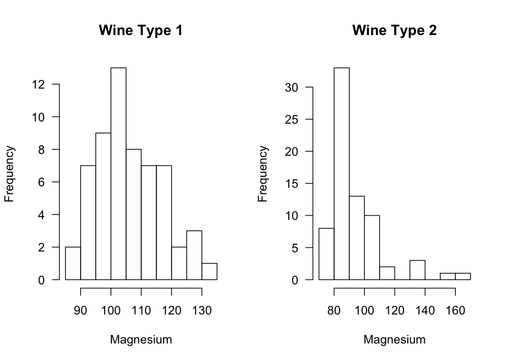
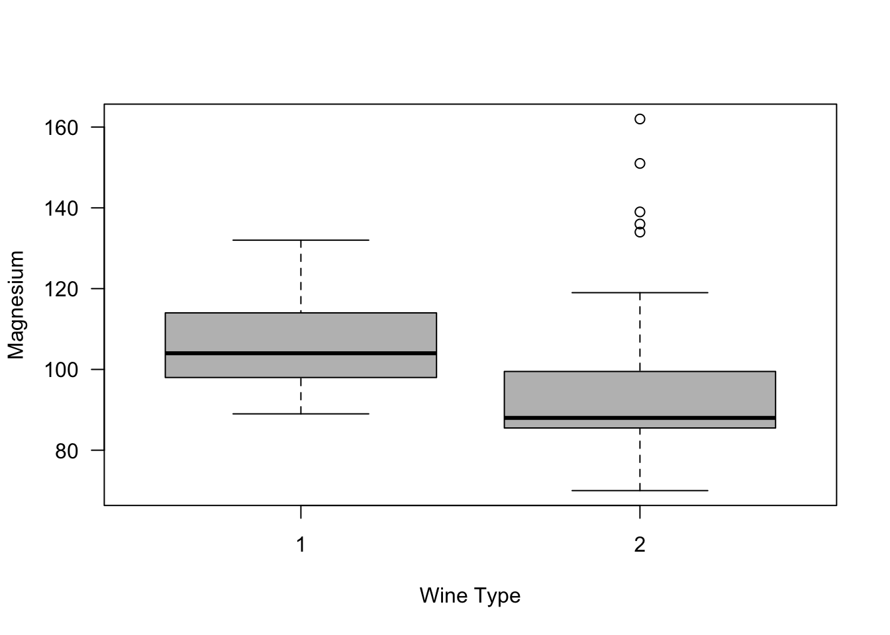

# (PART) Nonparametric Testing {-} 

# Rank and Sign Statistics {#rank-tests}

<!--   ## Introduction

Start with t-test example, difference in means is sufficient for superiority

Give example of type of tests we are interested in.

Why ranks and why nonparametric testing?

(reduce influence of outliers)
-->

## Ranks

### Definition

* Suppose we have $n$ observations $\mathbf{X} = (X_{1}, \ldots, X_{n})$. The **rank** of the $i^{th}$ observation $R_{i}$ is defined as
\begin{equation}
R_{i} = R_{i}(\mathbf{X}) = \sum_{j=1}^{n} I( X_{i} \geq X_{j}) 
(\#eq:rankdef)
\end{equation}
where
\begin{equation}
I(X_{i} \geq X_{j}) 
= \begin{cases}
1 & \text{ if } X_{i} \geq X_{j} \\
0 & \text{ if } X_{i} < X_{j}
\end{cases}
\end{equation}
* The largest observation has a rank of $n$.
* The smallest observation has a rank of $1$ (if there are no ties).
* I'm using the notation $R_{i}(\mathbf{X})$ to emphasize that the rank
of the $i^{th}$ observations depends on the entire vector of observations
rather than only the value of $X_{i}$.


* You can compute ranks in **R** using the **rank** function:

```r
x <- c(3, 7, 1, 12, 6)  ## 5 observations
rank(x)
```

```
## [1] 2 4 1 5 3
```

### Handling Ties

* In the definition of ranks shown in \@ref(eq:rankdef), tied observations
receive their maximum possible rank. 
* For example, suppose that $(X_{1}, X_{2}, X_{3}, X_{4}) = (0, 1, 1, 2)$. 
In this case, one could argue whether both observations 2 and 3 should be ranked
$2^{nd}$ or $3^{rd}$ while observations $1$ and $4$ should unambiguously receive
ranks of $1$ and $4$ respectively.
* Under definition \@ref(eq:rankdef), both observations $2$ and $3$ receive a rank of $3$.

* In **R**, handling ties that is consistent with definition \@ref(eq:rankdef) is done using the **ties.method = "max"** argument

```r
x <- c(0, 1, 1, 2)  
rank(x, ties.method="max")
```

```
## [1] 1 3 3 4
```
* The default in **R** is to replace the ranks of tied observations with their "average" rank

```r
x <- c(0, 1, 1, 2)  
rank(x)
```

```
## [1] 1.0 2.5 2.5 4.0
```

```r
y <- c(2, 9, 7, 7, 3, 2, 1)
rank(y, ties.method="max")
```

```
## [1] 3 7 6 6 4 3 1
```

```r
rank(y)
```

```
## [1] 2.5 7.0 5.5 5.5 4.0 2.5 1.0
```

---

* When defining ranks using the "average" or "midrank" approach to handling ties, replaces
tied ranks with the average of the two "adjacent" ranks. 

* For example, if we have a vector of ranks $(R_{1}, R_{2}, R_{3}, R_{4})$ where $R_{2} = R_{3} =3$ and $R_{1} = 4$ and $R_{4} = R_{1}$, then the vector of modified ranks using the "average" approach to handling ties
would be
\begin{equation}
(R_{1}', R_{2}', R_{3}', R_{4}') = \Big( 4, \frac{4 + 1}{2}, \frac{4 + 1}{2}, 1 \Big)
\end{equation}

* The "average" approach is the most common way of handling ties when computing the
Wilcoxon rank sum statistic.


### Properties of Ranks
Suppose $(X_{1}, \ldots, X_{n})$ is random sample from a continuous distribution $F$ (so that the probability
of ties is zero). Then, the following properties hold for the associated ranks $R_{1}, \ldots, R_{n}$.

* Each $R_{i}$ follows a discrete uniform distribution
\begin{equation}
P(R_{i} = j) = 1/n, \quad \text{for any } j = 1, \ldots,n.
\end{equation}
* The expectation of $R_{i}$ is
\begin{equation}
E( R_{i} ) = \sum_{j=1}^{n} j P(R_{i} = j) = \frac{1}{n}\sum_{j=1}^{n} j = \frac{(n+1)}{2}
\end{equation}
* The variance of $R_{i}$ is
\begin{equation}
\text{Var}( R_{i} ) = E( R_{i}^{2} ) - E(R_{i})^{2}
= \frac{1}{n}\sum_{j=1}^{n} j^{2}  - \Big( \frac{n+1}{2} \Big)^{2}
= \frac{ n^{2} - 1}{12}
\end{equation}
* The random variables $R_{1}, \ldots, R_{n}$ are **not** independent (why?). However,
the vector $\mathbf{R}_{n} = (R_{1}, \ldots, R_{n})$ is uniformly distributed
on the set of $n!$ permutations of $(1,2,\ldots,n)$.

---

**Exercise 3.1**: Suppose $X_{1}, X_{2}, X_{3}$ are i.i.d. observations from a continuous
distribution function $F_{X}$. Compute the covariance matrix of the vector 
of ranks $\big( R_{1}(\mathbf{X}), R_{2}(\mathbf{X}), R_{3}( \mathbf{X} ) \big)$.

**Exercise 3.2**: Again, suppose that $X_{1}, X_{2}, X_{3}, X_{4}$ are i.i.d. observations from a continuous
distribution function $F_{X}$. Let $T= R_{1}( \mathbf{X} ) + R_{2}(\mathbf{X})$. Compute $P( T = j )$ 
for $j = 3, 4, 5, 6, 7$.

---

## Two-Sample Tests

### The Wilcoxon Rank Sum (WRS) Test

#### Goal of the Test

* The Wilcoxon Rank Sum (WRS) test (sometimes referred to as the Wilcoxon-Mann-Whitney test) is a popular,
rank-based two-sample test.

* The WRS test is used to test whether or not observations from one group tend to be larger (or smaller) than observations
from the other group. 

* Suppose we have observations from two groups: $X_{1}, \ldots, X_{n} \sim F_{X}$ and $Y_{1}, \ldots, Y_{m} \sim F_{Y}$.

* Roughly speaking, the WRS tests the following hypothesis
\begin{eqnarray}
H_{0}: & & F_{X} = F_{Y} \quad \textrm{ versus } \nonumber \\
H_{A}: & & \textrm{Observations from } F_{X} \textrm{ tend to be larger than observations from } F_{Y} 
(\#eq:general-wilcoxon-hypothesis)
\end{eqnarray}

---

* What is meant by "tend to be larger" in the alternative hypothesis?

* Two common ways of stating the alternative hypothesis for the WRS include
    1. The stochastic dominance alternative
\begin{eqnarray}
H_{0}: & & F_{X} = F_{Y} \quad \textrm{ versus } \nonumber \\
H_{A}: & & F_{X} \textrm{ is stochastically larger than } F_{Y} \nonumber 
\end{eqnarray}
    2. The "shift" alternative
\begin{eqnarray}
H_{0}: & & F_{X} = F_{Y} \quad \textrm{ versus } \nonumber \\
H_{A}: & & F_{X}(t) = F_{Y}(t - \Delta), \Delta > 0.
\end{eqnarray}
* A distribution function $F_{X}$ is said to be stochastically larger than
$F_{Y}$ if $F_{X}(t) \geq F_{Y}(t)$ for all $t$ with $F_{X}(t) > F_{Y}(t)$
for at least one value of $t$.

* Note that the "shift alternative" implies stochastic dominance.

* Why do we need to specify an alternative?

---

* Discuss Mann-Whitney alternative here ...

* Cite  @divine2018


#### Definition of the WRS Test Statistic

* The WRS test statistic is based on computing the sum of ranks (ranks based on the pooled sample)
in one group.

* If observations from group 1 tend to be larger than those from group 2, the average rank from group 1 should exceed the
average rank from group 2. 

* A sufficiently large value of the average rank from group 1 will allow us to reject $H_{0}$ 
in favor of $H_{A}$.

---

* We will define the pooled data vector $\mathbf{Z}$ as 
\begin{equation}
\mathbf{Z} = (X_{1}, \ldots, X_{n}, Y_{1}, \ldots, Y_{m})
\end{equation}
This is a vector with length $n + m$.

* The Wilcoxon rank-sum test statistic $W$ for testing hypotheses of the form \@ref(eq:general-wilcoxon-hypothesis)
is then defined as
\begin{equation}
W = \sum_{i=1}^{n} R_{i}( \mathbf{Z} )
(\#eq:wrs-formula)
\end{equation}

* In other words, the WRS test statistic is the sum of the ranks for those observations coming 
from group 1 (i.e., the group with the $X_{i}$ as observations).

* If the group 1 observations tend to, in fact, be larger than the group 2 observations,
then we should expect the sum of the ranks in this group to be larger than the sum of the
ranks from group 2.

--- 

* Under $H_{0}$, we can treat both $X_{i}$ and $Y_{i}$ as being observations coming from
a common distribution function $F$.

* Hence, the expectation of $R_{i}(\mathbf{Z})$ under the null hypothesis is
\begin{equation}
E_{H_{0}}\{ R_{i}(\mathbf{Z}) \} = \frac{n + m + 1}{2}
\end{equation}
and thus the expectation of $W$ under $H_{0}$
\begin{equation}
E_{H_{0}}( W ) = \sum_{i=1}^{n} E_{H_{0}}\{ R_{i}( \mathbf{Z} ) \}
= \frac{ n(n + m + 1)  }{ 2 }
\end{equation}

* It can be shown that the variance of $W$ under the null hypothesis is
\begin{equation}
\textrm{Var}_{H_{0}}( W ) = \frac{mn(m + n + 1)}{12}
\end{equation}

#### Computing p-values for the WRS Test

**Exact Distribution**

* The p-value is found by computing the probability
\begin{equation}
\textrm{p-value} = P_{H_{0}}( W \geq w_{obs})
\end{equation}
where $w_{obs}$ is the observed WRS test statistic that 
we get from our data.

* Computing p-values for the WRS test requires us to 
work with the **null distribution** of $W$. That is,
the distribution of $W$ under the assumption that
$F_{X} = F_{Y}$.

* The exact null distribution is found by using the fact
that each possible ordering of the ranks has the same probability.
That is,
\begin{equation}
P\{ R_{1}(\mathbf{Z}) = r_{1}, \ldots, R_{n+m} =  r_{n+m} \} = \frac{1}{(n + m)!},
\end{equation}
where $(r_{1}, \ldots, r_{n+m})$ is any permutation of the set $\{1, 2, \ldots, n + m\}$.
Note that the null distribution only depends on $n$ and $m$.

* Also, there are ${n + m \choose n}$ possible ways to assign distinct ranks to group 1.

* Consider an example with $n = m = 2$. In this case, there are ${4 \choose 2} = 6$ distinct
ways to assign 2 ranks to group 1.
What is the null distribution of the WRS test statistic? 

---

**Large-Sample Approximate Distribution**

* Looking at \@ref(eq:wrs-formula), we can see that the
WRS test statistic is a sum of nearly independent random variables 
(at least nearly independent for large $n$ and $m$).

* Thus, we can expect that an appropriately centered and scaled
version of $W$ should be approximately Normally distributed (recall the Central Limit Theorem).

* The standardized version $\tilde{W}$ of the WRS is defined as
\begin{equation}
\tilde{W} = \frac{W - E_{H_{0}}(W)}{ \sqrt{\textrm{Var}_{H_{0}}(W) }  }
= \frac{W - n(n+m+1)/2}{ \sqrt{ mn(n + m + 1)/12 }  }
\end{equation}

* Under $H_{0}$, $\tilde{W}$ converges in distribution to a Normal$(0,1)$ random variable.

* A p-value using this large-sample approximation would then be computed in the following
way
\begin{eqnarray}
\textrm{p-value} &=& P_{H_{0}}( W \geq w_{obs}) 
= P\Bigg( \frac{W - n(n+m+1)/2}{ \sqrt{ mn(n + m + 1)/12 }  } \geq \frac{w_{obs} - n(n+m+1)/2}{ \sqrt{ mn(n + m + 1)/12 }  }\Bigg)
\nonumber \\
&=& P_{H_{0}}\Big( \tilde{W} \geq \frac{w_{obs} - n(n+m+1)/2}{ \sqrt{ mn(n + m + 1)/12 }  }\Big)
= 1 - \Phi\Bigg( \frac{w_{obs} - n(n+m+1)/2}{ \sqrt{ mn(n + m + 1)/12 }  }  \Bigg),
\end{eqnarray}
where $\Phi(t)$ denotes the cumulative distribution function of a standard Normal random variable.

* Often, in practice, a continuity correction is applied when using this large-sample approximation.
For example, we would compute the probability $P_{H_{0}}(W \geq w_{obs} - 0.5)$ with the Normal approximation
rather than $P_{H_{0}}(W \geq w_{obs})$ directly.

---

* Many statistical software packages (including **R**) will not compute p-values using the exact distribution in 
the presence of ties. The **coin** package does a permutation test in the presence of ties.

* Notes on permutation tests.

* A "two-sided" Wilcoxon rank sum test could also be performed. In this case,

<!-- * Give exercise, compute p-values for Wilcoxon test where
we have two populations. both are Normally distributed
with mean zero but different variances. -->


#### Computing the WRS test in R

* To illustrate performing the WRS test in **R**, we can use the **wine** dataset from the **rattle.data** package.
This dataset is also available from the UCI Machine Learning Repository.

```r
library(rattle.data)
head(wine)
```

```
##   Type Alcohol Malic  Ash Alcalinity Magnesium Phenols Flavanoids
## 1    1   14.23  1.71 2.43       15.6       127    2.80       3.06
## 2    1   13.20  1.78 2.14       11.2       100    2.65       2.76
## 3    1   13.16  2.36 2.67       18.6       101    2.80       3.24
## 4    1   14.37  1.95 2.50       16.8       113    3.85       3.49
## 5    1   13.24  2.59 2.87       21.0       118    2.80       2.69
## 6    1   14.20  1.76 2.45       15.2       112    3.27       3.39
##   Nonflavanoids Proanthocyanins Color  Hue Dilution Proline
## 1          0.28            2.29  5.64 1.04     3.92    1065
## 2          0.26            1.28  4.38 1.05     3.40    1050
## 3          0.30            2.81  5.68 1.03     3.17    1185
## 4          0.24            2.18  7.80 0.86     3.45    1480
## 5          0.39            1.82  4.32 1.04     2.93     735
## 6          0.34            1.97  6.75 1.05     2.85    1450
```

* This dataset contains three types of wine. We will only consider the first two. 

```r
wine2 <- subset(wine, Type==1 | Type==2)
wine2$Type <- factor(wine2$Type)
```

* Let's consider the difference in the level of magnesium across the two types of wine.


* Suppose we are interested in testing whether or not magnesium levels in 
Type 1 wine are generally larger than magnesium levels in Type 2 wine.
This can be done with the following code

```r
wilcox.test(x=wine2$Magnesium[wine2$Type==1], y=wine2$Magnesium[wine2$Type==2], 
            alternative="greater")
```

```
## 
## 	Wilcoxon rank sum test with continuity correction
## 
## data:  wine2$Magnesium[wine2$Type == 1] and wine2$Magnesium[wine2$Type == 2]
## W = 3381.5, p-value = 8.71e-10
## alternative hypothesis: true location shift is greater than 0
```

You could also use the following code (just be careful about the ordering of the levels of **Type**)

```r
wilcox.test(Magnesium ~ Type, data=wine2, alternative="greater")
```

```
## 
## 	Wilcoxon rank sum test with continuity correction
## 
## data:  Magnesium by Type
## W = 3381.5, p-value = 8.71e-10
## alternative hypothesis: true location shift is greater than 0
```

* What is the value of the WRS test statistic? We can code this directly 
with the following steps:

```r
W <- wilcox.test(x=wine2$Magnesium[wine2$Type==1], y=wine2$Magnesium[wine2$Type==2])

n <- sum(wine2$Type==1)
m <- sum(wine2$Type==2)
zz <- rank(wine2$Magnesium) ## vector of pooled ranks
sum(zz[wine2$Type==1])  ## The WRS test statistic
```

```
## [1] 5151.5
```

* The statistic returned by the **wilcox.test** function is actually equal to $W - n(n+1)/2$ not $W$

```r
sum(zz[wine2$Type==1]) - n*(n + 1)/2
```

```
## [1] 3381.5
```

```r
W$statistic
```

```
##      W 
## 3381.5
```

* $\{ W - n(n+1)/2 \}/mn$ is equal to the Mann-Whitney statistic. Thus, **W$statistic/(mn)** is
an estimate of the probability $P(X_{i} > Y_{i})$.

```r
W$statistic/(m*n)
```

```
##         W 
## 0.8072332
```

* Let's check how the Mann-Whitney statistic matches a simulation-based estimate of this probability

```r
ind1 <- which(wine2$Type==1)
ind2 <- which(wine2$Type==2)
xgreater <- rep(0, 100)
for(k in 1:100) {
    xi <- sample(ind1, size=1)
    yi <- sample(ind2, size=1)
    xgreater[k] <- ifelse(wine2$Magnesium[xi] > wine2$Magnesium[yi], 1, 0)
}
mean(xgreater)  ## estimate of this probability
```

```
## [1] 0.77
```


#### Additional Notes for the WRS test


## One Sample Tests

### The Sign Test

* Suppose we have observations $W_{1}, \ldots, W_{n}$ which arise from the following model
\begin{equation}
W_{i} = \theta + \varepsilon_{i}, \nonumber 
\end{equation}
where $\varepsilon_{i}$ are iid random variables each with distribution function $F$
that is assumed to have a median of zero.


### The Signed-Rank Wilcoxon Test

## Comparisons with Parametric Tests

## Thinking about Rank statistics more generally

## Notes 

* Additional reading which covers the material discussed in this chapter includes:
Chapter 3-4 from @hollander2013,


