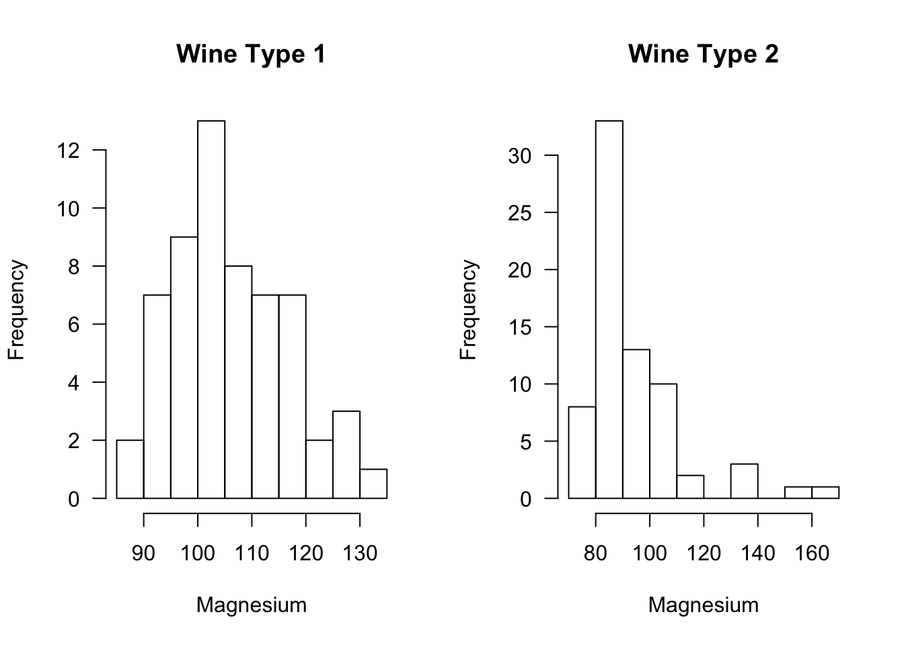
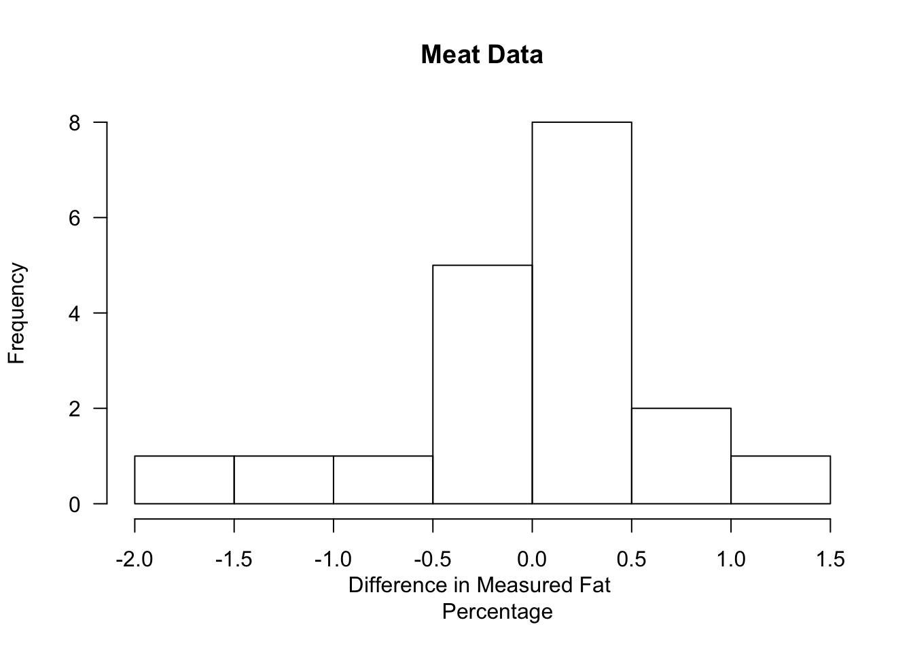
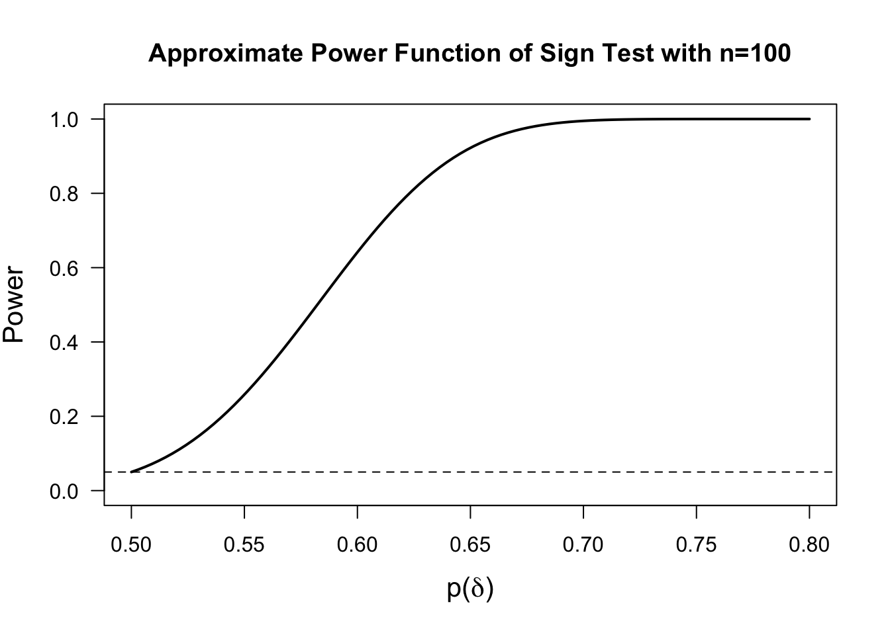
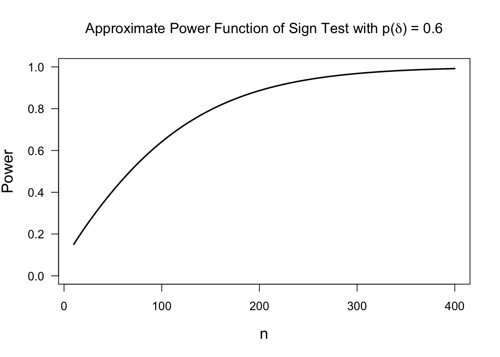

# (PART) Nonparametric Testing {-} 

# Rank and Sign Statistics {#rank-tests}

<!--   ## Introduction

Start with t-test example, difference in means is sufficient for superiority

Give example of type of tests we are interested in.

Why ranks and why nonparametric testing?

(reduce influence of outliers)
-->

## Ranks

### Definition

* Suppose we have $n$ observations $\mathbf{X} = (X_{1}, \ldots, X_{n})$. The **rank** $R_{i}$ of the $i^{th}$ observation is defined as
\begin{equation}
R_{i} = R_{i}(\mathbf{X}) = \sum_{j=1}^{n} I( X_{i} \geq X_{j}) 
(\#eq:rankdef)
\end{equation}
where
\begin{equation}
I(X_{i} \geq X_{j}) 
= \begin{cases}
1 & \text{ if } X_{i} \geq X_{j} \\
0 & \text{ if } X_{i} < X_{j}
\end{cases}
\end{equation}
* The largest observation has a rank of $n$.

* The smallest observation has a rank of $1$ (if there are no ties).

* I am using the notation $R_{i}(\mathbf{X})$ to emphasize that the rank
of the $i^{th}$ observations depends on the entire vector of observations
rather than only on the value of $X_{i}$.


* You can compute ranks in **R** using the **rank** function:

```r
x <- c(3, 7, 1, 12, 6)  ## 5 observations
rank(x)
```

```
## [1] 2 4 1 5 3
```

### Handling Ties

* In the definition of ranks shown in \@ref(eq:rankdef), tied observations
receive their maximum possible rank. 

* For example, suppose that $(X_{1}, X_{2}, X_{3}, X_{4}) = (0, 1, 1, 2)$. 
In this case, one could argue whether both observations 2 and 3 should be ranked
$2^{nd}$ or $3^{rd}$ while observations $1$ and $4$ should unambiguously receive
ranks of $1$ and $4$ respectively.

* Under definition \@ref(eq:rankdef), both observations $2$ and $3$ receive a rank of $3$.

* In **R**, handling ties in a way that is consistent with definition \@ref(eq:rankdef) is done using the **ties.method = "max"** argument

```r
x <- c(0, 1, 1, 2)  
rank(x, ties.method="max")
```

```
## [1] 1 3 3 4
```
* The default in **R** is to replace the ranks of tied observations with their "average" rank

```r
x <- c(0, 1, 1, 2)  
rank(x)
```

```
## [1] 1.0 2.5 2.5 4.0
```

* As another example of the "average" definition of ranks, consider the following example:


```r
y <- c(2, 9, 7, 7, 3, 2, 1)
rank(y, ties.method="max")
```

```
## [1] 3 7 6 6 4 3 1
```

```r
rank(y)
```

```
## [1] 2.5 7.0 5.5 5.5 4.0 2.5 1.0
```

---

* When defining ranks using the "average" or "midrank" approach to handling ties, we replace
tied ranks with the average of the two "adjacent" ranks. 

* For example, if we have a vector of ranks $(R_{1}, R_{2}, R_{3}, R_{4})$ where $R_{2} = R_{3} =3$ and $R_{1} = 4$ and $R_{4} = 1$, then the vector of modified ranks using the "average" approach to handling ties
would be
\begin{equation}
(R_{1}', R_{2}', R_{3}', R_{4}') = \Big( 4, \frac{4 + 1}{2}, \frac{4 + 1}{2}, 1 \Big)
\end{equation}

* The "average" approach is the most common way of handling ties when computing the
Wilcoxon rank sum statistic.


### Properties of Ranks
Suppose $(X_{1}, \ldots, X_{n})$ is random sample from a continuous distribution $F$ (so that the probability
of ties is zero). Then, the following properties hold for the associated ranks $R_{1}, \ldots, R_{n}$.

* Each $R_{i}$ follows a discrete uniform distribution
\begin{equation}
P(R_{i} = j) = 1/n, \quad \text{for any } j = 1, \ldots,n.
\end{equation}
* The expectation of $R_{i}$ is
\begin{equation}
E( R_{i} ) = \sum_{j=1}^{n} j P(R_{i} = j) = \frac{1}{n}\sum_{j=1}^{n} j = \frac{(n+1)}{2}
(\#eq:rank-expectation)
\end{equation}
* The variance of $R_{i}$ is
\begin{equation}
\text{Var}( R_{i} ) = E( R_{i}^{2} ) - E(R_{i})^{2}
= \frac{1}{n}\sum_{j=1}^{n} j^{2}  - \Big( \frac{n+1}{2} \Big)^{2}
= \frac{ n^{2} - 1}{12}
\end{equation}
* The random variables $R_{1}, \ldots, R_{n}$ are **not** independent (why?). However,
the vector $\mathbf{R}_{n} = (R_{1}, \ldots, R_{n})$ is uniformly distributed
on the set of $n!$ permutations of $(1,2,\ldots,n)$.


## The Wilcoxon Rank Sum (WRS) Test: A Two-Sample Test

### Goal of the Test

* The Wilcoxon Rank Sum (WRS) test (sometimes referred to as the Wilcoxon-Mann-Whitney test) is a popular,
rank-based two-sample test.

* The one-sided WRS test is used to test whether or not observations from one group tend to be larger (or smaller) than observations
from the other group. 

* Suppose we have observations from two groups: $X_{1}, \ldots, X_{n} \sim F_{X}$ and $Y_{1}, \ldots, Y_{m} \sim F_{Y}$.

* Roughly speaking, the one-sided WRS tests the following hypothesis
\begin{eqnarray}
H_{0}: && F_{X} = F_{Y} \quad \textrm{ versus }  \\
H_{A}: && \textrm{Observations from } F_{X} \textrm{ tend to be larger than observations from } F_{Y} \nonumber
(\#eq:general-wilcoxon-hypothesis)
\end{eqnarray}

---

* What is meant by "tend to be larger" in the alternative hypothesis?

* Two common ways of stating the alternative hypothesis for the WRS include
    1. The stochastic dominance alternative
\begin{eqnarray}
H_{0}: & & F_{X} = F_{Y} \quad \textrm{ versus } \nonumber \\
H_{A}: & & F_{X} \textrm{ is stochastically larger than } F_{Y} 
(\#eq:stochasticlarger-formulation)
\end{eqnarray}
    2. The "shift" alternative
\begin{eqnarray}
H_{0}: & & F_{X} = F_{Y} \quad \textrm{ versus } \nonumber \\
H_{A}: & & F_{X}(t) = F_{Y}(t - \Delta), \Delta > 0.
(\#eq:shift-formulation)
\end{eqnarray}
* A distribution function $F_{X}$ is said to be stochastically larger than
$F_{Y}$ if $F_{X}(t) \leq F_{Y}(t)$ for all $t$ with $F_{X}(t) < F_{Y}(t)$
for at least one value of $t$.

* Note that the "shift alternative" implies stochastic dominance.

* Why do we need to specify an alternative?

---

* It is often stated that the WRS test is a test
of equal medians.

* This is true under the assumption that the 
relevant alternative is of the form $F_{X}(t) = F_{Y}(t - \Delta)$.

* However, one could have a scenario where the two groups have equal medians, but 
the WRS test has a very high probability of rejecting $H_{0}$.

* In addition, in many applications, it is difficult to justify
that the "shift alternative" is a reasonable assumption.

* An alternative is to view the WRS test as performing the following
hypothesis test:
\begin{eqnarray}
H_{0}: && P(X_{i} > Y_{j}) + \tfrac{1}{2}P(X_{i} = Y_{j}) = 1/2 \quad \textrm{ versus } \nonumber \\
H_{A}: && P(X_{i} > Y_{j}) + \tfrac{1}{2}P(X_{i} = Y_{j}) > 1/2
(\#eq:mw-formulation)
\end{eqnarray}
See  @divine2018 for more discussion around this formulation of the
WRS test.

* The hypothesis test \@ref(eq:mw-formulation) makes fewer assumptions
about how $F_{X}$ and $F_{Y}$ are related and is, in many cases, more interpretable.

* For example, in medical applications, it is often more natural to 
answer the question: what is the probability that the outcome
under treatment 1 is better than the outcome under treatment 2.

* The justification of hypothesis test \@ref(eq:mw-formulation) comes through
the close connection between the WRS test statistic $W$ and the Mann-Whitney statistic $M$.
Specifically, $W = M + n(n+1)/2$. (Although, often $M$ is defined as 
$M = mn + n(n+1)/2 - W$).

* The Mann-Whitney statistic divided by $mn$ is an estimate of the probability:
\begin{equation}
P(X_{i} > Y_{j}) + \tfrac{1}{2}P(X_{i} = Y_{j}) = 1/2. \nonumber
\end{equation}

---

* The reason for stating $H_{0}$ in \@ref(eq:mw-formulation) as 
\begin{equation}
H_{0}: P(X_{i} > Y_{j}) + \tfrac{1}{2}P(X_{i} = Y_{j}) = 1/2  \nonumber \\
\end{equation}
is to cover the case of either a continuous or discrete distribution. 

* When both $X_{i}$ and $Y_{j}$ are samples from a continuous distribution
we will have $P(X_{i} = Y_{j}) = 0$, and we should then think of the null 
hypothesis as $H_{0}: P(X_{i} > Y_{j})$.

* For the case when both $X_{i}$ and $Y_{j}$ have a discrete distribution,
consider an example where $X_{i}$ and $Y_{j}$ have the same discrete 
distribution with probabilities $P(X_{i} = 0) = p_{0}, P(X_{i} = 1) = p_{1}$,
and $P(X_{i} = 2) = 1 - p_{0} - p_{2}$.

* With this common discrete distribution on $\{0, 1, 2\}$, we can see
that $P(X_{i} > Y_{j}) + \tfrac{1}{2}P(X_{i} = Y_{j}) = 1/2$ because
\begin{eqnarray}
P(X_{i} > Y_{j}) + \frac{1}{2}P(X_{i} = Y_{j}&)& = P(X_{i}=1, Y_{j}=0) + P(X_{i} = 2, Y_{j}=0) + P(X_{i}=2, Y_{j}=1)  \nonumber \\
&+& \frac{1}{2}\Big[P(X_{i}=0, Y_{j}=0) + P(X_{i} = 1, Y_{j}=1) + P(X_{i}=2, Y_{j}=2) \Big] \nonumber \\
&=& p_{1}p_{0} + (1 - p_{1} - p_{0})p_{0} + (1 - p_{1} - p_{0})p_{1}  \nonumber \\
&+&  p_{0}^{2} + p_{1}^{2} + \frac{1}{2} - p_{0} - p_{1} + p_{0}p_{1} \nonumber \\
&=& 1/2 \nonumber
\end{eqnarray}


### Definition of the WRS Test Statistic

* The WRS test statistic is based on computing the sum of ranks (ranks based on the pooled sample)
in one group.

* The motivation for the WRS test statistic is the following: if observations from group 1 tend to be larger than those from group 2, the average rank from group 1 should exceed the average rank from group 2. 

* A sufficiently large value of the average rank from group 1 will allow us to reject $H_{0}$ 
in favor of $H_{A}$.

---

* We will define the pooled data vector $\mathbf{Z}$ as 
\begin{equation}
\mathbf{Z} = (X_{1}, \ldots, X_{n}, Y_{1}, \ldots, Y_{m})  \nonumber
\end{equation}
This is a vector with length $n + m$.

* The Wilcoxon rank-sum test statistic $W$ for testing hypotheses of the form \@ref(eq:general-wilcoxon-hypothesis)
is then defined as
\begin{equation}
W = \sum_{i=1}^{n} R_{i}( \mathbf{Z} )
(\#eq:wrs-formula)
\end{equation}

* In other words, the WRS test statistic is the sum of the ranks for those observations coming 
from group 1 (i.e., the group with the $X_{i}$ as observations).

* If the group 1 observations tend to, in fact, be larger than the group 2 observations,
then we should expect the sum of the ranks in this group to be larger than the sum of the
ranks from group 2.

--- 

* Under $H_{0}$, we can treat both $X_{i}$ and $Y_{i}$ as being observations coming from
a common distribution function $F$.

* Hence, the expectation of $R_{i}(\mathbf{Z})$ under the null hypothesis is
\begin{equation}
E_{H_{0}}\{ R_{i}(\mathbf{Z}) \} = \frac{n + m + 1}{2} \nonumber
\end{equation}
and thus the expectation of $W$ under $H_{0}$
\begin{equation}
E_{H_{0}}( W ) = \sum_{i=1}^{n} E_{H_{0}}\{ R_{i}( \mathbf{Z} ) \} \nonumber
= \frac{ n(n + m + 1)  }{ 2 }
\end{equation}

* It can be shown that the variance of $W$ under the null hypothesis is
\begin{equation}
\textrm{Var}_{H_{0}}( W ) = \frac{mn(m + n + 1)}{12}  \nonumber 
\end{equation}

### Computing p-values for the WRS Test

**Exact Distribution**

* The p-value for the WRS test is found by computing the probability
\begin{equation}
\textrm{p-value} = P_{H_{0}}( W \geq w_{obs})
\end{equation}
where $w_{obs}$ is the observed WRS test statistic that 
we get from our data.

* Computing p-values for the WRS test requires us to 
work with the **null distribution** of $W$. That is,
the distribution of $W$ under the assumption that
$F_{X} = F_{Y}$.

* The exact null distribution is found by using the fact
that each possible ordering of the ranks has the same probability.
That is,
\begin{equation}
P\{ R_{1}(\mathbf{Z}) = r_{1}, \ldots, R_{n+m}(\mathbf{Z}) =  r_{n+m} \} = \frac{1}{(n + m)!},
\end{equation}
where $(r_{1}, \ldots, r_{n+m})$ is any permutation of the set $\{1, 2, \ldots, n + m\}$.
Note that the null distribution only depends on $n$ and $m$.

* Also, there are ${n + m \choose n}$ possible ways to assign distinct ranks to group 1.

* Consider an example with $n = m = 2$. In this case, there are ${4 \choose 2} = 6$ distinct
ways to assign 2 ranks to group 1.
What is the null distribution of the WRS test statistic? Try to verify that
\begin{eqnarray}
P_{H_{0}}( W = 7) &=& 1/6 \nonumber \\
P_{H_{0}}( W = 6 ) &=& 1/6 \nonumber \\
P_{H_{0}}(W = 5) &=& 1/3  \nonumber \\
P_{H_{0}}( W = 4 ) &=& 1/6  \nonumber \\
P_{H_{0}}(W = 3) &=& 1/6. \nonumber 
\end{eqnarray}

---

**Large-Sample Approximate Distribution**

* Looking at \@ref(eq:wrs-formula), we can see that the
WRS test statistic is a sum of nearly independent random variables 
(at least nearly independent for large $n$ and $m$).

* Thus, we can expect that an appropriately centered and scaled
version of $W$ should be approximately Normally distributed (recall the Central Limit Theorem).

* The standardized version $\tilde{W}$ of the WRS is defined as
\begin{equation}
\tilde{W} = \frac{W - E_{H_{0}}(W)}{ \sqrt{\textrm{Var}_{H_{0}}(W) }  }
= \frac{W - n(n+m+1)/2}{ \sqrt{ mn(n + m + 1)/12 }  }
\end{equation}

* Under $H_{0}$, $\tilde{W}$ converges in distribution to a Normal$(0,1)$ random variable.

* A p-value using this large-sample approximation would then be computed in the following
way
\begin{eqnarray}
\textrm{p-value} &=& P_{H_{0}}( W \geq w_{obs}) 
= P\Bigg( \frac{W - n(n+m+1)/2}{ \sqrt{ mn(n + m + 1)/12 }  } \geq \frac{w_{obs} - n(n+m+1)/2}{ \sqrt{ mn(n + m + 1)/12 }  }\Bigg)
\nonumber \\
&=& P_{H_{0}}\Big( \tilde{W} \geq \frac{w_{obs} - n(n+m+1)/2}{ \sqrt{ mn(n + m + 1)/12 }  }\Big)
= 1 - \Phi\Bigg( \frac{w_{obs} - n(n+m+1)/2}{ \sqrt{ mn(n + m + 1)/12 }  }  \Bigg), \nonumber
\end{eqnarray}
where $\Phi(t)$ denotes the cumulative distribution function of a standard Normal random variable.

* Often, in practice, a continuity correction is applied when using this large-sample approximation.
For example, we would compute the probability $P_{H_{0}}(W \geq w_{obs} - 0.5)$ with the Normal approximation
rather than $P_{H_{0}}(W \geq w_{obs})$ directly.

---

* Many statistical software packages (including **R**) will not compute p-values using the exact distribution in 
the presence of ties. 

* The **coin** package in **R** does allow you to perform a permutation test in the presence of ties.

* A "two-sided" Wilcoxon rank sum test can also be performed. The two-sided 
hypothesis tests could either be stated as 
\begin{eqnarray}
H_{0}: & & F_{X} = F_{Y} \quad \textrm{ versus } \nonumber \\
H_{A}: & & F_{X} \textrm{ is stochastically larger or smaller than } F_{Y}  \nonumber
\end{eqnarray}
or
\begin{eqnarray}
H_{0}: & & F_{X} = F_{Y} \quad \textrm{ versus } \nonumber \\
H_{A}: & & F_{X}(t) = F_{Y}(t - \Delta), \Delta \neq 0. \nonumber
\end{eqnarray}
or
\begin{eqnarray}
H_{0}: && P(X_{i} > Y_{i}) + \tfrac{1}{2}P(X_{i} = Y_{i}) = 1/2 \quad \textrm{ versus } \nonumber \\
H_{A}: && P(X_{i} > Y_{i}) + \tfrac{1}{2}P(X_{i} = Y_{i}) \neq 1/2  \nonumber
\end{eqnarray}


<!-- * Give exercise, compute p-values for Wilcoxon test where
we have two populations. both are Normally distributed
with mean zero but different variances. -->


### Computing the WRS test in R

* To illustrate performing the WRS test in **R**, we can use the **wine** dataset from the **rattle.data** package.
This dataset is also available from the UCI Machine Learning Repository.

```r
library(rattle.data)
head(wine)
```

```
##   Type Alcohol Malic  Ash Alcalinity Magnesium Phenols Flavanoids Nonflavanoids
## 1    1   14.23  1.71 2.43       15.6       127    2.80       3.06          0.28
## 2    1   13.20  1.78 2.14       11.2       100    2.65       2.76          0.26
## 3    1   13.16  2.36 2.67       18.6       101    2.80       3.24          0.30
## 4    1   14.37  1.95 2.50       16.8       113    3.85       3.49          0.24
## 5    1   13.24  2.59 2.87       21.0       118    2.80       2.69          0.39
## 6    1   14.20  1.76 2.45       15.2       112    3.27       3.39          0.34
##   Proanthocyanins Color  Hue Dilution Proline
## 1            2.29  5.64 1.04     3.92    1065
## 2            1.28  4.38 1.05     3.40    1050
## 3            2.81  5.68 1.03     3.17    1185
## 4            2.18  7.80 0.86     3.45    1480
## 5            1.82  4.32 1.04     2.93     735
## 6            1.97  6.75 1.05     2.85    1450
```

* This dataset contains three types of wine. We will only consider the first two. 

```r
wine2 <- subset(wine, Type==1 | Type==2)
wine2$Type <- factor(wine2$Type)
```

* Let us consider the difference in the level of magnesium across the two types of wine.


* Suppose we are interested in testing whether or not magnesium levels in 
Type 1 wine are generally larger than magnesium levels in Type 2 wine.
This can be done with the following code

```r
wilcox.test(x=wine2$Magnesium[wine2$Type==1], y=wine2$Magnesium[wine2$Type==2], 
            alternative="greater")
```

```
## 
## 	Wilcoxon rank sum test with continuity correction
## 
## data:  wine2$Magnesium[wine2$Type == 1] and wine2$Magnesium[wine2$Type == 2]
## W = 3381.5, p-value = 8.71e-10
## alternative hypothesis: true location shift is greater than 0
```

* You could also use the following code to perform this test (just be careful about the ordering of the levels of **Type**)

```r
wilcox.test(Magnesium ~ Type, data=wine2, alternative="greater")
```

```
## 
## 	Wilcoxon rank sum test with continuity correction
## 
## data:  Magnesium by Type
## W = 3381.5, p-value = 8.71e-10
## alternative hypothesis: true location shift is greater than 0
```

* What is the value of the WRS test statistic? We can code this directly 
with the following steps:

```r
W <- wilcox.test(x=wine2$Magnesium[wine2$Type==1], y=wine2$Magnesium[wine2$Type==2])

n <- sum(wine2$Type==1)
m <- sum(wine2$Type==2)
zz <- rank(wine2$Magnesium) ## vector of pooled ranks
sum(zz[wine2$Type==1])  ## The WRS test statistic
```

```
## [1] 5151.5
```

* The statistic returned by the **wilcox.test** function is actually equal to $W - n(n+1)/2$ not $W$

```r
sum(zz[wine2$Type==1]) - n*(n + 1)/2
```

```
## [1] 3381.5
```

```r
W$statistic
```

```
##      W 
## 3381.5
```

* $\{ W - n(n+1)/2 \}$ is equal to the Mann-Whitney statistic. Thus, **W$statistic/(mn)** is
an estimate of the probability $P(X_{i} > Y_{j}) + P(X_{i} = Y_{j})/2$.

```r
W$statistic/(m*n)
```

```
##         W 
## 0.8072332
```

* Let's check how the Mann-Whitney statistic matches a simulation-based estimate of this probability

```r
ind1 <- which(wine2$Type==1)
ind2 <- which(wine2$Type==2)
xgreater <- rep(0, 100)
for(k in 1:100) {
    xi <- sample(ind1, size=1)
    yi <- sample(ind2, size=1)
    xgreater[k] <- ifelse(wine2$Magnesium[xi] > wine2$Magnesium[yi], 1, 0) + 
                   ifelse(wine2$Magnesium[xi] == wine2$Magnesium[yi], 1/2, 0)
}
mean(xgreater)  ## estimate of this probability
```

```
## [1] 0.755
```

* This simulation-based estimate of $P(X_{i} > Y_{j}) + P(X_{i} = Y_{j})/2$ is quite close to the value of the Mann-Whitney statistic divided by $mn$.

### Additional Notes for the WRS test

#### Comparing Ordinal Data

* The WRS test is often suggested when comparing categorical data which are **ordinal**.

* For example, we might have 4 categories: 
    + Poor
    + Fair
    + Good
    + Excellent
    
* In this case, there is a natural ordering of the categories
but any numerical values assigned to these categories would be arbitrary.

* In such cases, we might be interested in testing whether or not outcomes tend to be
better in one group than the other rather than simply comparing whether or not
the distribution is different between the two groups.

* A WRS test is useful here since we can still compute ranks without having to 
choose aribtrary numbers for each category. 

* Thinking of the "probability greater than alternative \@ref(eq:mw-formulation)" 
or "stochastically larger than alternative \@ref(eq:stochasticlarger-formulation)" interpretation 
of the WRS test is probably more reasonable than the "shift alternative \@ref(eq:shift-formulation)" interpretation. 

* Note that there will probably be many ties when comparing ordinal data.

#### The Hodges-Lehmann Estimator

* The Hodges-Lehmann Estimator $\hat{\Delta}$ is an estimator of $\Delta$ in the location-shift model
\begin{equation}
F_{X}(t) = F_{Y}(t - \Delta) \nonumber
\end{equation}

* The Hodges-Lehmann is defined as the median difference among all possible (group 1, group 2) pairs. 
Specifically,
\begin{equation}
\hat{\Delta} = \textrm{median}\{ (X_{i} - Y_{j}); i=1,\ldots,n; j=1,\ldots,m \} \nonumber
\end{equation}

* We won't discuss the Hodges-Lehmann estimator in detail in this course, but in
many statistical software packages, the
Hodges-Lehmann is often reported when computing the WRS test.

* In **R**, the Hodges-Lehmann estimator can be obtained by using the **conf.int=TRUE**
argument in the **wilcox.test** function

```r
WC <- wilcox.test(x=wine2$Magnesium[wine2$Type==1], y=wine2$Magnesium[wine2$Type==2],
                  conf.int=TRUE)
WC$estimate     ## The Hodges-Lehmann estimate
```

```
## difference in location 
##               14.00005
```


## One Sample Tests

### The Sign Test {#sign-test}

#### Motivation and Definition

* The **sign test** can be thought of as a test of whether or not
the median of a distribution is greater than zero (or greater than some other fixed value $\theta_{0}$).

* Frequently, the sign test is applied in the following context: 
    + Suppose we have observations $D_{1}, \ldots, D_{n}$ which arise from the model
\begin{equation}
D_{i} = \theta + \varepsilon_{i},
(\#eq:general-location)
\end{equation}
where $\varepsilon_{i}$ are iid random variables each with distribution function $F_{\epsilon}$
that is assumed to have a median of zero. Moreover, we will assume the density function
$f_{\varepsilon}(t)$ of $\varepsilon_{i}$ is symmetric around zero.

* The distribution function of $D_{i}$ is then
\begin{equation}
F_{D}(t) = P(D_{i} \leq t) = P(\varepsilon_{i} \leq t - \theta) = F_{\epsilon}(t - \theta)
\end{equation}

* Likewise, the density function $f_{D}(t)$ of $D_{i}$ is given by
\begin{equation}
f_{D}(t) = f_{\epsilon}(t - \theta)
\end{equation}

* In this context, $\theta$ is usually referred to as a **location parameter**.

* The goal here is to test $H_{0}: \theta = \theta_{0}$ vs. $H_{A}: \theta > \theta_{0}$. (Often, $\theta_{0} = 0$).

---

* This sort of test usually comes up in the context of **paired data**.
Common examples include
    + patients compared "pre and post treatment"
    + students before and after the introduction of a new teaching method 
    + comparison of "matched" individuals who are similar (e.g., same age, sex, education, etc.)
    + comparing consistency of measurements made on the same objects

<table border=1>
<tr> <th>  </th> <th> Baseline_Measure </th> <th> Post_Treatment_Measure </th>  </tr>
  <tr> <td align="center"> Patient 1 </td> <td align="center"> Y1 </td> <td align="center"> X1 </td> </tr>
  <tr> <td align="center"> Patient 2 </td> <td align="center"> Y2 </td> <td align="center"> X2 </td> </tr>
  <tr> <td align="center"> Patient 3 </td> <td align="center"> Y3 </td> <td align="center"> X3 </td> </tr>
  <tr> <td align="center"> Patient 4 </td> <td align="center"> Y4 </td> <td align="center"> X4 </td> </tr>
   </table>
   
* In such cases, we have observations $X_{i}$ and $Y_{i}$ for $i = 1,\ldots n$ where
it is not necessarily reasonable to think of $X_{i}$ and $Y_{i}$ as independent.

* We can define $D_{i} = X_{i} - Y_{i}$ as the difference in the $i^{th}$ pair.

* With this setup, a natural question is whether or not the differences $D_{i}$ tend to be 
greater than zero or not.

---

* The **sign** statistic $S_{n}$ is defined as
\begin{equation}
S_{n} = \sum_{i=1}^{n} I( D_{i} > 0)
(\#eq:sign-statistic)
\end{equation}

* If the null hypothesis $H_{0}: \theta = 0$ is true, then we should expect that roughly half
of the observations will be positive.

* This suggests that we will reject $H_{0}$ if $S_{n} \geq c$, where $c$ is a 
number that is greater than $n/2$.

#### Null Distribution and p-values for the Sign Test

* Notice that the sign statistic defined in \@ref(eq:sign-statistic) is the sum of independent
Bernoulli random variable. 

* That is, we can think of $Z_{i} = I(D_{i} > 0)$ as a random variable with success probability
$p( \theta )$ where the formula for $p( \theta )$ is
\begin{equation}
p(\theta) = P(Z_{i} = 1) = P(D_{i} > 0) = 1 - F_{D}(0) = 1 - F_{\epsilon}( -\theta ) \nonumber
\end{equation}

* This implies that $S_{n}$ is a binomial random variable
with $n$ trials and success probability $p(\theta)$. 
That is, 
\begin{equation}
S_{n} \sim \textrm{Binomial}(n, p(\theta) )
(\#eq:signstat-distribution)
\end{equation}

* Because $p(0) = 1/2$, $S_{n} \sim \textrm{Binomial}(n, 1/2 )$ under $H_{0}$.

* Notice that the "null distribution" of the sign statistic is "distribution free"
in the sense that the null distribution of $S_{n}$ does not depend on the distribution of $D_{i}$.

* The p-value for the one-sided sign test can be computed by
\begin{equation}
\textrm{p-value} = P_{H_{0}}(S_{n} \geq s_{obs}) = \sum_{j=s_{obs}}^{n} P_{H_{0}}(S_{n} = j)
= \sum_{j=s_{obs}}^{n} {n \choose j} \frac{1}{2^{n}}, \nonumber
\end{equation}
where $s_{obs}$ is the observed value of the sign statistic.


```r
### How to compute the p-value for the sign test using R
xx <- rnorm(100)
sign.stat <- sum(xx > 0)  ## This is the value of the sign statistic
1 - pbinom(sign.stat - 1, size=100, prob=1/2) ## p-value for sign test
```

```
## [1] 0.1841008
```

* The reason that this is the right expression using **R** is that for any positive integer $w$
\begin{equation}
P_{H_{0}}(S_{n} \geq w) = 1 - P_{H_{0}}(S_{n} < w) = 1 - P_{H_{0}}(S_{n} \leq w - 1)
\end{equation}
and the **R** function **pbinom(t, n, prob)** computes $P(X \leq t)$ where $X$ is 
a binomial random variable with $n$ trials and success probability **prob**.

* You can also perform the one-sided sign test by using the **binom.test** function in **R**.

```r
btest <- binom.test(sign.stat, n=100, p=0.5, alternative="greater") 
btest$p.value
```

```
## [1] 0.1841008
```

#### Two-sided Sign Test

* Notice that the number of negative values of $D_{i}$ can be expressed as
\begin{equation}
\sum_{i=1}^{n} I(D_{i} < 0) = n - S_{n}
\end{equation}
if there are no observations that equal zero exactly. Large value of $n - S_{n}$
would be used in favor of another possible one-sided alternative $H_{A}: \theta < 0$.

* If we now want to test the two-sided alternative
\begin{equation}
H_{0}: \theta = 0 \quad \textrm{ vs. }  \quad H_{A}: \theta \neq 0 \nonumber
\end{equation}
you would need to compute the probability under the null hypothesis of observing
a "more extreme" observation than the one that was actually observed.

* Extreme is defined by thinking about the fact that we would have rejected $H_{0}$
if either $S_{n}$ or $n - S_{n}$ were very large.

* For example, if $n = 12$, then the expected value of the sign statistic would be $6$.
If $s_{obs} = 10$, then the collection of "more extreme" events would be
$\leq 2$ or $\geq 10$.

* The two-sided p-value is determined by looking at the tail probabilities on both sides
\begin{equation}
\textrm{p-value} = 
\begin{cases}
P_{H_{0}}(S_{n} \geq s_{obs}) + P_{H_{0}}(S_{n} \leq n - s_{obs}) & \textrm{ if } s_{obs} \geq n/2 \nonumber \\
P_{H_{0}}(S_{n} \leq s_{obs}) + P_{H_{0}}(S_{n} \geq n - s_{obs}) & \textrm{ if } s_{obs} < n/2 \nonumber
\end{cases}
\end{equation}

* It actually works out that
\begin{equation}
\textrm{p-value} = 
\begin{cases}
2 P_{H_{0}}(S_{n} \geq s_{obs})   & \textrm{ if } s_{obs} \geq n/2 \nonumber \\
2 P_{H_{0}}(S_{n} \leq s_{obs})   & \textrm{ if } s_{obs} < n/2  \nonumber
\end{cases}
\end{equation}

* Also, you can note that this p-value would be the same that you would get from performing the test 
$H_{0}: p = 1/2$ vs. $H_{A}: p \neq 1/2$ when it is assumed that $S_{n} \sim \textrm{Binomial}(n, p)$.

* Another note: It is often suggested that one should drop observations which are exactly zero
when performing the sign test.


### The Wilcoxon Signed Rank Test

* The Wilcoxon signed rank test can be applied
under the same scenario that we used the sign test.

* One criticism of the sign test is that it ignores the magnitude 
of the observations.

* For example, the sign test statistic $S$ treats observations 
$D_{i} = 0.2$ and $D_{i}=3$ the same.

* The **Wilcoxon signed rank statistic** $T_{n}$ weights the
signs of $D_{i}$ by the rank of its absolute value.

* Specifically, the Wilcoxon signed rank statistic is defined as
\begin{equation}
T_{n} = \sum_{i=1}^{n} \textrm{sign}( D_{i}) R_{i}( |\mathbf{D}| ) \nonumber
\end{equation}
where the $\textrm{sign}$ function is defined as
\begin{equation}
\textrm{sign}(x) = \begin{cases}
1 & \textrm{if } x > 0 \\
0 & \textrm{if } x = 0 \\
-1 & \textrm{if } x < 0
\end{cases}
\nonumber
\end{equation}

* Here, $R_{i}( |\mathbf{D}| )$ is the rank of the $i^{th}$ element from the vector
$|\mathbf{D}| = (|D_{1}|, |D_{2}|, \ldots, |D_{n}|)$.

* Intuitively, the Wilcoxon signed rank statistic is measuring whether 
or not large values of $|D_{i}|$ tend to be associated with positive 
vs. negative values of $D_{i}$.


#### Asymptotic Distribution

* As mentioned in the above exercise, the expectation of $T_{n}$ under $H_{0}$ is zero.

* It can be shown that the variance under the null hypothesis is
\begin{equation}
\textrm{Var}_{H_{0}}( T_{n} ) = \frac{n(2n + 1)(n + 1)}{6} \nonumber
\end{equation}

* Similar, to the large-sample approximation we used for the WRS test, we have the following
asymptotic result for the Wilcoxon signed-rank test
\begin{equation}
\frac{T_{n}}{\sqrt{\textrm{Var}_{H_{0}}(T_{n}) }} \longrightarrow \textrm{Normal}(0,1) \quad \textrm{as } n \longrightarrow \infty \nonumber
\end{equation}

* Because the variance of $T$ is dominated by the term $n^{3}/3$ for very large $n$, we could also say that under $H_{0}$
that
\begin{equation}
\frac{T_{n}}{\sqrt{n^{3}/3} } \longrightarrow \textrm{Normal}(0,1) \quad \textrm{as } n \longrightarrow \infty
\end{equation}
In other words, we can say that $T_{n}$ has an approximately $\textrm{Normal}(0, n^{3}/3)$ for large $n$.


#### Exact Distribution

* The exact distribution of the Wilcoxon signed rank statistic $T_{n}$ 
is somewhat more complicated than the exact distribution of the WRS test statistic.
Nevertheless, there exists functions in **R** for working with this exact distribution. 


### Using R to Perform the Sign and Wilcoxon Tests 

* Let's first look at the **Meat** data from the **PairedData** **R** package.

* This data set contains 20 observations with each observation corresponding to a single piece of meat. 
For each observation, we have two measures of fat percentage that were obtained different 
measuring techniques.
 

```r
library(PairedData, quietly=TRUE, warn.conflicts=FALSE) ## loading PairedData package
data(Meat)  ## loading Meat data
head(Meat)
```

```
##   AOAC Babcock     MeatType
## 1 22.0    22.3       Wiener
## 2 22.1    21.8       Wiener
## 3 22.1    22.4       Wiener
## 4 22.2    22.5       Wiener
## 5 24.6    24.9   ChoppedHam
## 6 25.3    25.6 ChooppedPork
```

* Define the differences $D_{i}$ as the **Babcock** measurements minus the **AOAC** measures. 
We will drop the single observation that equals zero.

```r
DD <- Meat[,2] - Meat[,1]
DD <- DD[DD!=0]
hist(DD, main="Meat Data", xlab="Difference in Measured Fat 
     Percentage", las=1)
```



```r
summary(DD)
```

```
##     Min.  1st Qu.   Median     Mean  3rd Qu.     Max. 
## -1.60000 -0.25000  0.30000  0.04211  0.40000  1.10000
```

**The Sign Test in R**

* Let's first test the hypothesis $H_{0}: \theta = 0$ vs. $H_{A}: \theta \neq 0$ using
the two-sided sign test. This can be done using the **binom.test** function


```r
binom.test(sum(DD > 0), n = length(DD), p=0.5)$p.value
```

```
## [1] 0.6476059
```

**Wilcoxon Signed Rank Test in R**

* You can actually use the function **wilcox.test** to perform the Wilcoxon signed rank test in addition 
to the Wilcoxon rank sum test. To perform the Wilcoxon signed rank test in **R**, you just
need to enter data for the **x** argument and leave the **y** argument empty.


```r
wilcox.test(x=DD)
```

```
## Warning in wilcox.test.default(x = DD): cannot compute exact p-value with ties
```

```
## 
## 	Wilcoxon signed rank test with continuity correction
## 
## data:  DD
## V = 118.5, p-value = 0.3534
## alternative hypothesis: true location is not equal to 0
```

* You will note that the p-value for the Wilcoxon signed rank test is lower than that
of the sign test. In general, the Wilcoxon signed rank test is somewhat more "sensitive"
than the sign test meaning that it will have a greater tendency
to reject $H_{0}$ for small deviations from $H_{0}$.

* We can explore this sensitivity comparison with a small simulation study. We
will consider a scenario where $D_{i} = 0.4 + \varepsilon_{i}$ with $\varepsilon_{i}$
having a t distribution with $3$ degrees of freedom.

```r
set.seed(1327)
n.reps <- 500  ## number of simulation replications
samp.size <- 50  ## the sample size
wilcox.reject <- rep(0, n.reps)
sign.reject <- rep(0, n.reps)
for(k in 1:n.reps) {
    dsim <- .4 + rt(samp.size, df=3)
    wilcox.reject[k] <- ifelse(wilcox.test(x=dsim)$p.value < 0.05, 1, 0)
    sign.reject[k] <- ifelse(binom.test(sum(dsim > 0), 
                                       n=samp.size, p=0.5)$p.value < 0.05, 1, 0)
}
mean(wilcox.reject)  ## proportion of times Wilcoxon signed rank rejected H0
```

```
## [1] 0.614
```

```r
mean(sign.reject)  ## proportion of times Wilcoxon signed rank rejected H0
```

```
## [1] 0.488
```


## Power and Comparisons with Parametric Tests

### The Power Function of a Test

* The **power** of a test is the probability
that a test rejects the null hypothesis when the 
alternative hypothesis is true.

* The alternative hypothesis $H_{A}$ is usually characterized
by a large range of values of the parameter of interest.
For example, $H_{A}: \theta > 0$ or $H_{A}: \theta \neq 0$.

* For this reason, it is better to think of power
as a function that varies across the range
of the alternative hypothesis.

* To be more precise, we will define the power
function as a function of some parameter $\theta$
where the null hypothesis corresponds to $\theta = \theta_{0}$
and the alternative hypothesis represents a range
of alternative values of $\theta$.

* The power function $\gamma_{n}(\cdot)$ of a testing procedure is defined as
\begin{equation}
\gamma_{n}(\delta) = P_{\theta=\delta}\{  \textrm{reject } H_{0} \} \qquad \textrm{ for } \delta \in H_{A}. \nonumber
\end{equation}

* The notation $P_{\theta=\delta}\{  \textrm{reject } H_{0} \}$ means that we are computing this
probability under the assumption that the parameter of interest $\theta$ equals $\delta$.


---

**The Approximate Power Function of the Sign Test**

* Let us consider the sign test for testing $H_{0}: \theta = 0$ vs. $\theta > 0$.

* The sign test is based on the value of the sign statistic $S_{n}$.

* Recalling \@ref(eq:signstat-distribution), we know that $S_{n} \sim \textrm{Binomial}(n, p(\theta))$.
Hence,
\begin{equation}
\sqrt{n}(\tfrac{S_{n}}{n} - p(\theta)) \longrightarrow \textrm{Normal}\Big( 0, p(\theta)(1 - p(\theta)) \Big) \quad \textrm{as } n \longrightarrow \infty
(\#eq:approx-signstat)
\end{equation}

* The sign test will reject $H_{0}$ when $S_{n} \geq c_{\alpha,n}$ where the constant $c_{\alpha,n}$ is chosen
so that $P_{H_{0}}( S_{n} \geq c_{\alpha,n} ) = \alpha$. Using the large-sample approximation \@ref(eq:approx-signstat), you can
show that
\begin{equation}
c_{\alpha, n} = \frac{n + \sqrt{n}z_{1-\alpha}}{2}, 
(\#eq:critical-value-signstat)
\end{equation}
where $z_{1-\alpha}$ denotes the upper $1 - \alpha$ quantile of the standard normal distribution. In other words,
$\Phi( z_{1-\alpha}) = 1-\alpha$.


* Also, when using large-sample approximation \@ref(eq:approx-signstat), the power of this test to detect a value of $\theta = \delta$ is given by
\begin{eqnarray}
\gamma_{n}(\delta) &=& P_{\theta=\delta}\{ S_{n} \geq c_{\alpha,n} \} 
= P_{\theta=\delta}\Bigg\{ \frac{\sqrt{n}(S_{n}/n - p(\delta))}{\sqrt{ p(\delta)(1 - p(\delta)) } } \geq 
\frac{ \sqrt{n}(c_{\alpha, n}/n - p(\delta)) }{ \sqrt{p(\delta)(1 - p(\delta))}  } \Bigg\}  \nonumber \\
&=& 1 - \Phi\Bigg( \frac{ \sqrt{n}(c_{\alpha,n}/n - p(\delta)) }{ \sqrt{p(\delta)(1 - p(\delta))}  } \Bigg) \nonumber \\
&=& 1 - \Phi\Bigg( \frac{ z_{1-\alpha} }{ 2\sqrt{p(\delta)(1 - p(\delta))}  } - \frac{ \sqrt{n}(p(\delta) - 1/2) }{ \sqrt{p(\delta)(1 - p(\delta))}  }\Bigg)
(\#eq:powerfn-signstat)
\end{eqnarray}

* Notice that the power of the test depends more directly on the term $p(\delta) = P_{\theta = \delta}(D_{i} > 0)$. 
Recall from Section \@ref(sign-test) that
$p(\delta) = 1 - F_{\epsilon}(-\delta)$, where $F_{\epsilon}$ is the distribution function
of $\varepsilon_{i}$ in the model $D_{i} = \theta + \varepsilon_{i}$.

* So, in any power or sample size calculation, it would be more sensible to think about plausible
values for $p(\delta)$ rather than $\delta$ itself. Plus, $p(\delta)$ has the direct interpretation
$p(\delta) = P_{\theta=\delta}( D_{i} > 0)$.




### Power Comparisons and Asymptotic Relative Efficiency

* Notice that for the sign statistic power function shown in \@ref(eq:powerfn-signstat),
we have that
\begin{equation}
\lim_{n \longrightarrow \infty} \gamma_{n}(\delta)
= \begin{cases}
\alpha & \textrm{ if } \delta = 0 \\
1 & \textrm{ if } \delta > 0
\end{cases}
(\#eq:powerfn-consistent)
\end{equation}

* The above type of limit for the power function is will be 
true for most "reasonable" tests.

* Indeed, a test whose power function satisfies
\@ref(eq:powerfn-consistent) is typically called a **consistent** tests. 

---

* If nearly all reasonable tests are consistent, then
how can we compare tests with respect to their power?

* One approach is to use simulations to compare power for several plausible alternatives.
While this can be useful for a specific application, it limits
our ability to make more general statements about power comparisons.

* Another approach might be to determine 
for which values of $(\delta, n)$ one test has
greater power than another. However, this could
be tough to interpret (no test will be uniformly more powerful for all distributions) 
or even difficult to compute.

* One way to think about power is to think about the **relative efficiency** of
two testing procedures. The efficiency of a test in this context is
the sample size required to achieve a certain level of power.

---

* To find the asymptotic relative efficiency, we first need to derive the
asymptotic power function.

* For our hypothesis $H_{0}: \theta = \theta_{0}$ vs. $H_{A}: \theta > \theta_{0}$, this is defined as 
\begin{equation}
\tilde{\gamma}(\delta) = \lim_{n \longrightarrow \infty} \gamma_{n}( \theta_{0} + \delta/\sqrt{n}) \nonumber
\end{equation}

* Considering the sequence of "local alternatives" $\theta_{n} = \theta_{0} + \delta/\sqrt{n}$, 
we avoid the problem of the power always converging to $1$.

* It can be shown that
\begin{equation}
\tilde{\gamma}(\delta) = 1 - \Phi\Bigg( z_{1-\alpha} - \delta \frac{\mu'(\theta_{0})}{\sigma(\theta_{0})} \Bigg)
\end{equation}
as long as we can find functions $\mu(\cdot)$ and $\sigma(\cdot)$ such that
\begin{equation}
\frac{\sqrt{n}(V_{n} - \mu(\theta_{n}))}{ \sigma(\theta_{n})} \longrightarrow \textrm{Normal}(0, 1) 
(\#eq:asymptotic-v)
\end{equation}
where the test of $H_{0}:\theta = \theta_{0}$ vs. $H_{A}: \theta > \theta_{0}$ 
is based on the test statistic $V_{n}$ with rejection of $H_{0}$ occurring whenever $V_{n} \geq c_{\alpha, n}$.
Statement \@ref(eq:asymptotic-v) asssumes that the distribution of $V_{n}$ is governed by $\theta_{n}$ for each $n$.

---

* The ratio $e(\theta_{0}) = \mu'(\theta_{0})/\sigma(\theta_{0})$ is the **asymptotic efficiency** of the 
test.

* When comparing two tests with efficiency $e_{1}(\theta_{0})$ and $e_{2}(\theta_{0})$,
the asymptotic relative efficiency of test 1 vs. test 2 is defined as
\begin{equation}
ARE_{12}(\theta_{0}) = \Big( \frac{e_{1}(\theta_{0})}{e_{2}(\theta_{0})} \Big)^{2}
\end{equation}

---

**Interpretation of Asymptotic Efficiency of Tests**

* Roughly speaking, the asymptotic relative efficiency $ARE_{12}( \theta_{0} )$ approximately equals
$n_{2}/n_{1}$ where $n_{1}$ is the sample size needed for test 1
to achieve power $\beta$ and $n_{2}$ is the sample size needed for test 2
to achieve power $\beta$. This is true for an arbitrary $\beta$. 

* To further justify this interpretation notice that, for large $n$, we should have
\begin{equation}
c_{\alpha, n} \approx \mu(\theta_{0}) + \frac{ \sigma(\theta_{0})z_{1-\alpha}  }{\sqrt{n}}
\end{equation}
(This approximation for $c_{\alpha, n}$ comes from the asymptotic statement in \@ref(eq:asymptotic-v))

* Now, consider the power for detecting $H_{A}: \theta = \theta_{A}$ (where we will assume 
that $\theta_{A}$ is "close" to $\theta_{0}$). Using \@ref(eq:asymptotic-v), 
the approximate power in this setting is
\begin{eqnarray}
P_{\theta_{A}}\Big( V_{n} \geq c_{\alpha, n} \Big)
&=& P_{\theta_{A} }\Bigg( \frac{\sqrt{n}(V_{n} - \mu(\theta_{A} ))}{ \sigma(\theta_{A} )}
\geq \frac{\sqrt{n}(c_{\alpha,n} - \mu(\theta_{A}))}{ \sigma(\theta_{A})} \Bigg)  \nonumber \\
&\approx& 1 - \Phi\Bigg( \frac{\sqrt{n}(c_{\alpha,n} - \mu(\theta_{A}))}{ \sigma(\theta_{A})} \Bigg)
\nonumber \\
&=& 1 - \Phi\Bigg( \frac{\sqrt{n}(\mu(\theta_{0}) - \mu(\theta_{A}))}{ \sigma(\theta_{A})} + \frac{z_{1-\alpha}\sigma(\theta_{0})}{ \sigma(\theta_{A})}\Bigg)
\end{eqnarray}

* Hence, if we want to achieve a power level of $\beta$ for the alternative $H_{A}: \theta = \theta_{A}$, 
we need the corresponding sample size $n_{\beta}( \theta_{A} )$ to satisfy 
\begin{equation}
\frac{\sqrt{n_{\beta}(\theta_{A})}(\mu(\theta_{0}) - \mu(\theta_{A}))}{ \sigma(\theta_{A})} + \frac{z_{1-\alpha}\sigma(\theta_{0})}{ \sigma(\theta_{A})}
= z_{1-\beta}
\end{equation}
which reduces to 
\begin{equation}
n_{\beta}(\theta_{A})
= \Bigg( \frac{ z_{1-\beta}\sigma(\theta_{A}) - z_{1-\alpha}\sigma(\theta_{0}) }{ \mu(\theta_{0}) - \mu(\theta_{A}) } \Bigg)^{2}
\approx \Bigg( \frac{ [z_{1-\beta} - z_{1-\alpha}]\sigma(\theta_{0}) }{ (\theta_{A} - \theta_{0})\mu'(\theta_{0})} \Bigg)^{2}
(\#eq:approx-sample-size)
\end{equation}

* So, if we were comparing two testing procedures and we computed the approximate sample sizes $n_{\beta}^{1}(\theta_{A})$ and $n_{\beta}^{2}(\theta_{A})$ needed to reach $\beta$ power for the alternative $H_{A}: \theta = \theta_{A}$, the sample
size ratio (using approximation \@ref(eq:approx-sample-size)) would be
\begin{equation}
\frac{ n_{\beta}^{2}(\theta_{A}) }{n_{\beta}^{1}(\theta_{A}) }
= \Bigg( \frac{ \mu_{1}'(\theta_{0})\sigma_{2}(\theta_{0}) }{ \mu_{2}'(\theta_{0})\sigma_{1}(\theta_{0})} \Bigg)^{2}
= \textrm{ARE}_{12}(\theta_{0}) 
\end{equation}

* Notice that $\textrm{ARE}_{12}(\theta_{0}) > 1$ indicates that the test $1$ is better than test $2$
because the sample size required for test $1$ would be less than the sample size required for test $2$.

* It is also worth noting that our justification for the interpretation of $\textrm{ARE}_{12}(\theta_{0})$
was not very rigorous or precise, but it is possible to make a more rigorous statement.
See, for example, Chapter 13 of @lehmann2006 for a more rigorous treatment of relative efficiency. 

* In @lehmann2006, they have a result that states (under appropriate assumptions) that
\begin{equation}
\lim_{\theta \downarrow \theta_{0}} \frac{N_{2}(\theta)}{N_{1}(\theta)} 
= ARE_{12}(\theta_{0})
\end{equation}
where $N_{1}(\theta)$ and $N_{2}(\theta)$ are the sample
sizes required to have power $\beta$ against alternative $\theta$.


---

### Efficiency Examples

**The Sign Test**

* Let us return to the example of the sign statistic $S_{n}$ and its use
in testing the hypothesis $H_{0}: \theta = 0$ vs. $H_{A}: \theta > 0$.

* Notice that the sign test rejects $H_{0}:\theta=0$ for $V_{n} > c_{\alpha,n}$
where $V_{n} = S_{n}/n$ and $S_{n}$ is the sign statistic.

* When $V_{n}$ is defined this way \@ref(eq:asymptotic-v) is satisfied
when $\mu(\theta) = p(\theta)$ and $\sigma(\theta) = \sqrt{p(\theta)(1 - p(\theta) )}$
where $p(\theta) = 1 - F_{\epsilon}( -\theta )$.

* Thus, the efficiency of the sign test for testing $H_{0}: \theta = 0$ vs. $H_{A}: \theta > 0$ is
\begin{equation}
\frac{\mu'(0)}{\sigma(0)} = \frac{p'(0)}{\sqrt{p(0)(1 - p(0))}} = 2f_{\epsilon}(0)  \nonumber 
\end{equation}
where $f_{\epsilon}(t) = F_{\epsilon}'(t)$.

---

**The One-Sample t-test**

* Assume that we have data $D_{1}, \ldots, D_{n}$ generated under the same assumption 
as in our discussion of the sign test and the Wilcoxon signed-rank test. That is,
\begin{equation}
D_{i} = \theta + \varepsilon_{i},  \nonumber 
\end{equation}
where $\varepsilon_{i}$ are assumed to have median $0$ with $\varepsilon_{i}$ having p.d.f. $f_{\varepsilon}$


* The one-sample t-test will reject $H_{0}: \theta = 0$ whenever 
$V_{n} > c_{\alpha, n}$, where $V_{n}$ is defined to be
\begin{equation}
V_{n} = \frac{\bar{D}}{ \hat{\sigma} }  \nonumber
\end{equation}


* Note that \@ref(eq:asymptotic-v) will apply if we choose 
\begin{eqnarray}
\mu(\theta) &=& E_{\theta}(D_{i}) = \theta \nonumber \\
\sigma(\theta) &=& \sqrt{\textrm{Var}_{\theta}(D_{i})} = \sqrt{\textrm{Var}(\varepsilon_{i})} = \sigma_{\epsilon} \nonumber
\end{eqnarray}

* These choices of $\mu(\theta)$ and $\sigma(\theta)$ work because
\begin{eqnarray}
\frac{\sqrt{n}(V_{n} - \mu(\theta_{n}))}{\sigma(\theta_{n})}
&=& \frac{\sqrt{n}(\bar{D} - \theta_{n})}{\sigma_{e}} + \sqrt{n}\theta_{n}\Big( \frac{1}{\hat{\sigma}} - \frac{1}{\sigma_{e}}  \Big) \nonumber \\
&=& \frac{\sqrt{n}(\bar{D} - \theta_{n})}{\sigma_{e}} + \delta\Big( \frac{1}{\hat{\sigma}} - \frac{1}{\sigma_{e}}  \Big)  \nonumber \\
&\longrightarrow& \textrm{Normal}(0, 1)  \nonumber
\end{eqnarray}

* So, the efficiency of the one-sample t-test is given by
\begin{equation}
\frac{\mu'(0)}{\sigma(0)} = \frac{1}{ \sigma_{e} }  \nonumber 
\end{equation}

---

**The Wilcoxon Rank Sum Test**

* Using the close relation between the WRS test statistic and 
the Mann-Whitney statistic, the WRS test can be represented as
rejecting $H_{0}$ when $V_{N} \geq c_{\alpha, N}$ where $V_{N}$ is
\begin{equation}
V_{N} = \frac{1}{mn} \sum_{i=1}^{n}\sum_{j=1}^{m} I(X_{i} \geq Y_{j})  \nonumber
\end{equation}
and $N = n + m$.


* The power of the WRS test is usually analyzed in the context of 
the "shift alternative". Namely, we are assuming that $F_{X}(t) = F_{Y}(t - \theta)$
and test $H_{0}: \theta=0$ vs. $H_{A}: \theta > 0$.

* The natural choice for $\mu(\theta)$ is the expectation of $V_{N}$ when $\theta$ is the true 
shift parameter.

* So, let $\mu(\theta) = P_{\theta}(X_{i} \geq Y_{j})$. This can be written in terms of $F_{Y}$ and $f_{Y}$:
\begin{eqnarray}
\mu(\theta) &=& \int_{-\infty}^{\infty} P_{\theta}( X_{i} \geq Y_{j} | Y_{j}=t) f_{Y}(t) dt
= \int_{-\infty}^{\infty} P_{\theta}( X_{i} \geq t) f_{Y}(t) dt  \nonumber \\
&=& \int_{-\infty}^{\infty} \{1 - F_{X}(t) \} f_{Y}(t) dt
= 1 - \int_{-\infty}^{\infty} F_{Y}(t - \theta) f_{Y}(t) dt
\end{eqnarray}


* You can show that \@ref(eq:asymptotic-v) holds (see e.g, Chapter 14 of @van2000)
if you choose $\sigma^{2}(\theta)$ to be
\begin{eqnarray}
\sigma^{2}(\theta) &=& \frac{1}{1 - \lambda}\textrm{Var}\{ F_{Y}(X_{i}) \} + \frac{1}{\lambda} \textrm{Var}\{ F_{Y}(Y_{i} - \theta) \}
\end{eqnarray}
Here, $n/(m + n) \longrightarrow \lambda$.

* Thus, the efficiency of testing $H_{0}: \theta = 0$ for the WRS test is
\begin{equation}
e(0) = \frac{\mu'(0)}{\sigma(0)} = \frac{\int_{-\infty}^{\infty} f^{2}(t) dt}{\sigma(0)}
\end{equation}


### Efficiency Comparisons for Several Distributions

**Sign Test vs. One-Sample t-test**

* Comparisons of the Efficiency of the sign and one-sample t-test only
require us to find $f_{\epsilon}(0)$ and $\sigma_{e}^{2}$ for different assumptions 
about the residual density $f_{\epsilon}$.

* For the Logistic(0,1) distribution, $f_{\epsilon}(0) = 1/4$ and the standard deviation
is $\pi/\sqrt{3}$. Hence, the asymptotic relative efficiency of the sign test vs. the one-sample
t-test is $(\pi/2\sqrt{3})^{2} = \pi^{2}/12$.


* The relative efficiencies for the sign vs. t-test for other distributions are shown below
\begin{eqnarray}
\textrm{Distribution} & & \quad \textrm{Efficiency} \\
\textrm{Normal}(0,1) & & \qquad 2/\pi \\
\textrm{Logistic}(0,1) & &  \qquad \pi^{2}/12 \\
\textrm{Laplace}(0,1) & & \qquad 2 \\
\textrm{Uniform}(-1, 1) & & \qquad 1/3 \\
\textrm{t-dist}_{\nu} & & \qquad [4(\nu/(\nu-2))\Gamma^{2}\{ (\nu + 1)/2\}]/[ \Gamma^{2}(\nu/2)\nu \pi ]
\end{eqnarray}

---

**WRS Test vs. Two-Sample t-test**

* The relative efficiencies for the WRS test vs. the two-sample t-test
for several distributions are shown below.

\begin{eqnarray}
\textrm{Distribution} & & \quad \textrm{Efficiency} \\
\textrm{Normal}(0,1) & & \qquad 3/\pi \\
\textrm{Logistic}(0,1) & &  \qquad \pi^{2}/9 \\
\textrm{Laplace}(0,1) & & \qquad 3/2 \\
\textrm{Uniform}(-1, 1) & & \qquad 1 \\
\textrm{t-dist}_{3} & & \qquad 1.24 \\
\textrm{t-dist}_{5} & & \qquad 1.90 \\
\end{eqnarray}

### A Power "Contest"

* To compare power for specific sample sizes, effect sizes, and
distributional assumptions, a simulation study can be more
helpful than statements about asymptotic relative efficiency.

* Below shows the results of a simulation study in **R** which compares
power for the one-sample testing problem.

* This simulation study compares the sign test, Wilcoxon signed rank test,
and the one-sample t-test.

* It is assumed that $n = 200$ and that responses $D_{i}$ are generated from 
the following model:
\begin{equation}
D_{i} = 0.2 + \varepsilon_{i}  \nonumber
\end{equation}

* Three choices for the distribution of $\varepsilon_{i}$ were considered:
    + $\varepsilon_{i} \sim \textrm{Logistic}(0, 1)$
    + $\varepsilon_{i} \sim \textrm{Normal}(0, 1)$
    + $\varepsilon_{i} \sim \textrm{Uniform}(-3/2, 3/2)$

* The **R** code and simulation results are shown below.


```r
set.seed(148930)
theta <- 0.2
n <- 200
nreps <- 500
RejectSign <- RejectWilcoxonSign <- RejectT <- matrix(NA, nrow=nreps, ncol=4)
for(k in 1:nreps) {
  xx <- theta + rlogis(n)
  yy <- theta + rnorm(n)
  zz <- theta + runif(n, min=-3/2, max=3/2)
  ww <- theta + (rexp(n, rate=1) - rexp(n, rate=1))/sqrt(2)
  
  RejectSign[k,1] <- ifelse(binom.test(x=sum(xx > 0), n=n, p=0.5)$p.value < 0.05, 1, 0)
  RejectWilcoxonSign[k,1] <- ifelse(wilcox.test(xx)$p.value < 0.05, 1, 0) 
  RejectT[k,1] <- ifelse(t.test(xx)$p.value < 0.05, 1, 0)
  
  RejectSign[k,2] <- ifelse(binom.test(x=sum(yy > 0), n=n, p=0.5)$p.value < 0.05, 1, 0)
  RejectWilcoxonSign[k,2] <- ifelse(wilcox.test(yy)$p.value < 0.05, 1, 0) 
  RejectT[k,2] <- ifelse(t.test(yy)$p.value < 0.05, 1,0)  
  
  RejectSign[k,3] <- ifelse(binom.test(x=sum(zz > 0), n=n, p=0.5)$p.value < 0.05, 1, 0)
  RejectWilcoxonSign[k,3] <- ifelse(wilcox.test(zz)$p.value < 0.05, 1, 0) 
  RejectT[k,3] <- ifelse(t.test(zz)$p.value < 0.05,1,0)  
  
  RejectSign[k,4] <- ifelse(binom.test(x=sum(ww > 0), n=n, p=0.5)$p.value < 0.05, 1, 0)
  RejectWilcoxonSign[k,4] <- ifelse(wilcox.test(ww)$p.value < 0.05, 1, 0) 
  RejectT[k,4] <- ifelse(t.test(ww)$p.value < 0.05, 1, 0)
}

power.results <- data.frame(Distribution=c("Logistic", "Normal", "Uniform", "Laplace"),
                 SignTest=colMeans(RejectSign), WilcoxonSign=colMeans(RejectWilcoxonSign),
                 tTest=colMeans(RejectT))
```

<table border=1>
<caption align="bottom"> Estimated power for three one-sample tests and
              three distributions. 500 simulation replications were used. </caption>
<tr> <th> Distribution </th> <th> SignTest </th> <th> WilcoxonSign </th> <th> tTest </th>  </tr>
  <tr> <td align="center"> Logistic </td> <td align="center"> 0.25 </td> <td align="center"> 0.37 </td> <td align="center"> 0.34 </td> </tr>
  <tr> <td align="center"> Normal </td> <td align="center"> 0.59 </td> <td align="center"> 0.77 </td> <td align="center"> 0.81 </td> </tr>
  <tr> <td align="center"> Uniform </td> <td align="center"> 0.44 </td> <td align="center"> 0.87 </td> <td align="center"> 0.90 </td> </tr>
  <tr> <td align="center"> Laplace </td> <td align="center"> 0.93 </td> <td align="center"> 0.92 </td> <td align="center"> 0.81 </td> </tr>
   </table>


## Linear Rank Statistics in General

### Definition

* The Wilcoxon rank sum statistic is an example of a statistic that belongs to a more general class of rank statistics.

* This is the class of **linear rank statistics**.

* Suppose we have observations $\mathbf{Z} = (Z_{1}, \ldots, Z_{N})$.
A linear rank statistic is a statistic $T_{N}$ that can be expressed as
\begin{equation}
T_{N} = \sum_{i=1}^{N} c_{iN} a_{N}\big( R_{i}( \mathbf{Z} ) \big)
(\#eq:general-linear-rank)
\end{equation}

* The terms $c_{1N}, \ldots, c_{NN}$ are usually called **coefficients**. These
are fixed numbers and are not random variables.

* The terms $a_{N}(R_{i}( \mathbf{Z} ) )$ are commonly referred to as **scores**.

* Typically, the scores are generated from a given function $\psi$ in 
the following way
\begin{equation}
a_{N}(i) = \psi\Big( \frac{i}{N+1} \Big)  \nonumber
\end{equation}

---

**Example: WRS statistic **

* For the Wilcoxon rank sum test, we separated the data $\mathbf{Z} = (Z_{1}, \ldots, Z_{N})$ 
into two groups.

* The first $n$ observations were from group 1 while the
last $m$ observations were from group 2.

* The WRS statistic was then defined as
\begin{equation}
W = \sum_{i=1}^{n} R_{i}(\mathbf{Z}) \nonumber
\end{equation}

* In this case, the WRS statistic can be expressed in the form \@ref(eq:general-linear-rank)
if we choose the coefficients to be the following 
\begin{equation}
c_{iN} = \begin{cases}
   1 & \textrm{ if } i \leq n \\
   0 & \textrm{ if } i > n 
 \end{cases}
 \nonumber
\end{equation}
and we choose the scores to be
\begin{equation}
a_{N}(i) = i  \nonumber
\end{equation}

### Properties of Linear Rank Statistics

* The expected value of the linear rank statistic (if the distribution of the $Z_{i}$ is continuous) 
is
\begin{equation}
E(T_{N}) = N\bar{c}_{N}\bar{a}_{N},
(\#eq:expec-linear-rank)
\end{equation}
where $\bar{c}_{N} = \frac{1}{N} \sum_{j=1}^{N} c_{jN}$ and $\bar{a}_{N} = \frac{1}{N}\sum_{j=1}^{N} a_{N}(j)$

* The formula \@ref(eq:expec-linear-rank) for the expectation only uses the fact that $R_{i}(\mathbf{Z})$ has a discrete uniform
distribution. So,
\begin{equation}
E\{ a_{N}( R_{i}(\mathbf{Z} ) \}
= \sum_{j=1}^{N} a_{N}(j)P\{ R_{i}( \mathbf{Z}) = j \}
= \sum_{j=1}^{N} \frac{ a_{N}(j) }{N}
= \bar{a}_{N} \nonumber
\end{equation}
Using this, we can then see that
\begin{equation}
E( T_{N} ) = \sum_{j=1}^{N} c_{jN} E\{ a_{N}(R_{i}(\mathbf{Z})) \}
= \sum_{j=1}^{N} c_{jN}\bar{a}_{N} = N\bar{c}_{N}\bar{a}_{N} \nonumber
\end{equation}

---

* A similar argument can show that the variance of $T_{N}$ is
\begin{equation}
\textrm{Var}( T_{N} ) = \frac{N^{2}}{n-1} \sigma_{a}^{2}\sigma_{c}^{2}, \nonumber
\end{equation}
where $\sigma_{c}^{2} = \frac{1}{N}\sum_{j=1}^{N} (c_{jN} - \bar{c}_{N})^{2}$
and $\sigma_{a}^{2} = \frac{1}{N}\sum_{j=1}^{N} (a_{N}(j) - \bar{a}_{N})^{2}$

---

* To perform hypothesis testing when using a general linear rank statistics,
working with the exact distribution or performing permutation tests can 
often be computationally demanding.

* Using a large-sample approximation is often easier.

* As long as a few conditions for the coefficients and scores are satisfied,
one can state the following
\begin{equation}
\frac{T_{N} - E( T_{N})}{\sqrt{\textrm{Var}(T_{N})}} \longrightarrow \textrm{Normal}(0, 1), \nonumber
\end{equation}
where, as we showed, both $E(T_{N})$ and $\textrm{Var}(T_{N})$ both have closed-form expressions
for an arbitrary linear rank statistic.


### Other Examples of Linear Rank Statistics

#### The van der Waerden statistic and the normal scores test

* Van der Waerden's rank statistic is used for two-sample problems
where the first $n$ observations come from group 1 while the last
$m$ observations come from group 2.

* Van der Waerden's rank statistic $VW_{N}$ is defined as
\begin{equation}
VW_{N} = \sum_{j=1}^{n} \Phi^{-1}\Bigg( \frac{\mathbf{R}_{i}( \mathbf{Z})}{N+1} \Bigg) \nonumber
\end{equation}

* The function $\Phi^{-1}$ denotes the inverse of the cumulative distribution
function of a standard Normal random variable.

* The statistic $VW_{N}$ is a linear rank statistic with coefficients 
\begin{equation}
c_{iN} = \begin{cases}
   1 & \textrm{ if } i \leq n \\
   0 & \textrm{ if } i > n 
 \end{cases}
 \nonumber
\end{equation}
and scores determined by
\begin{equation}
a_{N}(i) = \Phi^{-1}\Big(  \frac{i}{N+1} \Big)  \nonumber
\end{equation}

* A test based on van der Waerden's statistic is often referred to as
the **normal scores test**.

* The normal scores test is often suggested as an attractive test when 
the underlying data has an approximately normal distribution. 

* If you plot a histogram of the van der Waerden scores $a_{N}(i)$ it should look
roughly like a Gaussian distribution (if there are not too many ties).

#### The median test

* The median test is also a two-sample rank test.

* While the Wilcoxon rank sum test looks at the average rank within group $1$,
the median test instead looks at how many of the ranks from group $1$
are less than the median rank (which should equal $(N+1)/2$).

* The test statistic $M_{N}$ for the median test is defined as
\begin{equation}
M_{N} = \sum_{i=1}^{n} I\Big( R_{i}(\mathbf{Z}) \leq \frac{N+1}{2} \Big)  \nonumber
\end{equation}
because $(N+1)/2$ will be the median rank.

* This is a linear rank statistic with coefficients
\begin{equation}
c_{iN} = \begin{cases}
   1 & \textrm{ if } i \leq n \\
   0 & \textrm{ if } i > n 
 \end{cases}
\nonumber
\end{equation}
and scores
\begin{equation}
a_{N}(i) = 
\begin{cases}
   1 & \textrm{ if } i \leq (N+1)/2 \\
   0 & \textrm{ if } i > (N+1)/2 
 \end{cases}
 \nonumber
\end{equation}

* The median test could be used to test whether or not observations
from group 1 tend to be smaller than those from group 2.

### Choosing the scores $a_{N}(i)$

* The rank tests we have discussed so far are nonparametric in the sense
that their null distribution does not depend on any particular parametric
assumptions about the distributions from which the observations arise.

* For power calculations, we often think of some parameter or "effect size"
modifying the base distribution in some way. 

* For example, we often think of the shift alternative $F_{X}(t) = F_{Y}(t - \theta)$
in the two-sample problem.

---

* In parametric statistics, when testing $H_{0}:\theta = 0$ the most powerful test 
of $H_{0}: \theta = \theta_{0}$ vs. $H_{A}:\theta = \theta_{A}$ is based on
rejecting $H_{0}$ whenever the likelihood ratio is large enough:
\begin{equation}
\textrm{Reject } H_{0} \textrm{ if: } \quad \frac{p_{\theta_{A}}(\mathbf{z})}{p_{\theta_{0}}(\mathbf{z})} \geq c_{\alpha, n}
(\#eq:parametric-np-lemma)
\end{equation}
This is the Neyman-Pearson Lemma.

* The same property is true if we are considering tests based on ranks. The most powerful test
for testing $H_{0}: \theta = \theta_{0}$ vs. $H_{A}:\theta = \theta_{A}$ is based on
\begin{equation}
\textrm{Reject } H_{0} \textrm{ if: } \quad 
\frac{P_{\theta_{A}}\Big( R_{1}(\mathbf{Z}), \ldots, R_{N}(\mathbf{Z}) \Big)}{ P_{\theta_{0}}\Big( R_{1}(\mathbf{Z}), \ldots, R_{N}(\mathbf{Z}) \Big) } \geq c_{\alpha, n}
(\#eq:nonparametric-np-lemma)
\end{equation}

* The main difference between \@ref(eq:parametric-np-lemma) and \@ref(eq:parametric-np-lemma) is
that the distribution $P_{\theta_{A}}\Big( R_{1}(\mathbf{Z}), \ldots, R_{N}(\mathbf{Z}) \Big)$
is unknown unless we are willing to make certain distributional assumptions.

* Nevertheless, we can approximate this probability if $\theta_{A}$ is a location parameter "close" to $\theta_{0}$

\begin{equation}
P_{\theta_{A}}\Big( R_{1}(\mathbf{Z}), \ldots, R_{N}(\mathbf{Z}) \Big)
\approx P_{\theta_{0}}\Big( R_{1}(\mathbf{Z}), \ldots, R_{N}(\mathbf{Z}) \Big)
+ \frac{\theta_{A}}{N!}\sum_{i=1}^{N} c_{iN} E\Bigg\{ \frac{\partial \log f(Z_{(i)})}{ \partial Z}  \Bigg\} \nonumber
\end{equation}
where $Z_{(i)}$ denotes the $i^{th}$ order statistic.
See, for example, Chapter 13 of @van2000 for more details on the derivation of this approximation.

* So, large values of the linear rank statistic $T_{N} = \sum_{i=1}^{N} c_{iN} a_{N}(i)$ will approximately 
correspond to large values of $P_{\theta_{A}}\Big( R_{1}(\mathbf{Z}), \ldots, R_{N}(\mathbf{Z}) \Big)$
if we choose the scores to be
\begin{equation}
a_{N}(i) = E\Bigg\{ \frac{\partial \log f(Z_{(i)})}{ \partial Z}  \Bigg\}  \nonumber
\end{equation}

* Linear rank statistics with scores generated this way are usually called 
**locally most powerful** rank tests.

---

* The best choice of the scores will depend on what we assume about the density $f$.

* For example, if we assume that $f(z)$ is $\textrm{Normal}(0,1)$, then
\begin{equation}
\frac{\partial \log f(z)}{\partial z} = -z  \nonumber
\end{equation}

* The approximate expectation of the order statistics from a Normal$(0,1)$ distribution are
\begin{equation}
E\{ Z_{(i)} \} \approx \Phi^{-1}\Bigg( \frac{i}{N+1} \Bigg)  \nonumber
\end{equation}
This implies that the van der Waerden's scores are approximately optimal
if we assume the distribution of the $Z_{i}$ is Normal.

* This can also be worked out for other choices of $f(z)$.

* If $f(z)$ is a Logistic distribution, the optimal scores correspond to the Wilcoxon rank sum test statistic.

* If $f(z)$ is Laplace (meaning that $f(z) = \frac{1}{2}e^{-|z|}$), then the optimal scores
correspond to the median test.


## Additional Reading 

* Additional reading which covers the material discussed in this chapter includes:
    + Chapters 3-4 from @hollander2013

## Exercises

**Exercise 3.1**: Suppose $X_{1}, X_{2}, X_{3}$ are i.i.d. observations from a continuous
distribution function $F_{X}$. Compute the covariance matrix of the vector 
of ranks $\big( R_{1}(\mathbf{X}), R_{2}(\mathbf{X}), R_{3}( \mathbf{X} ) \big)$.

**Exercise 3.2**: Again, suppose that $X_{1}, X_{2}, X_{3}, X_{4}$ are i.i.d. observations from a continuous
distribution function $F_{X}$. Let $T= R_{1}( \mathbf{X} ) + R_{2}(\mathbf{X})$. Compute $P( T = j )$ 
for $j = 3, 4, 5, 6, 7$.

**Exercise 3.3.** Using the exact distribution of the WRS test statistic, what is the smallest
possible one-sided p-value associated with the WRS test 
for a fixed value of $n$ and $m$ (assuming the probability of ties is zero)? 

**Exercise 3.4.** Suppose we have observations $(-2, 1, -1/2, 3/2, 3)$ from a single group. What is the value of the Wilcoxon signed rank statistic?

**Exercise 3.5.** Under the assumptions of model \@ref(eq:general-location), what is 
the density function of $|D_{i}|$ and $-|D_{i}|$?

**Exercise 3.6.** Under the assumptions of model \@ref(eq:general-location) and
assuming that $\theta = 0$, show that the expectation of the Wilcoxon signed-rank
statistic is $0$.

**Exercise 3.7**: Derive the formula for $c_{\alpha, n}$ shown in \@ref(eq:critical-value-signstat).

**Exercise 3.8**: Suppose that $X_{1}, \ldots, X_{n} \sim \textrm{Exponential}(\lambda)$ and $Y_{1}, \ldots, Y_{m} \sim \textrm{Gamma}(\alpha, \theta)$ meaning that the p.d.f. of $Y_{i}$ is 
\begin{equation}
    f_{Y_{i}}(y) = \begin{cases}
         \frac{\theta^{\alpha}}{ \Gamma(\alpha) } y^{\alpha - 1}e^{-\theta y} & \textrm{ if } y > 0  \nonumber \\
         0 & \textrm{ otherwise.}
     \end{cases} 
\end{equation}
The pooled-data vector is $\mathbf{Z} = (Z_{1}, \ldots, Z_{n + m}) = (X_{1}, \ldots, X_{n}, Y_{1}, \ldots, Y_{m})$ so that $Z_{j} = X_{j}$ for $1 \leq j \leq n$ and $Z_{j} = Y_{j-n}$ for $n + 1 \leq j \leq n + m$.

Compute both $E\{ R_{1}(\mathbf{Z}) \}$ and $E\{ R_{n+1}( \mathbf{Z} ) \}$.

