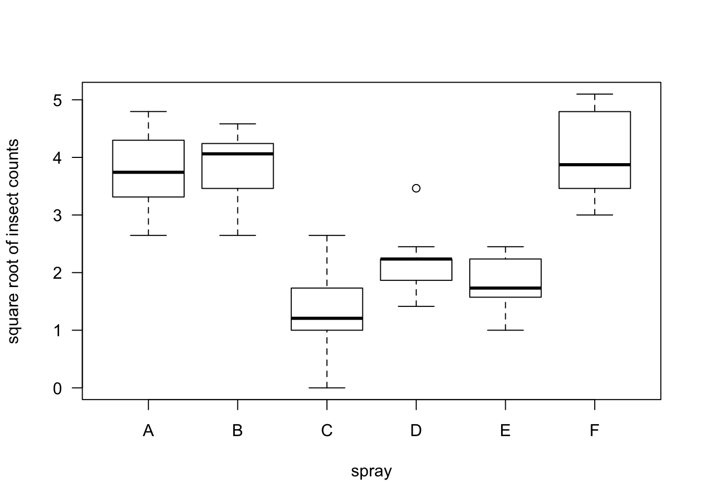

# Rank Tests for Multiple Groups {#krusk-wallis}

* We can roughly think of the tests discussed in Chapter 3
as being related to the parametric tests shown in the table below.


* The **Kruskal-Wallis** test can be though of as the
nonparametric analogue of one-way analysis of variance (ANOVA).

* For $K \geq 3$ groups, one-way ANOVA considers the analysis of data
arising from the following model
\begin{equation}
Y_{kj} = \mu_{k} + \varepsilon_{kj}, \qquad j=1,\ldots, n_{k}; k=1,\ldots,K  
(\#eq:normal-anova-model)
\end{equation}
where it is often assumed that $\varepsilon_{kj} \sim \textrm{Normal}(0, \sigma^{2})$.


* Usually, the one-way ANOVA hypothesis of interest is something like
\begin{equation}
H_{0}: \mu_{1} = \mu_{2} = \ldots = \mu_{K}
(\#eq:homogeneity-hyp)
\end{equation}
which is sometimes referred to as the homogeneity hypothesis.

* A test of the hypothesis \@ref(eq:homogeneity-hyp) is based on decomposing the observed variation in
the responses $Y_{kj}$:
\begin{eqnarray}
\underbrace{ \sum_{k=1}^{K}\sum_{j=1}^{n_{k}} (Y_{kj} - \bar{Y}_{..})^{2}}_{SST} &=& \sum_{k=1}^{K}\sum_{j=1}^{n_{k}} (\bar{Y}_{k.} - \bar{Y}_{..})^{2} + \sum_{k=1}^{K}\sum_{j=1}^{n_{k}} (Y_{kj} - \bar{Y}_{k.})^{2} \nonumber \\
&=& \underbrace{\sum_{k=1}^{K} n_{k} (\bar{Y}_{k.} - \bar{Y}_{..})^{2}}_{SSA} + \underbrace{\sum_{k=1}^{K}\sum_{j=1}^{n_{k}} (Y_{kj} - \bar{Y}_{k.})^{2}}_{SSE} 
(\#eq:anova-decomp)
\end{eqnarray}
where $\bar{Y}_{k.} = \frac{1}{n_{k}}\sum_{j=1}^{n_{k}} Y_{kj}$ and $\bar{Y}_{..} = \frac{1}{K}\sum_{k=1}^{K} \bar{Y}_{k.}$.

* Large values of $SSA = \sum_{k=1}^{K} n_{k} (\bar{Y}_{k.} - \bar{Y}_{..})^{2}$ provide evidence against the null hypothesis \@ref(eq:homogeneity-hyp). The alternative hypothesis here is that there is at least one pair of means $\mu_{h}, \mu_{l}$
such that $\mu_{h} \neq \mu_{l}$.

## The Kruskal-Wallis Test

### Definition

* Instead of assuming \@ref(eq:normal-anova-model) for the responses $Y_{kj}$, nonparametric way of thinking
about this problem is to instead only assume that
\begin{equation}
Y_{kj} \sim F_{k}
\end{equation}
That is, $Y_{k1}, Y_{k2}, \ldots, Y_{kn_{k}}$ is an i.i.d. sample from $F_{k}$ for each $k$. 


* A nonparametric version of the one-way ANOVA homogeneity hypothesis is 
\begin{equation}
H_{0}: F_{1} = F_{2} = \ldots = F_{K}
(\#eq:nonpar-homogeneity-hyp)
\end{equation}

* The "shift alternative" in this case can be stated as
\begin{equation}
H_{A}: F_{k}(t) = F(t - \Delta_{k}), \quad \textrm{ for } k = 1, \ldots K \quad \textrm{ and not all $\Delta_{k}$ equal}
\end{equation}

---

* The Kruskal-Wallis test statistic is similar to the SSA term (defined in \@ref(eq:anova-decomp))
in the one-way ANOVA setting.

* Rather than comparing the group-specific means $\bar{Y}_{k.}$ with the overall mean $\bar{Y}_{..}$,
the Kruskal-Wallis test statistic will be comparing the group-specific rank 
means $\bar{R}_{k.}$ with their overall expectation under the null hypothesis.

* The Kruskal-Wallis test statistic is defined as
\begin{equation}
KW_{n} = \frac{12}{N(N-1)}\sum_{k=1}^{K} n_{k}\Big( \bar{R}_{k.} - \frac{N + 1}{2} \Big)^{2}, \quad \textrm{ where } N = \sum_{k=1}^{K} n_{k}
(\#eq:kw-definition)
\end{equation}

* In \@ref(eq:kw-definition), $\bar{R}_{k.}$ is the average rank of those $k^{th}$ group
\begin{equation}
\bar{R}_{k.} = \frac{1}{n_{k}} \sum_{j=1}^{n_{k}} R_{kj}(\mathbf{Z}),
\end{equation}
where $\mathbf{Z}$ denotes the pooled-data vector and $R_{kj}(\mathbf{Z})$ denotes
the rank of $Y_{kj}$ in the "pooled-data ranking".

---

* What is the expectation of $\bar{R}_{k.}$ under the null hypothesis \@ref(eq:nonpar-homogeneity-hyp)?

* Again, if the null hypothesis is true, we can treat all of our responses $Y_{kj}$ as just
an i.i.d. sample of size $N$ from a common distribution function $F$. 

* Hence, as we showed in \@ref(eq:rank-expectation) from Chapter 3, $E\{ R_{kj}(\mathbf{Z}) \} = (N+1)/2$ under the
assumption that the data are an i.i.d. sample from a common distribution function.

* So, the intuition behind the definition of $KW_{n}$ is that the differences
$\bar{R}_{k.} - \frac{N + 1}{2}$ should be small whenever the homogeneity
hypothesis \@ref(eq:nonpar-homogeneity-hyp) is true.


---

* When $K=2$, the following relationship between the Kruskal-Wallis statistic
$KW_{n}$ and the Wilcoxon rank sum test statistic $W$ from Chapter 3 holds.
\begin{equation}
KW_{n} = \frac{12}{mn(N+1)}\Big( W - \frac{n(N+1)}{2}  \Big)^{2}.
(\#eq:kw-wrs-equivalence)
\end{equation}

* Hence, the p-value from a Kruskal-Wallis test and a (two-sided)
WRS test should be the same when $K = 2$.

* However, you cannot directly perform a one-sided test using 
the Kruskal-Wallis test.

---

* **Exercise 4.1** If $K=2$, show that equation \@ref(eq:kw-wrs-equivalence) holds.

---

**An Example**

<table border=1>
<tr> <th> Group </th> <th> Y </th> <th> Rank </th>  </tr>
  <tr> <td align="center"> Group 1 </td> <td align="center"> 1.00 </td> <td align="center"> 8 </td> </tr>
  <tr> <td align="center"> Group 1 </td> <td align="center"> -1.20 </td> <td align="center"> 2 </td> </tr>
  <tr> <td align="center"> Group 1 </td> <td align="center"> -1.50 </td> <td align="center"> 1 </td> </tr>
  <tr> <td align="center"> Group 2 </td> <td align="center"> 0.00 </td> <td align="center"> 5 </td> </tr>
  <tr> <td align="center"> Group 2 </td> <td align="center"> -0.10 </td> <td align="center"> 4 </td> </tr>
  <tr> <td align="center"> Group 2 </td> <td align="center"> 1.10 </td> <td align="center"> 9 </td> </tr>
  <tr> <td align="center"> Group 3 </td> <td align="center"> 0.90 </td> <td align="center"> 7 </td> </tr>
  <tr> <td align="center"> Group 3 </td> <td align="center"> -0.40 </td> <td align="center"> 3 </td> </tr>
  <tr> <td align="center"> Group 3 </td> <td align="center"> 0.60 </td> <td align="center"> 6 </td> </tr>
   </table>

* In this case, $N = 9$, $\bar{R}_{1.} = 11/3$, $\bar{R}_{2.} = 6$, and $\bar{R}_{3.} = 16/3$. The Kruskall-Wallis
statistic is
\begin{equation}
KW_{n} = \frac{1}{6}\Big\{ (11/3 - 5)^{2} + (6 - 5)^{2} + (16/3 - 5)^{2}   \Big\} = 13/27
\end{equation}

### Asymptotic Distribution and Connection to One-Way ANOVA

* The Kruskal-Wallis statistic $KW_{n}$ has 
an asymptotic chi-square distribution with $K-1$ degrees of freedom under the null hypothesis \@ref(eq:nonpar-homogeneity-hyp).

* This follows from the fact that $(\bar{R}_{k.} - (N+1)/2)$ is approximately normally distributed
for large $n_{k}$.

* **R** uses the large-sample approximation when computing
the p-value for the Kruskal-Wallis test.


--- 

* The Kruskal-Wallis test can also be thought of as the test you would obtain
if you applied the one-way ANOVA setup to the ranks of $Y_{kj}$. 


* The one-way ANOVA test is based on the value of SSA where, as in \@ref(eq:anova-decomp),
SSA is defined as
\begin{equation}
SSA = \sum_{k=1}^{K} n_{k} (\bar{Y}_{k.} - \bar{Y}_{..})^{2}
\end{equation}

* You then reject $H_{0}$, when $SSA/SSE = SSA/(SST - SSA)$ is sufficiently large.

* Notice that if we computed SSA using the ranks $R_{kj}( \mathbf{Z} )$
rather than the observations $Y_{kj}$, we would get:
\begin{eqnarray}
SSA_{r} &=& \sum_{k=1}^{K} n_{k} (\bar{R}_{k.} - \bar{R}_{..})^{2}  \nonumber \\
&=& \sum_{k=1}^{K} n_{k} (\bar{R}_{k.} - \frac{N+1}{2})^{2}  \nonumber \\
&=& \frac{N(N-1)}{12} KW_{n}  
(\#eq:ssa-kw)
\end{eqnarray}

* If you were applying ANOVA to the ranks of $Y_{kj}$, $SST_{r}$ would be 
a fixed constant. 

* So, any test of the homogeneity hypothesis would 
be based on just the value of  $SSA_{r}$ which as we showed in \@ref(eq:ssa-kw) 
is just a constant times the Kruskal-Wallis statistic.


## Performing the Kruskal-Wallis Test in R

* We will look at performing Kruskal-Wallis tests in **R** by using the
"InsectSprays" dataset.

```r
head(InsectSprays)
```

```
##   count spray
## 1    10     A
## 2     7     A
## 3    20     A
## 4    14     A
## 5    14     A
## 6    12     A
```

* This dataset has 72 observations.

* The variable **count** is the number of 
insects measured in some agricultural unit.

* The variable **spray** was the type of spray used on 
that unit.

* You could certainly argue that a standard ANOVA is not
appropriate in this situation because the responses are counts,
and for count data, the variance is usually a function of the mean.

* A generalized linear model with a log link function might be more appropriate.

* Applying a square-root transformation to count data is also a commonly suggested 
approach. (The square-root transformation is the ``variance-stabilizing transformation"
for Poisson-distributed data).


```r
boxplot(sqrt(count) ~ spray, data=InsectSprays,las=1, ylab="square root of insect counts")
```



---

* Let us perform a test of homogeneity using both the one-way ANOVA approach and a Kruskal-Wallis
test


```r
anova(lm(sqrt(count) ~ spray, data=InsectSprays))
```

```
## Analysis of Variance Table
## 
## Response: sqrt(count)
##           Df Sum Sq Mean Sq F value    Pr(>F)    
## spray      5 88.438 17.6876  44.799 < 2.2e-16 ***
## Residuals 66 26.058  0.3948                      
## ---
## Signif. codes:  0 '***' 0.001 '**' 0.01 '*' 0.05 '.' 0.1 ' ' 1
```


```r
a  <- kruskal.test(sqrt(count) ~ spray, data=InsectSprays)
a$p.value
```

```
## [1] 1.510844e-10
```


---

* Notice that it applying the square root transformation or not does not affect the
value of the Kruskal-Wallis statistic or the Kruskal-Wallis p-value.


```r
kruskal.test(count ~ spray, data=InsectSprays)
```

```
## 
## 	Kruskal-Wallis rank sum test
## 
## data:  count by spray
## Kruskal-Wallis chi-squared = 54.691, df = 5, p-value = 1.511e-10
```

* This invariance to data transformation is not true for the standard one-way ANOVA.

```r
anova(lm(count ~ spray, data=InsectSprays))
```

```
## Analysis of Variance Table
## 
## Response: count
##           Df Sum Sq Mean Sq F value    Pr(>F)    
## spray      5 2668.8  533.77  34.702 < 2.2e-16 ***
## Residuals 66 1015.2   15.38                      
## ---
## Signif. codes:  0 '***' 0.001 '**' 0.01 '*' 0.05 '.' 0.1 ' ' 1
```

## Comparison of Specific Groups

* A Kruskal-Wallis test performs a test of the overall homogeneity hypothesis
\begin{equation}
H_{0}: F_{1} = F_{2} = \ldots = F_{K}
\end{equation}

* However, a rejection of the homogeneity hypothesis does not indicate which
group differences are primarily the source of this rejection nor
does it provide any measure of the "magnitude" of the differences between
each of the groups.

* In tradtional one-way ANOVA one will typically report pairwise differences
in the means with associated confidence intervals.


## An Additional Example


* We will use the "cane" dataset from the **boot** package.


```r
library(boot)
data(cane)
head(cane)
```

```
##     n  r  x var block
## 1  87 76 19   1     A
## 2 119  8 14   2     A
## 3  94 74  9   3     A
## 4  95 11 12   4     A
## 5 134  0 12   5     A
## 6  92  0  3   6     A
```

* These data come from a study trying to determine the susceptibility of different types
of sugar cane to a particular type of disease.

* The variable **n** contains the total number of shoots in each plot.

* The variable **r** containes the total number of diseased shoots.

* We can create a new variable **prop** that measures the proportion 
of shoots that are diseased.


```r
cane$prop <- cane$r/cane$n
```

* You could certainly argue that 


```r
cane$prop.trans <- asin(sqrt(cane$prop))
boxplot(prop.trans ~ block, data=cane, las=1, ylab="number of shoots")
```


```r
kruskal.test(prop ~ block, data=cane)
```

```
## 
## 	Kruskal-Wallis rank sum test
## 
## data:  prop by block
## Kruskal-Wallis chi-squared = 1.1355, df = 3, p-value = 0.7685
```

## Additional Reading 

* Additional reading which covers the material discussed in this chapter includes:
    + Chapters 6 from @hollander2013


