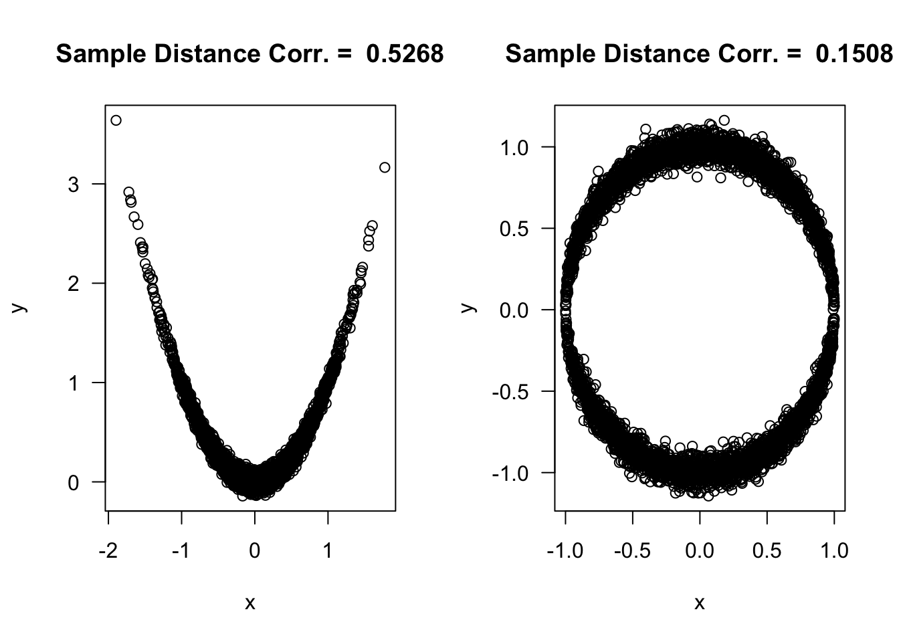

# (PART) Nonparametric Estimation {-} 

# U-Statistics {#ustat}

## Definition

* Suppose we have i.i.d. observations $X_{1}, \ldots, X_{n}$.

* U-statistics are a family of statistics used to estimate quantities 
that can be written as
\begin{equation}
\theta = E\Big\{ h(X_{1}, \ldots, X_{r})  \Big\}
(\#eq:ustat-parameter)
\end{equation}

* The U-statistic $U$ which estimates \@ref(eq:ustat-parameter) is given by the following formula:
\begin{equation}
U = \frac{1}{{n \choose r}} \sum_{c \in \mathcal{C}_{n,r}} h(X_{c_{1}}, \ldots, X_{c_{r}})
(\#eq:ustat-definition)
\end{equation}

* The function $h$ is usually called the **kernel** of the U-statistic.
We will assume the kernel is symmetric.

* The integer $r$ is called the **order** of the U-statistic. Typically,
$r=1$, $r = 2$, or $r = 3$ at most.

* In \@ref(eq:ustat-definition), $\mathcal{C}_{n,r}$ denotes the set of all ${n \choose r}$ combinations of size
$r$ from the set $\{1, \ldots, n\}$.

* For example, if $n = 3$ and $r = 2$ then 
\begin{equation}
\mathcal{C}_{n, r} = \{ (1,2), (1,3), (2, 3) \} \nonumber
\end{equation}

* For many common U-statistics $r=2$ in which case \@ref(eq:ustat-definition) can be written as
\begin{equation}
U = \frac{2}{n(n-1)} \sum_{i=1}^{n}\sum_{j=i+1}^{n} h(X_{i}, X_{j})
\end{equation}

## Examples
 
* A wide range of well-known statistics can be represented as U-statistics.


### Example 1: The Sample Mean

* The sample mean is actually an example of a U-statistic with $r = 1$.

* Choosing $h(x) = x$ means that the corresponding U-statistic is
\begin{equation}
U_{m} = \frac{1}{n} \sum_{i=1}^{n} X_{i} \nonumber
\end{equation}

* Taking the expectation of $h(X_{1})$ gives the parameter that $U_{m}$
is estimating
\begin{equation}
E\{ h(X_{1}) \} = E\{ X_{1} \} = \mu \nonumber
\end{equation}

### Example 2: The Sample Variance

* The sample variance is actually another example of a U-statistic. 
In this case, $r = 2$.

* To show why this is the case, choose the kernel $h(x_{1}, x_{2})$ to be
\begin{equation}
h(x_{1}, x_{2}) = \frac{1}{2}(x_{1} - x_{2})^{2} \nonumber
\end{equation}

* The expectation of this kernel is $\sigma^{2} = E\{ h(X_{1}, X_{2}) \}$ because
\begin{eqnarray}
E\{ h(X_{1}, X_{2}) \} &=& \frac{1}{2}\Big[ E(X_{1}^{2}) - 2E(X_{1})E(X_{2})  + E(X_{2}^{2}) \Big] \nonumber \\
&=& \frac{1}{2}\Big[ \sigma^{2} + \mu^{2} - 2\mu^{2}  + \sigma^{2} + \mu^{2} \Big] \nonumber \\
&=& \sigma^{2}
(\#eq:sampvar-ustat)
\end{eqnarray}

* Also, by using formula \@ref(eq:ustat-definition), this choice of kernel generates the sample variance at its U-statistic:
\begin{eqnarray}
U_{var} &=& \frac{1}{{n \choose 2}} \sum_{c \in \mathcal{C}_{n,2}} h(X_{c_{1}}, X_{c_{2}})
= \frac{2}{n(n-1)}\sum_{i=1}^{n} \sum_{j=i+1}^{n} \frac{1}{2} (X_{i} - X_{j})^{2}  \nonumber \\
&=& \frac{2}{n(n-1)}\sum_{i=1}^{n} \sum_{j=1}^{n} \frac{1}{4}(X_{i} - X_{j})^{2} \nonumber \\
&=& \frac{1}{2n(n-1)}\sum_{i=1}^{n} \sum_{j=1}^{n} \{ (X_{i} - \bar{X})^{2} - 2(X_{i} - \bar{X})(X_{j} - \bar{X}) + (X_{j} - \bar{X})^{2} \} \nonumber \\
&=& \frac{1}{2n(n-1)}\sum_{i=1}^{n} n(X_{i} - \bar{X})^{2} + \frac{1}{2n(n-1)}\sum_{j=1}^{n} n(X_{j} - \bar{X})^{2}  \nonumber \\
&=& \frac{1}{n-1}\sum_{i=1}^{n} (X_{i} - \bar{X})^{2} \nonumber
\end{eqnarray}

---

* Typically, the variance has the interpretation of $\sigma^{2} = E\{ (X_{i} - \mu)^{2} \}$.
That is, $\sigma^{2}$ measures the expected squared deviation of $X_{i}$ from its mean.

* Given the form of the U-statistic \@ref(eq:sampvar-ustat), we can also interpret the variance
in the following way: if we select two observations $X_{i}$ and $X_{j}$ at random,
the expected squared distance between $X_{i}$ and $X_{j}$ will be $2\sigma^{2}$.

* You can see this through the following computer experiment.

```r
n <- 50000
xx <- rlogis(n, location=2, scale=0.75)
diff.sq <- rep(0, 5000)
for(k in 1:5000) {
   idx <- sample(1:n, size=2)
   diff.sq[k] <- (xx[idx[1]] - xx[idx[2]])^2
}
round(var(xx), 3)
```

```
## [1] 1.863
```

```r
round(mean(diff.sq)/2, 3)
```

```
## [1] 1.923
```


### Example 3: Gini's Mean Difference

* Gini's mean difference statistic is defined as
\begin{equation}
U_{G} = \frac{1}{{n \choose 2}} \sum_{i=1}^{n}\sum_{j=i+1}^{n} | X_{i} - X_{j} | \nonumber
\end{equation}

* This is a U-statistic with $r=2$ and kernel
\begin{equation}
h(X_{1},X_{2}) = | X_{1} - X_{2} | \nonumber
\end{equation}

* The parameter that we are estimating with Gini's mean difference statistic is:
\begin{equation}
\theta_{G} = E\Big\{ \Big| X_{1} - X_{2} \Big|  \Big\}  \nonumber
\end{equation}

* Gini's mean difference parameter $\theta_{G}$ can be interpreted in the following way: If we draw 
two observations at random from our population, $\theta_{G}$ 
represents the expected absolute difference between these
two observations.

* The Gini coefficient $\theta_{Gc}$ is a popular measure of inequality. It is related
to the mean difference parameter via
\begin{equation}
\theta_{Gc} = \frac{ \theta_{G}}{ 2\mu },  \nonumber
\end{equation}
where $\mu = E( X_{i} )$.

---

* **Exercise 6.1**. Compute the Gini coefficient $\theta_{Gc}$ when it is assumed that
    + $X_{i} \sim \textrm{Normal}( \mu, \sigma^{2})$, for $\mu > 0$. 
    + $X_{i} \sim \textrm{Exponential}(\lambda)$, (**Hint**: The difference between two independent Exponential random variables has a Laplace distribution).

---

### Example 4: Wilcoxon Signed Rank Statistic

* The Wilcoxon signed rank test statistic is related to the following U statistic
\begin{equation}
U_{WS} = \frac{2}{n(n-1)}\sum_{i=1}^{n}\sum_{j=i+1}^{n} I\Big( X_{i} + X_{j} \geq 0 \Big)  \nonumber
\end{equation}

* $U_{WS}$ is a U-statistic of order $2$ with kernel
\begin{equation}
h(x, y) = I\Big( x + y \geq 0\Big)  \nonumber
\end{equation}

* Hence, $U_{WS}$ can be interpreted as an estimate of
the following parameter
\begin{equation}
\theta_{WS} = P\Big( X_{i} + X_{j} \geq 0  \Big) = P\Big( X_{i} \geq -X_{j} \Big)  \nonumber
\end{equation}

* If the distribution of $X_{i}$ is symmetric around $0$, $\theta_{WS}$ will be equal 
to $1/2$.

---

* Recall that the Wilcoxon signed rank test is designed to detect
distributions which are not symmetric around $0$.

* The Wilcoxon signed rank statistic $T_{n}$ that we defined in Chapter 3 had the following formula
\begin{equation}
T_{n} = \sum_{i=1}^{n} \textrm{sign}( X_{i}) R_{i}( |\mathbf{X}| ) \nonumber
\end{equation}

* Additional algebra can show that
\begin{eqnarray}
T_{n} &=& n(n-1) U_{WS} + 2\sum_{i=1}^{n} I(X_{i} > 0) - \frac{n(n+1)}{2} \nonumber \\
&=& n(n-1) U_{WS} + 2 S_{n} - \frac{n(n+1)}{2} 
(\#eq:wilcoxsign-equivalence)
\end{eqnarray}
where $S_{n}$ is the sign test statistic defined in Chapter 3.

* For large $n$, $T_{n}$ is largely determined by $U_{WS} - 1/2$. 
Hence, a "large" value of $U_{WS} - 1/2$ will lead to rejection
of the one-sample null hypothesis discussed in Section 3.3. 

---

* If you want to derive \@ref(eq:wilcoxsign-equivalence) (though you don't need to know how), I think it is helpful to note
the following
\begin{eqnarray}
I( X_{(i)} > 0)R_{(i)}(|\mathbf{X}|)
&=& \sum_{j=1}^{n} I( X_{(i)} > 0)I(|X_{(i)}| \geq |X_{j}|)
= \sum_{j=1}^{n} I(X_{(i)} \geq |X_{j}|) \nonumber \\
&=& \sum_{j=1}^{n} I(X_{(i)} \geq |X_{(j)}|) 
= \sum_{j=1}^{i} I(X_{(i)} \geq -X_{(j)}) \nonumber \\
&=&  \sum_{j=1}^{i} I(X_{(i)} + X_{(j)} \geq 0) \nonumber
\end{eqnarray}

## Inference using U-statistics

* By using a large-sample approximation, you can construct a confidence interval 
for your U-statistic parameter of interest $\theta$ where 
\begin{equation}
\theta = E\Big\{ h(X_{1}, \ldots, X_{r})  \Big\}
\end{equation}

* While the U-statistic is a sum of random variables that are not necessarily independent,
there is a type of Central Limit Theorem for $U$-statistics.

* Specifically, under appropriate regularity conditions:
\begin{equation}
\sqrt{n}(U - \theta) \longrightarrow \textrm{Normal}\Big( 0, r^{2} \varphi \Big) \nonumber
\end{equation}

* The formula for $\varphi$ is
\begin{equation}
\varphi = \textrm{Cov}\Big( h(X_{1}, X_{2}, \ldots, X_{r}) , h(X_{1}, X_{2}', \ldots, X_{r}') \Big), \nonumber
\end{equation}
where $X_{1}', X_{2}', \ldots, X_{r}'$ are thought of as another i.i.d. sample from 
the same distribution as $X_{1}, \ldots, X_{r}$. 


## U-statistics for Two-Sample Problems

* In two-sample problems, we have data from two groups which
we label $X_{1}, \ldots, X_{n}$ and $Y_{1}, \ldots, Y_{m}$

* A U-statistic with order $(r,s)$ for a two-sample problem is
\begin{equation}
U = \frac{1}{{n \choose r}}\frac{1}{{m \choose s}} \sum_{c \in \mathcal{C}_{n,r}} \sum_{q \in \mathcal{C}_{m,s}} h(X_{c_{1}}, \ldots, X_{c_{r}}, Y_{q_{1}}, \ldots, Y_{q_{s}})
\end{equation}


### The Mann-Whitney Statistic

* Consider the following U-statistic 
\begin{equation}
U_{MW} = \frac{1}{mn}\sum_{i=1}^{n}\sum_{j=1}^{m} I( X_{i} \geq Y_{j})
\end{equation}

* This is a U-statistic of order $(1,1)$ with kernel $h(x, y) = I(x \geq y)$.

* Hence, the U-statistic $U_{MW}$ can be thought of as an estimate of the following
parameter
\begin{equation}
\theta_{MW} = P\Big( X_{i} \geq Y_{j} \Big)
(\#eq:mw-parameter)
\end{equation}

* If both $X_{i}$ and $Y_{j}$ have the same distribution, then
$\theta_{MW}$ should equal $1/2$.

---


* The statistic $mn U_{MW}$ is known as the **Mann-Whitney** statistic.

* The Mann-Whitney statistic has a close relation to the Wilcoxon 
rank sum statistic $W$ that we defined in Section 3.2:
\begin{eqnarray}
mn U_{MW} &=& 
\sum_{i=1}^{n}\sum_{j=1}^{m} I( X_{i} \geq Y_{j}) \nonumber \\
&=& \sum_{i=1}^{n}\Big[ \sum_{j=1}^{m} I( X_{i} \geq Y_{j}) +
\sum_{k=1}^{n} I( X_{i} \geq X_{k}) \Big] -
\sum_{i=1}^{n}\sum_{k=1}^{n} I( X_{i} \geq X_{k}) \nonumber \\
&=& \sum_{i=1}^{n} R_{i}(\mathbf{Z}) -
\sum_{i=1}^{n} R_{i}( \mathbf{X} ) (\#eq:wrs-mw-deriv1)  \\
&=& W - \frac{n(n+1)}{2} \nonumber
\end{eqnarray}

* In other words, the Mann-Whitney statistic is equal to 
the WRS statistic minus a constant term.

* In \@ref(eq:wrs-mw-deriv1), we are defining $\mathbf{Z}$ as
the pooled-data vector $\mathbf{Z} = (X_{1}, \ldots, X_{n}, Y_{1}, \ldots, Y_{m})$.

* Also, the above derivation assumes no ties so that 
$\sum_{i=1}^{n} R_{i}( \mathbf{X} ) = n(n+1)/2$.

---

* Because $W = n(n+1)/2 + mn U_{MW}$ is a linear function of $U_{MW}$, 
inference from the Wilcoxon rank sum test (when using large-sample p-values)
should match inferences made from using $U_{MW}$ to test the hypothesis $H_{0}: \theta_{MW} = 1/2$.

* In other words, the two-sided Wilcoxon rank sum test can 
be thought of as a test of $H_{0}: \theta_{MW} = 1/2$ vs. $H_{A}:\theta_{MW} \neq 1/2$,
where $\theta_{MW}$ is the parameter defined in \@ref(eq:mw-parameter).


## Measures of Association

* Many important measures of association are also examples of U-statistics.

* For measures of association, we have observations on $n$ pairs of variables
\begin{equation}
(X_{1}, Y_{1}), \ldots, (X_{n}, Y_{n}), \nonumber 
\end{equation}
and our goal is to report some measure which quantifies the relationship between these
two variables.

* In this context, we will think about U-statistics which have the form
\begin{equation}
U = \frac{1}{{n \choose r}} \sum_{c \in \mathcal{C}_{n,r} } h\Bigg( \begin{bmatrix} X_{c_{1}} \\ Y_{c_{1}} \end{bmatrix},
\ldots, \begin{bmatrix} X_{c_{r}} \\ Y_{c_{r}} \end{bmatrix} \Bigg)
\end{equation}


### Spearman's Rank Correlation

* Spearman's sample rank correlation is defined as
\begin{eqnarray}
\hat{\rho}_{R} &=& \frac{\sum_{i=1}^{n} \{R_{i}(\mathbf{X}) - \bar{R}(\mathbf{X}) \}\{ R_{i}(\mathbf{Y}) - \bar{R}(\mathbf{Y}) \}}{ \big[ \sum_{i=1}^{n} \{R_{i}(\mathbf{X}) - \bar{R}(\mathbf{X}) \}^{2} \sum_{i=1}^{n}\{ R_{i}(\mathbf{Y}) - \bar{R}(\mathbf{Y}) \}^{2} \big]^{1/2} } \nonumber \\
&=& \frac{12}{n(n-1)(n+1)}\sum_{i=1}^{n} R_{i}( \mathbf{X} )R_{i}(\mathbf{Y}) - \frac{3(n+1)}{n-1},
(\#eq:spearman-simplifiation)
\end{eqnarray}
where $\bar{R}(X) = \frac{1}{n}\sum_{i=1}^{n} R_{i}( \mathbf{X} )$ and $\bar{R}( \mathbf{Y} ) = \frac{1}{n} \sum_{i=1}^{n} R_{i}( \mathbf{Y} )$.

* Remember that $R_{i}(\mathbf{X})$ denotes the rank of $X_{i}$ when only using the vector $\mathbf{X} = (X_{1}, \ldots, X_{n})$ to compute the rankings. Likewise, $R_{i}(\mathbf{Y})$ denotes the rank of $Y_{i}$ when only using the vector $\mathbf{Y} = (Y_{1}, \ldots, Y_{n})$ to compute the rankings.

* Notice that $\hat{\rho}_{R}$ comes from applying the usual Pearson's estimate of correlation to the ranks $(R_{i}( \mathbf{X} )$, $R_{i}(\mathbf{Y}) )$ rather than the original data $(X_{i}, Y_{i})$.

* As with the usual estimate of correlation, $\hat{\rho}_{R}$ is large (i.e., closer to 1) whenever large values of $X_{i}$ tend to be associated with large values of $Y_{i}$. Similarly, $\hat{\rho}_{R}$ is small wheneve large values of $X_{i}$ tend to be associated with small values of $Y_{i}$.

* Values of $\hat{\rho}_{R}$ near zero indicate that there is little association
between these two variables.

---

* Due to its use of ranks, $\hat{\rho}_{R}$ is less sensitive to outliers than Pearson's correlation.

* Another important feature of $\hat{\rho}_{R}$ is that it is invariant to monotone transformations
of the data.

* While Pearson's correlation is very effective for detecting linear associations between two variables,
the rank correlation is very effective at detecting any monotone associations between two variables.

* $\hat{\rho}_{R}$ will equal 1 if $Y_{i}$ is a monotone increasing function of $X_{i}$,
and $\hat{\rho}_{R}$ will equal -1 if $Y_{i}$ is a monotone decreasing function $X_{i}$.


```r
xx <- pmax(rnorm(100, mean=10), 0.01)
yy <- pmax(xx + rnorm(100, sd=.5), 0.01)

## Compare the usual Pearson's correlation between 
## (xx, yy) and (xx, yy^2)
round( c( cor(xx, yy), cor(xx, yy^2)), 3)
```

```
## [1] 0.870 0.865
```

```r
## Now do the same for Spearman's rank correlation
round(c( cor(xx, yy, method="spearman"), 
         cor(xx, yy^2, method="spearman")), 3)
```

```
## [1] 0.847 0.847
```

---


* $\hat{\rho}_{R}$ can be thought of as an estimate of the following population
quantity:
\begin{equation}
\theta_{R} = 12 P\Big( X_{1} \geq X_{2}, Y_{1} \geq Y_{3} \Big) - 3
\end{equation}

* To justify this, first notice that
\begin{eqnarray}
V_{R} &=& \frac{1}{n^{3}}\sum_{i=1}^{n} R_{i}(\mathbf{X})R_{i}(\mathbf{Y})
= \frac{1}{n^{3}}\sum_{i=1}^{n} \sum_{j=1}^{n} I(X_{i} \geq X_{j}) \sum_{k=1}^{n} I(Y_{i} \geq Y_{k}) \nonumber \\
&=& \frac{1}{n^{3}}\sum_{i=1}^{n} \sum_{j=1}^{n} \sum_{k=1}^{n} I(X_{i} \geq X_{j}) I(Y_{i} \geq Y_{k})  \nonumber
\end{eqnarray}

* While $V_{R}$ is not exactly a U-statistic, it can be thought of as roughly a "U-statistic" with non-symmetric kernel function
\begin{equation}
h\Bigg( \begin{bmatrix} X_{1} \\ Y_{1} \end{bmatrix}, \begin{bmatrix} X_{1} \\ Y_{1} \end{bmatrix},
\begin{bmatrix} X_{3} \\ Y_{3} \end{bmatrix} \Bigg) = I(X_{1} \geq X_{2}) I(Y_{1} \geq Y_{3}) \nonumber
\end{equation}

* So, we should expect $V_{R}$ to converge to $P\{X_{1} \geq X_{2}, Y_{1} \geq Y_{3}\}$ as $n$ gets larger.

* Using \@ref(eq:spearman-simplifiation) and our formula for $V_{R}$, we can write $\hat{\rho}_{R}$ as
\begin{eqnarray}
\hat{\rho}_{R} &=& \frac{12}{n(n-1)(n+1)}\sum_{i=1}^{n} R_{i}( \mathbf{X} )R_{i}(\mathbf{Y}) - \frac{3(n+1)}{n-1} \nonumber \\
&=& 12 V_{R} \Big( \frac{n^{3}}{n(n-1)(n+1)} \Big)  - \frac{3(n+1)}{n-1}. \nonumber
\end{eqnarray}

---


**Exercise 6.2.** Why does $\theta_{R}$ equal zero when $X_{i}$ and $Y_{i}$ are independent?
Why is $-1\leq \theta_{R} \leq 1$?

---


### Kendall's tau

* Ignoring the possibility of ties, Kendall's $\tau$-statistic $U_{\tau}$ is given by
\begin{eqnarray}
U_{\tau}
&=& \frac{2}{n(n-1)}\sum_{i=1}^{n}\sum_{j=i+1}^{n} \Bigg[ 2 \times I\Big\{ (X_{j} - X_{i})(Y_{j} - Y_{i}) > 0 \Big\}  - 1 \Bigg]
\nonumber
\end{eqnarray}

* Note that $U_{\tau}$ is a U-statistic of order $2$ with kernel
\begin{equation}
h\Bigg( \begin{bmatrix} X_{1} \\ Y_{1} \end{bmatrix},
\begin{bmatrix} X_{2} \\ Y_{2} \end{bmatrix} \Bigg)
= 2 \times I\Big\{ (X_{2} - X_{1})(Y_{2} - Y_{1}) > 0 \Big\}  - 1
\end{equation}

<!--
\begin{equation}
h\Bigg( \begin{bmatrix} X_{1} \\ Y_{1} \end{bmatrix},
\begin{bmatrix} X_{2} \\ Y_{2} \end{bmatrix} \Bigg)
= 2 \times I\Big\{ (X_{2} - X_{1})(Y_{2} - Y_{1}) > 0 \Big\}  - 
I\Big\{ X_{2} \neq X_{1} \Big\}I\Big\{ Y_{2} \neq Y_{1} \Big\}
\end{equation}
-->

* Assuming the probability of ties is zero, Kendall's $\tau$ can be thought of as an estimate of the following quantity
\begin{equation}
\theta_{\tau} = 2 P\Big\{ (X_{j} - X_{i})(Y_{j} - Y_{i}) > 0 \Big\} - 1
\end{equation}

* Kendall's $\tau$ must be in between $-1$ and $1$.

* If $X_{i}$ and $Y_{i}$ are idependent, Kendall's $\tau$ will be equal to zero (why?).


---

* In the context of computing $U_{\tau}$, pairs of observations $(X_{i}, Y_{i})$ and $(X_{j}, Y_{j})$ are said to be **concordant** if 
the sign of $X_{j} - X_{i}$ agrees with the sign of $Y_{j} - Y_{i}$.

* If the sign of $X_{j} - X_{i}$ and $Y_{j} - Y_{i}$ do **not** agree, then the
pairs $(X_{i}, Y_{i})$ and $(X_{j}, Y_{j})$ are said to be **discordant**.

* If either $X_{j}=X_{i}$ or $Y_{j}=Y_{i}$, then the pairs $(X_{i}, Y_{i})$ and $(X_{j}, Y_{j})$
are neither concordant or discordant.

* Let us define the following
\begin{eqnarray}
n_{c} &=& \textrm{ the number of concordant pairs} \nonumber \\
n_{d} &=& \textrm{ the number of discordant pairs} \nonumber \\
n_{n} &=& \textrm{ number of pairs which are neither}  \nonumber
\end{eqnarray}

* Here, we are counting $n_{c}$ and $n_{d}$ from the number of unique possible pairings. There
are $n(n-1)/2$ unique pairings, and hence
\begin{equation}
n_{c} + n_{d} + n_{n} = {n \choose 2} = \frac{n(n-1)}{2}
\end{equation}

* Notice that $n_{c}$ can be expressed in terms of indicator functions as
\begin{equation}
n_{c} = \sum_{i=1}^{n}\sum_{j=i+1}^{n} I\Big\{ (X_{j} - X_{i})(Y_{j} - Y_{i}) > 0 \Big\} \nonumber
\end{equation}

* If we assume that there are no ties (i.e., $n_{n} = 0$), then $U_{\tau}$
can be written as
\begin{equation}
U_{\tau} = \frac{4n_{c}}{n(n-1)} - 1
= \frac{2n_{c} + 2n_{c} - n(n - 1)}{n(n-1)}
= \frac{2n_{c} - 2n_{d} }{n(n-1)} 
= \frac{2(n_{c} - n_{d})}{n(n-1)} \nonumber
\end{equation}

* Under independence, the number of concordant and discordant pairs should be roughly equal.

---

* We just need ordinal data to use Kendall's $\tau$. Kendall's $\tau$ can be computed
as long you can tell if one observation is "larger" than another.

* Kendall's $\tau$ is often used in the context of assessing the agreement between
different ratings.

* In this context, we might have $K$ different judges which are rating $J$ different objects.
If $r_{jk}$ denotes the object-j rating given by judge $k$, Kendall's $\tau$
from the $J$ pairs $(r_{11}, r_{12}), \ldots, (r_{J1}, r_{J2})$ would give
a measure of the agreement between judges 1 and 2.
 

### Distance Covariance and Correlation

* A correlation equal to zero does not imply that two random variables
are independent.

* For example, if $X \sim \textrm{Normal}(0, 1)$, then
\begin{equation}
\textrm{Corr}(X, X^{2}) = \textrm{Cov}(X, X^{2}) = E( X^{3} ) = 0 \nonumber
\end{equation}

* This is also true for Spearman's rank correlation and Kendall's $\tau$. You 
can have situations where $\theta_{R} = 0$ but $X$ and $Y$ are not independent.
Similarly, you can have situations where $\theta_{\tau} = 0$
while $X$ and $Y$ are not independent.

* Note that the association between the two variables in the figures below
is **non-monotone**.


#### Definition

* **Distance covariance** and **distance correlation** are two measures of dependence that have been developed 
much more recently (see @szekely2007).

* The interesting thing about these two measures is that: if they equal zero then it
implies that the two random variables are independent.

* Moreover, the measures have a relatively straightforward formula, and
they have easily computable estimates.

* For i.i.d. bivariate random variables $(X_{1}, Y_{1}), \ldots, (X_{n}, Y_{n})$,
the squared distance covariance parameter is defined as
\begin{eqnarray}
\theta_{dCov,XY}^{2} 
&=& E\Big\{ |X_{1} - X_{2}| |Y_{1} - Y_{2}|  \Big\} + E\Big\{ |X_{1} - X_{2}| \Big\}E\Big\{ |Y_{1} - Y_{2}| \Big\} \nonumber \\
&-& 2E\Big\{ |X_{1} - X_{2}||Y_{1} - Y_{3}| \Big\} \nonumber
\end{eqnarray}

* The distance correlation bettween $X_{i}$ and $Y_{i}$ is then defined as
\begin{equation}
\rho_{d, XY} = \frac{ \theta_{dCov,XY} }{\theta_{dCov,XX} \theta_{dCov, YY} }  \nonumber
\end{equation}

* Notice that we must have $\theta_{dCov, XY} \geq 0$ and $\rho_{d, XY} \geq 0$. 

* There is no notion of a negative correlation when using distance correlation. 

* The interpretation of $\theta_{dCov,XY}^{2}$ is perhaps not as clear as 
the usual correlation parameter. Nevertheless, $\theta_{dCov,XY} = 0$
implies independence, and larger values of $\theta_{dCov,XY}$ imply
that $X_{i}$ and $Y_{i}$ have some form of ``greater" association.

---

**Example**

* Let us consider the example we had before where we compared $X$ and $X^{2}$.

* Specifically, suppose we have observed pairs $(X_{1}, Y_{1}), \ldots, (X_{n},Y_{n})$
where $X_{i} \sim \textrm{Normal}(0, 1)$ and $Y_{i} = X_{i}^{2}$.

* In this case, the distance covariance turns out to be
\begin{eqnarray}
&&\theta_{dCov,XY}^{2} 
= E\Big\{ |X_{1} - X_{2}| |Y_{1} - Y_{2}|  \Big\} + E\Big\{ |X_{1} - X_{2}| \Big\}E\Big\{ |Y_{1} - Y_{2}| \Big\} - 2E\Big\{ |X_{1} - X_{2}||Y_{1} - Y_{3}| \Big\} \nonumber \\
&&= E\Big\{ |X_{1} - X_{2}| |X_{1}^{2} - X_{2}^{2}|  \Big\} + E\Big\{ |X_{1} - X_{2}| \Big\}E\Big\{ |X_{1}^{2} - X_{2}^{2}| \Big\} - 2E\Big\{ |X_{1} - X_{2}||X_{1}^{2} - X_{3}^{2}| \Big\} \nonumber 
\end{eqnarray}

* It could be a lot work to compute the above expectation exactly. However,
we can estimate it pretty closely using simulation:


```r
set.seed(4157)
nreps <- 500000 ## number of simulation replications
term1 <- term2 <- term3 <- term4 <- rep(0, nreps)
for(k in 1:nreps) {
    xx <- rnorm(3)
    term1[k] <- abs(xx[1] - xx[2])*abs(xx[1]^2 - xx[2]^2) 
    term2[k] <- abs(xx[1] - xx[2])
    term3[k] <- abs(xx[1]^2 - xx[2]^2)
    term4[k] <- abs(xx[1] - xx[2])*abs(xx[1]^2 - xx[3]^2)
}
dcov.sq.est <- mean(term1) + mean(term2)*mean(term3) - 2*mean(term4)
dcov.sq.est
```

```
## [1] 0.137895
```

* The squared distance covariance for this example seems to be about $0.14$. 

* Thus, the distance covariance is positive for this example where
the two variables are dependent while the usual covariance between
these two variables is zero.

---

* **Exercise 6.2**. For the example where we have observed pairs $(X_{1}, Y_{1}), \ldots, (X_{n},Y_{n})$
    with $X_{i} \sim \textrm{Normal}(0, 1)$ and $Y_{i} = X_{i}^{2}$, compute Kendall's $\tau$ parameter $\theta_{\tau}$.

---

#### Estimation of Distance Covariance and Distance Correlation

* The distance covariance and correlation are estimated by using a bunch of pairwise distances
between our observations.

* The pairwise distances $a_{ij}$ and $b_{ij}$ for the $X_{i}$ and $Y_{i}$ are defined as
\begin{eqnarray}
a_{ij} &=& | X_{i} - X_{j}|  \nonumber \\
b_{ij} &=& | Y_{i} - Y_{j}|  \nonumber
\end{eqnarray}

* We then construct the $n \times n$ matrix $\mathbf{A}$ 
(with elements $A_{ij}$) and the $n \times n$ matrix $\mathbf{B}$
(with elements $B_{ij}$) in the following way
\begin{equation}
A_{ij} = 
\begin{cases}
a_{ij} - \frac{1}{n-2} a_{i.} - \frac{1}{n-2} a_{.j} + \frac{1}{(n-1)(n-2)}a_{..} & \textrm{ if } i \neq j \nonumber \\
0 & \textrm{ if } i = j \nonumber
\end{cases}
\end{equation}
\begin{equation}
B_{ij} = 
\begin{cases}
b_{ij} - \frac{1}{n-2} b_{i.} - \frac{1}{n-2} b_{.j} + \frac{1}{(n-1)(n-2)}b_{..} & \textrm{ if } i \neq j \nonumber \\
0 & \textrm{ if } i = j \nonumber
\end{cases}
\end{equation}
where $a_{i.} = \sum_{k=1}^{n} a_{ik}$, $a_{.j} = \sum_{k=1}^{n} a_{kj}$, and $a_{..} = \sum_{k=1}^{n}\sum_{l=1}^{n} a_{ij}$.


* In other words, $\mathbf{A}$ is a matrix containing "centered" pairwise distances.

---

* The estimate of the squared distance covariance parameter is then given by
\begin{equation}
\hat{\theta}_{dCov,XY}^{2} = \frac{1}{n(n-3)}\sum_{i=1}^{n}\sum_{j=1}^{n} A_{ij}B_{ij}
\end{equation}

* The estimate of the distance correlation is
\begin{equation}
\hat{\rho}_{d, XY} = \frac{ \hat{\theta}_{dCov,XY} }{\hat{\theta}_{dCov,XX} \hat{\theta}_{dCov, YY} } 
\end{equation}

* It turns out that $\hat{\theta}_{dCov, XY}^{2}$ is a U-statistic of order $4$ (see @huo2016 for a justification of this).
It has kernel function
\begin{equation}
h\Bigg( \begin{bmatrix} X_{1} \\ Y_{1} \end{bmatrix}, \begin{bmatrix} X_{1} \\ Y_{1} \end{bmatrix},
\begin{bmatrix} X_{3} \\ Y_{3} \end{bmatrix}, \begin{bmatrix} X_{4} \\ Y_{4}\end{bmatrix} \Bigg) 
= \frac{1}{4}\sum_{i=1}^{4}\sum_{j=1}^{4} A_{ij}B_{ij}
\end{equation}

---

* You can compute distance covariances and distance correlations using the **energy** package in **R**.


```r
library(energy)

n <- 5000
## generate "parabola" data
xx1 <- rnorm(n, sd=0.5)  
yy1 <- xx1^2 + rnorm(n, sd=0.05)

## generate circle data
xx2 <- runif(n, min=-1, max=1)
yy2 <- sample(c(-1,1), size=n, replace=TRUE)*sqrt(1 - xx2^2) + rnorm(n, sd=.05)

d.cor1 <- dcor(xx1, yy1)
d.cor2 <- dcor(xx2, yy2)

par(mfrow=c(1,2))
plot(xx1, yy1, xlab="x", ylab="y", main=paste("Sample Distance Corr. = ", 
                                              round(d.cor1 ,4)), las=1)
plot(xx2, yy2, xlab="x", ylab="y", main=paste("Sample Distance Corr. = ", 
                                              round(d.cor2, 4)), las=1)
```




```r
## Let's just compare the values of distance correlation and Pearson's 
## for both examples 
p.cor1 <- cor(xx1, yy1)
p.cor2 <- cor(xx2, yy2)

kend.cor1 <- cor(xx1, yy1, method="kendall") 
kend.cor2 <- cor(xx2, yy2, method="kendall")

spear.cor1 <- cor(xx1, yy1, method="spearman") 
spear.cor2 <- cor(xx2, yy2, method="spearman")

# Pearson, Kendall's-tau, Rank, Distance Correlation
round(c(p.cor1, kend.cor1, spear.cor1, d.cor1), 4) ## parabola
```

```
## [1] -0.0124  0.0077  0.0109  0.5268
```

```r
round(c(p.cor2, kend.cor2, spear.cor2, d.cor2), 4) ## circle
```

```
## [1] 0.0134 0.0041 0.0138 0.1508
```

