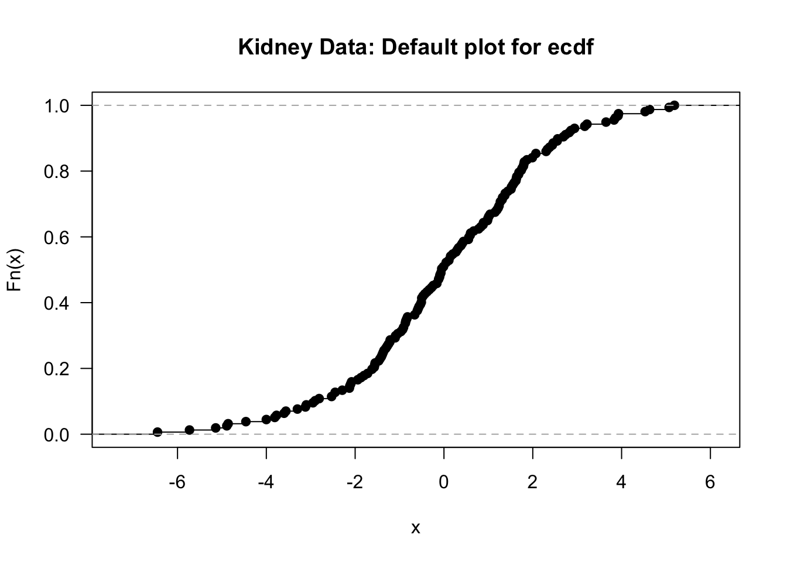

# (PART) Nonparametric Estimation {-} 

# The Empirical Distribution Function {#edf}


## Definition and Basic Properties

* Every random variable has a cumulative distribution function (cdf).

* The cdf of a random variable $X$ is defined as
\begin{equation}
F(t) = P( X \leq t)
\end{equation}

* The empirical distribution function or empirical cumulative distribution function (ecdf)
estimates $F(t)$ by computing the proportion of observations which are less than or equal 
to $t$. 

* For i.i.d. random variables $X_{1}, \ldots, X_{n}$ with cdf $F$, the empirical distribution function
is defined as
\begin{equation}
\hat{F}_{n}(t) = \frac{1}{n}\sum_{i=1}^{n} I( X_{i} \leq t) \nonumber
\end{equation}

* Note that the empirical distribution function can be computed for any type
of data without making any assumptions about the distribution from which 
the data arose.

* The only assumption we are making is that $X_{1}, \ldots, X_{n}$
constitute an i.i.d. sample from some common distribution function $F$.

---


## Confidence intervals for F(t)

* For a fixed value of $t$, the distribution of $\hat{F}_{n}(t)$ is
\begin{equation}
n \hat{F}_{n}(t) \sim \textrm{Binomial}\big( n, F(t) \big)
\end{equation}
(why?)

* For a fixed $t$, $n\hat{F}_{n}(t)$ is the sum of $n$ independent
Bernoulli random variables $W_{1}^{t}, \ldots, W_{n}^{t}$
\begin{equation}
\hat{F}_{n}(t) = \sum_{i=1}^{n} W_{i}^{t} = \sum_{i=1}^{n} I( X_{i} \leq t)
\end{equation}

* The probability that $W_{i}^{t} = 1$ is
\begin{equation}
P( W_{i}^{t} = 1) = P(X_{i} \leq t) = F(t) \nonumber
\end{equation}

---

* Because $\hat{F}_{n}(t)$ is a mean of independent random variables, we can say that
\begin{equation}
\frac{ \sqrt{n}\Big( \hat{F}_{n}(t) - F(t) \Big) }{\sqrt{ \hat{F}_{n}(t)(1 - \hat{F}_{n}(t))}} \longrightarrow \textrm{Normal}\Big(0, 1 \Big)
\end{equation}

* The above asymptotic statement is the basis for constructing **pointwise confidence intervals** for $F(t)$.

* For a fixed $t$, a $95\%$ confidence interval for $F(t)$ is the following
\begin{equation}
CI_{pw}(t) = \Big[ \hat{F}_{n}(t) - z_{0.975}\frac{ \sqrt{ \hat{F}_{n}(t)(1 - \hat{F}_{n}(t)) } }{ \sqrt{n} },
\hat{F}_{n}(t) + z_{0.975}\frac{ \sqrt{ \hat{F}_{n}(t)(1 - \hat{F}_{n}(t)) } }{ \sqrt{n} } \Big]
(\#eq:pointwise-cis)
\end{equation}


## The Empirical Distribution Function in R

* We will see how to work with empirical distribution functions in **R** by using data
from a study on kidney function.

* This dataset has $157$ observations which has the age of each study participant and
a measure of overall kidney function. The data can be obtained at https://web.stanford.edu/~hastie/CASI_files/DATA/kidney.txt

```r
kidney <- read.table("https://web.stanford.edu/~hastie/CASI_files/DATA/kidney.txt", 
                     header=TRUE)
head(kidney)
```

```
##   age   tot
## 1  18  2.44
## 2  19  3.86
## 3  19 -1.22
## 4  20  2.30
## 5  21  0.98
## 6  21 -0.50
```

* The **ecdf** function is the main function which computes the empirical distribution function
in **R**

* The **ecdf** function will create an **ecdf** object. To create an ecdf object
for the kidney totals, use the following code:

```r
kidney.Fhat <- ecdf(kidney$tot)
```

* You can plot the ecdf for the kidney totals by just calling **plot(ecdf)**

```r
plot(kidney.Fhat, main = "Kidney Data: Default plot for ecdf", las=1)
```



* If you don't like the look of the points in the ecdf plot, you can use add the argument
**do.points = FALSE** when calling plot. Also, you can add the argument **verticals =TRUE**
if you want the plot to draw vertical lines whenever there is a jump in the empirical distribution function.


```r
plot(kidney.Fhat, do.points=FALSE, verticals=TRUE, main = "Kidney Data:  ecdf with 
     vertical lines and without points", las=1, lwd=2)
```


---

* **R** does not plot confidence intervals when plotting the empirical distribution function.

* We can do this ourselves, by using the pointwise confidence interval formula shown in \@ref(eq:pointwise-cis)


```r
## 1. First, we will compute the standard errors at each of the observed time points
tt <- sort(unique(kidney$tot)) 
std.err <- sqrt(kidney.Fhat(tt)*(1 - kidney.Fhat(tt))/ length(kidney$tot))

## 2. Now, compute the confidence intervals at each time point
ci.low <- pmax(kidney.Fhat(tt) - qnorm(.975)*std.err, 0)
ci.upper <- pmin(kidney.Fhat(tt) + qnorm(.975)*std.err, 1)

## 3. Now, plot the results. Note that type="s" in the lines function produces
##    "step functions" which pass through the provided points.
plot(kidney.Fhat, las=1, main="Pointwise Confidence Intervals for Kidney data")
```


```r
plot(kidney.Fhat, do.points=FALSE, verticals=TRUE, main = "Kidney Data: 
     pointwise confidence intervals", las=1, lwd=2)
lines(tt, ci.low, type="s", lty=2)
lines(tt, ci.upper, type="s", lty=2)
```


## The Kolmogorov-Smirnov Test


## The empirical distribution function and statistical functionals

