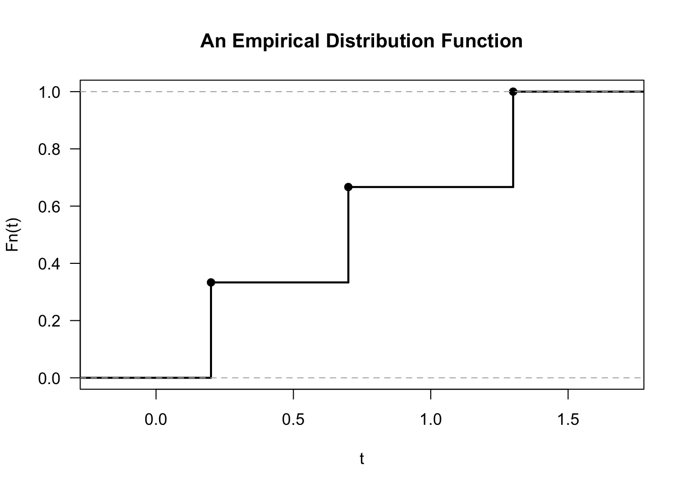

# (PART) Nonparametric Estimation {-} 

# The Empirical Distribution Function {#edf}

## Definition and Basic Properties

* Every random variable has a cumulative distribution function (cdf).

* The cdf of a random variable $X$ is defined as
\begin{equation}
F(t) = P( X \leq t)
\end{equation}

* The empirical distribution function or empirical cumulative distribution function (ecdf)
estimates $F(t)$ by computing the proportion of observations which are less than or equal 
to $t$. 

* For i.i.d. random variables $X_{1}, \ldots, X_{n}$ with cdf $F$, the empirical distribution function
is defined as
\begin{equation}
\hat{F}_{n}(t) = \frac{1}{n}\sum_{i=1}^{n} I( X_{i} \leq t) \nonumber
\end{equation}

* Note that the empirical distribution function can be computed for any type
of data without making any assumptions about the distribution from which 
the data arose.

* The only assumption we are making is that $X_{1}, \ldots, X_{n}$
constitute an i.i.d. sample from some common distribution function $F$.

---


* For example, if we observed $X_{1} = 0.7$, $X_{2} = 0.2$, and $X_{3} = 1.3$,
the corresponding empirical distribution function would be
\begin{equation}
\hat{F}_{3}(t) = 
\begin{cases}
0 & \textrm{ for } t < 0.2  \\
1/3 & \textrm{ for } 0.2 \leq t < 0.7 \\
2/3 & \textrm{ for } 0.7 \leq t < 1.3 \\
1   & \textrm{ for } t \geq 1.3
\end{cases}
\end{equation}




## Confidence intervals for F(t)

* For a fixed value of $t$, the distribution of $n\hat{F}_{n}(t)$ is
\begin{equation}
n \hat{F}_{n}(t) \sim \textrm{Binomial}\big( n, F(t) \big)
\end{equation}

* This is because, for a fixed $t$, $n\hat{F}_{n}(t)$ is the sum of $n$ independent
Bernoulli random variables $W_{1}^{t}, \ldots, W_{n}^{t}$
\begin{equation}
n \hat{F}_{n}(t) = \sum_{i=1}^{n} W_{i}^{t} = \sum_{i=1}^{n} I( X_{i} \leq t)
\end{equation}

* The probability that $W_{i}^{t} = 1$ is
\begin{equation}
P( W_{i}^{t} = 1) = P(X_{i} \leq t) = F(t) \nonumber
\end{equation}

---

**Pointwise Confidence Intervals**

* Because $\hat{F}_{n}(t)$ is a mean of independent random variables, we can say that
\begin{equation}
\frac{ \sqrt{n}\Big( \hat{F}_{n}(t) - F(t) \Big) }{\sqrt{ \hat{F}_{n}(t)(1 - \hat{F}_{n}(t))}} \longrightarrow \textrm{Normal}\Big(0, 1 \Big)
\nonumber
\end{equation}

* The above asymptotic statement is the basis for constructing **pointwise confidence intervals** for $F(t)$.

* For a fixed $t$, a $100 \times (1-\alpha)\%$ confidence interval for $F(t)$ is the following
\begin{eqnarray}
CI_{\alpha}^{pw}(t) &=& [L_{\alpha}^{pw}(t), U_{\alpha}^{pw}(t)] \nonumber \\
L_{\alpha}^{pw}(t) &=& \max\Bigg\{\hat{F}_{n}(t) - z_{1 - \alpha/2} \sqrt{ \frac{\hat{F}_{n}(t)(1 - \hat{F}_{n}(t)) }{n} }, 0 \Bigg\} \nonumber \\
U_{\alpha}^{pw}(t) &=& \min\Bigg\{ \hat{F}_{n}(t) + z_{1 - \alpha/2} \sqrt{ \frac{\hat{F}_{n}(t)(1 - \hat{F}_{n}(t)) }{n} }, 1 \Bigg\}
(\#eq:pointwise-cis)
\end{eqnarray}

* Plotting $CI_{\alpha}^{pw}(t)$ for different values of $t$, would give pointwise confidence intervals
for the distribution function. Plotting pointwise confidence 
intervals for $F(t)$ or for survival functions $S(t) = 1 - F(t)$ is fairly common in practice.

* However, these pointwise confidence intervals only hold for each point separately.


---

**Simultaneous Confidence Bands**

* Simultaneous confidence bands can be thought of as two functions $L_{\alpha}^{band}(t)$ and $U_{\alpha}^{band}(t)$
such that we are "$100 \times (1 - \alpha)$\% confident" that all of $F(t)$ is contained
within the bands $L_{\alpha}^{band}(t)$ and $U_{\alpha}^{band}(t)$.

* Specifically, we want the statement
\begin{equation}
L_{\alpha}^{band}(t) \leq F(t) \leq U_{\alpha}^{band}(t) \quad \textrm{ for all } t
\end{equation}
to hold with at least $1 - \alpha$ probability.

* In other words, we want less than $\alpha$ probability for any part
of the path of $F(t)$ going outside of the bands.

* One choice of $L_{\alpha}^{band}(t)$ and $U_{\alpha}^{band}(t)$ which has this property is the following
\begin{equation}
L_{\alpha}^{band}(t) = \max\{\hat{F}_{n}(t) - \delta_{\alpha,n}, 0 \} \qquad
U_{\alpha}^{band}(t) = \min\{\hat{F}_{n}(t) + \delta_{\alpha,n}, 1 \}, 
(\#eq:simultaneous-cis)
\end{equation}
where $\delta_{\alpha,n}$ is given by
\begin{equation}
\delta_{\alpha, n} = \sqrt{\frac{1}{2n} \ln\Big(\frac{2}{\alpha} \Big)} \nonumber
\end{equation}

---

* The reason this choice of confidence band works is the 
Dvoretzky-Kiefer-Wolfowitz (DKW) inequality.
The DKW inequality states that
\begin{equation}
P\Bigg( \sup_{t} |F(t) - \hat{F}_{n}(t) | > \varepsilon \Bigg) \leq 2 e^{-2n \varepsilon^{2}}
\nonumber
\end{equation}

* Our choice of confidence bands \@ref(eq:simultaneous-cis) then works because 
\begin{equation}
\sup_{t} | F(t) - \hat{F}_{n}(t)| \leq \delta_{\alpha, n} \nonumber
\end{equation}
is equivalent to
\begin{equation}
L_{\alpha}^{band}(t) \leq F(t) \leq U_{\alpha}^{band}(t) \qquad \textrm{for all } t
\nonumber
\end{equation}

* Then, from the DKW inequality we have
\begin{eqnarray}
P\Bigg( L_{\alpha}^{band}(t) \leq F(t) \leq U_{\alpha}^{band}(t) \quad \textrm{for all } t \Bigg)
&=& P\Bigg( \sup_{t} | F(t) - \hat{F}_{n}(t)| \leq \delta_{n, \alpha} \Bigg) \nonumber \\
&\geq& 1 - 2 e^{-2n \delta_{\alpha,n}^{2}} \nonumber \\
&=& 1 - \alpha. \nonumber
\end{eqnarray}


---

* Confidence bands will almost always be wider than 
the pointwise confidence intervals.

* This extra width is due to the fact that we are requiring the coverage probability
to hold for the entire path of $F(t)$ rather than at 
just a single point.


## The Empirical Distribution Function in R

* We will see how to work with empirical distribution functions in **R** by using data
from a study on kidney function.

* This dataset has $157$ observations which has the age of each study participant and
a measure of overall kidney function. The data can be obtained at https://web.stanford.edu/~hastie/CASI_files/DATA/kidney.txt

* We will only look at the **tot** variable in this chapter. 

```r
kidney <- read.table("https://web.stanford.edu/~hastie/CASI_files/DATA/kidney.txt", 
                     header=TRUE)
head(kidney)
```

```
##   age   tot
## 1  18  2.44
## 2  19  3.86
## 3  19 -1.22
## 4  20  2.30
## 5  21  0.98
## 6  21 -0.50
```

* The **ecdf** function is the main function which computes the empirical distribution function
in **R**

* The **ecdf** function will create an **ecdf** object. To create an ecdf object
for the kidney totals, use the following code:

```r
kidney.Fhat <- ecdf(kidney$tot)
```

* You can plot the ecdf for the kidney totals by just calling **plot(ecdf)**

```r
plot(kidney.Fhat, main = "Kidney Data: Default plot for ecdf", las=1)
```


* If you don't like the look of the points in the ecdf plot, you can use add the argument
**do.points = FALSE** when calling plot. Also, you can add the argument **verticals =TRUE**
if you want the plot to draw vertical lines whenever there is a jump in the empirical distribution function.


```r
plot(kidney.Fhat, do.points=FALSE, verticals=TRUE, main = "Kidney Data: 
    ecdf with vertical lines and without points", las=1, lwd=2)
```


---

* A nice feature of of the **ecdf** function is that **ecdf** object
can be treated as a function which computes the empirical distribution function.
For example,

```r
kidney.Fhat <- ecdf(kidney$tot)

kidney.Fhat(0)
```

```
## [1] 0.5095541
```

```r
kidney.Fhat( c(-1,1,4) )
```

```
## [1] 0.3057325 0.6560510 0.9745223
```

---

* **R** does not plot confidence intervals when plotting the empirical distribution function.

* We can do this ourselves, by using the pointwise confidence interval formula shown in \@ref(eq:pointwise-cis)


```r
## 1. First, we will compute the standard errors at each of the 
##    observed time points
tt <- sort(unique(kidney$tot)) 
std.err <- sqrt(kidney.Fhat(tt)*(1 - kidney.Fhat(tt))/ length(kidney$tot))

## 2. Now, compute the confidence intervals at each time point
ci.low <- pmax(kidney.Fhat(tt) - qnorm(.975)*std.err, 0)
ci.upper <- pmin(kidney.Fhat(tt) + qnorm(.975)*std.err, 1)

## 3. Now, plot the results. Note that type="s" in the lines function produces
##    "step functions" which pass through the provided points.
plot(kidney.Fhat, do.points=FALSE, verticals=TRUE, main = "Kidney Data: 
     95% pointwise confidence intervals", las=1, lwd=2)
lines(tt, ci.low, type="s", lty=2, lwd=2)
lines(tt, ci.upper, type="s", lty=2, lwd=2)
```


* We could plot the confidence bands as well.


```r
n <- length(kidney$tot)

## Compute the confidence bands at each time point
ci.band.low <- pmax(kidney.Fhat(tt) - sqrt(log(2/0.05)/(2*n)), 0)
ci.band.upper <- pmin(kidney.Fhat(tt) + sqrt(log(2/0.05)/(2*n)), 1)

plot(kidney.Fhat, do.points=FALSE, verticals=TRUE,
    main = "Kidney Data: 95% Confidence Bands", las=1, lwd=2)
lines(tt, ci.band.low, type="s", lty=2, lwd=2)
lines(tt, ci.band.upper, type="s", lty=2, lwd=2)
```


* Comparing the pointwise confidence intervals and the simultaneous confidence bands
in the same plot shows how much wider the confidence bands are:


## The Kolmogorov-Smirnov Test

* The one-sample Kolmogorov-Smirnov (KS) test is a type of goodness-of-fit test
that is based on the empirical distribution function.

* The KS test will test whether or not our data $X_{1}, \ldots, X_{n}$ comes
from a specific distribution of interest $F_{0}$. 

* Supposing our data $X_{1}, \ldots, X_{n}$ are an i.i.d. sample with distribution 
function $F$, the hypothesis test of interest can be stated as
\begin{equation}
H_{0}: F = F_{0} \quad \textrm{ vs. } \quad H_{A}: F \neq F_{0}
\end{equation}

* The one-sample KS test could be used, for example, as a test of normality. 

---

* The one-sample Kolmogorov-Smirnov test statistic $KS_{n}^{(1)}$ looks at the maximum distance
between the empirical distribution function and $F_{0}$
\begin{equation}
KS_{n}^{(1)} = \sup_{t} \big| \hat{F}_{n}(t) - F_{0}(t)  \big|  \nonumber
\end{equation}

* Large values of $KS_{n}^{(1)}$ provide evidence againts the null hypothesis.

* Under $H_{0}$, $\sqrt{n}KS_{n}^{(1)}$ converges in distribution to a **Kolmogorov distribution**
as $n$ goes to infinity.

* The Kolmogorov distribution has the following cumulative distribution function:
\begin{equation}
F_{Kolmo}(t) = 1 - 2\sum_{j=1}^{\infty} (-1)^{(j+1)} e^{-2j^{2}t^{2}} \nonumber
\end{equation}

* The one-sample KS test can be performed in **R** using the **ks.test** function. 
For one-sample tests, you have to provide the "name" of the distribution function
that you are choosing for $F_{0}$.

```r
xx <- rt(100, df=2) ## generate 100 observations from a t-dist with 2 d.f.
ks.test(xx, y="pnorm")  ## test that these data follow Normal(0, 1)
```

```
## 
## 	One-sample Kolmogorov-Smirnov test
## 
## data:  xx
## D = 0.088956, p-value = 0.4073
## alternative hypothesis: two-sided
```

* You can even test that the data follow some other $\textrm{Normal}(\mu, \sigma^{2})$
by just providing **mean** and **sd** arguments.

```r
ks.test(xx, y="pnorm", mean=1, sd=2)  
```

```
## 
## 	One-sample Kolmogorov-Smirnov test
## 
## data:  xx
## D = 0.30838, p-value = 1.098e-08
## alternative hypothesis: two-sided
```

---

* Suppose we have data from two groups: $X_{1}, \ldots, X_{n} \sim F_{X}$ and $Y_{1}, \ldots, Y_{m} \sim F_{Y}$.
The two-sample KS test performs a test of the following hypothesis
\begin{equation}
H_{0}: F_{X} = F_{Y} \quad \textrm{vs.} \quad H_{A}: F_{X} \neq F_{Y}. \nonumber
\end{equation}

* In this case, we are only testing whether the distributions of the two groups are different.
We are not testing whether observations from group 1 tend to be larger (or smaller)
than those from group 2.

* The two-sample KS test compares the empirical distribution functions from these 
two groups.

* The two-sample KS test statistic is defined as the maximum distance between the
two empirical distribution functions:
\begin{equation}
KS_{n,m}^{(2)} = \sup_{t} \big| \hat{F}_{n,X}(t) - \hat{F}_{m,Y}(t)  \big|  \nonumber
\end{equation}
Here, $\hat{F}_{n,X}(t) = \frac{1}{n}\sum_{i=1}^{n} I(X_{i} \leq t)$ and
$\hat{F}_{m,Y}(t) = \frac{1}{m}\sum_{j=1}^{m} I(Y_{j} \leq t)$ denote
the empirical distribution functions from the X and Y samples.

* The two-sample KS test statistic also converges to the same limit as 
the one-sample KS test statistic. In particular, under $H_{0}$:
\begin{equation}
\sqrt{ \frac{nm}{n + m } }KS_{n,m}^{(2)} \longrightarrow \textrm{Kolmogorov}
\qquad \textrm{ as } n,m \longrightarrow \infty  \nonumber
\end{equation}

---

* The **ks.test** function in **R** also performs two-sample KS tests.

```r
xx <- rnorm(100)
yy <- rlogis(100)
ks.test(xx, yy)  
```

```
## 
## 	Two-sample Kolmogorov-Smirnov test
## 
## data:  xx and yy
## D = 0.18, p-value = 0.07832
## alternative hypothesis: two-sided
```

* We can compute the KS statistic ourselves and check that this matches the value of the KS statistic 
returned by the **ks.test** function:


```r
zz <- c(xx, yy)
zz.order <- sort(zz)
F.x <- ecdf(xx)
F.y <- ecdf(yy)

KS.stat <- max( abs( F.x(zz.order) - F.y(zz.order) ) )
KS.stat
```

```
## [1] 0.18
```


---

* **Exercise 7.1.** Why does
\begin{equation}
KS_{n,m}^{(2)} = \max_{1 \leq i \leq n+m} \big| \hat{F}_{n,X}(Z_{(i)}) -  \hat{F}_{n,Y}(Z_{(i)}) \big|, \nonumber
\end{equation}
where $\mathbf{Z} = (Z_{1}, \ldots, Z_{n+m})$ denotes the pooled sample and $Z_{(1)}, \ldots, Z_{(n+m)}$
denote the order statistics from $\mathbf{Z}$?

---


## The empirical distribution function and statistical functionals

* In many areas of mathematics, it is common to refer to a function
which is a "functions of functions" as a **functional**.

* For example, $T(f)$ which is defined as
\begin{equation}
T(f) = \int_{0}^{1} f^{2}(x) dx
\end{equation}
is a functional because $T(f)$ takes arguments which are functions
and outputs real numbers.

---

* Many common parameters that we encounter in statistics can be thought of
as functionals where the input of the functional is usually a distribution function.

* For example, the mean is an example of a functional
\begin{equation}
\mu(F) = \int x dF(x) = \int x f(x) dx \nonumber 
\end{equation}
As indicated by the notation $\mu(F)$, the value of the mean
depends on the underlying distribution function $F$.

* Also, the variance is an example of a functional
\begin{equation}
\sigma^{2}(F) = \int (x - \mu(F))^{2} dF(x)
= \int x^{2} dF(x) - \mu^{2}(F) \nonumber
\end{equation}

* The median is an example of a functional
\begin{equation}
\textrm{med}(F) = F^{-1}(1/2) \nonumber
\end{equation}

* The tail probability $P(X_{i} > c)$ is also a functional
\begin{equation}
\theta_{c}(F) = \int I(x > c) dF(x) \nonumber
\end{equation}

---

* Many common estimators can be thought of as coming
from "plugging in" the empirical cdf into the appropriate statistical functional.

* For example, plugging in the empirical cdf into the mean functional gives:
\begin{equation}
\mu( \hat{F}_{n} ) = \int x d\hat{F}_{n}(x) = \frac{1}{n}\sum_{i=1}^{n} X_{i} = \bar{X}  \nonumber
\end{equation}

* Plugging in the empirical cdf into the tail probability functional gives
\begin{equation}
\theta_{c}( \hat{F}_{n} ) = \int I(x > c) d\hat{F}_{n}(x) = \frac{1}{n}\sum_{i=1}^{n}I(X_{i} > c)
= 1 - \hat{F}_{n}(c) \nonumber
\end{equation}

* The sample variance is not quite a plug-in estimate for $\sigma^{2}(F)$ but it is very close
\begin{eqnarray}
\sigma^{2}(\hat{F}_{n})
&=& \int x^{2} d\hat{F}_{n}(x) - \mu^{2}(\hat{F}_{n})
= \frac{1}{n} \sum_{i=1}^{n} X_{i}^{2} - \bar{X}^{2} \nonumber \\
&=& \frac{1}{n} \sum_{i=1}^{n} (X_{i} - \bar{X})^{2}
= \frac{n-1}{n} \hat{\sigma}^{2} \nonumber 
\end{eqnarray}

---

* This notation for statistical functionals will be useful when we discuss the bootstrap later in
the course.

* The notation for statistical functionals is also very useful in the context 
of influence functions and robust statistics, but we will not discuss these
topics in this course.

## Additional Reading

* Additional reading which covers the material discussed in this chapter includes:
    + Chapter 2 from @wasserman2006


