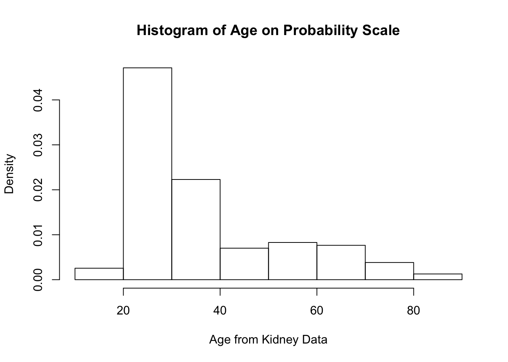
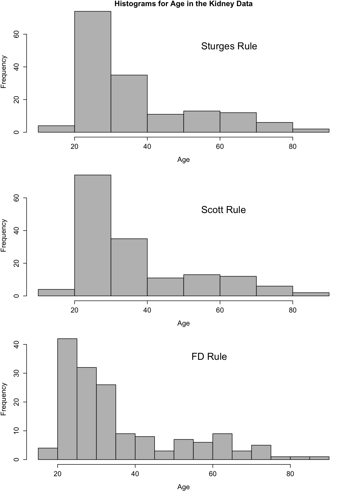

# Density Estimation {#density-estimation}

## Introduction

* In this section, we focus on methods for estimating a **probability density function** (pdf) $f(x)$.

* For a continuous random variable $X$, areas under the probability density function are probabilities
\begin{equation}
P(a < X < b) = \int_{a}^{b} f(x) dx \nonumber
\end{equation}
and $f(x)$ is related to the cumulative distribution function via $f(x) = F'(x)$.

* With parametric approaches to density estimation, you only need to estimate several parameters as
these parameters completely determine the form of $f(x)$.

* For example, with a Gaussian distribution you only need to find $\mu$ and $\sigma^{2}$ to 
determine the form of $f(x)$.

* In a nonparametric approach to estimating, we will assume that our observations $X_{1}, \ldots, X_{n}$
are an independent identically distribution sample from a distribution with pdf $f(x)$, but otherwise we will
make few assumptions about the particular form of $f(x)$.

## Histograms

<div class="figure">

<p class="caption">(\#fig:unnamed-chunk-1)Histogram of ages from kidney function data. Data retrieved from: https://web.stanford.edu/~hastie/CASI_files/DATA/kidney.txt</p>
</div>

### Definition

* While histograms are often thought of as maily a visualization tool,
a histogram can also be thought of as an estimate of the density $f(x)$. 

* To construct a histogram, you first need to define a series
of "bins": $B_{1}, \ldots, B_{D_{n}}$. 

* Each bin is a left-closed interval. The bins are usually
assumed to have the form $B_{k} = [x_{0} + (k-1)h_{n}, x_{0} + kh_{n})$:
\begin{eqnarray}
B_{1} &=& [x_{0}, x_{0} + h_{n}) \nonumber \\
B_{2} &=& [x_{0} + h_{n}, x_{0} + 2h_{n}) \nonumber \\
&\vdots& \nonumber \\
B_{D_{n}} &=& [x_{0} + (D_{n}-1)h_{n}, x_{0} + D_{n}h_{n}) \nonumber 
\end{eqnarray}

* $x_{0}$ - the origin
* $h_{n}$ - bin width
* $D_{n}$ - number of bins

* Histograms are based on the counts $n_{k}$ of observations that fall into each bin:
\begin{eqnarray}
n_{k} &=& \# \text{ of observations falling into the $k^{th}$ bin }  \nonumber \\
&=& \sum_{i=1}^{n} I( x_{0} + (k-1)h_{n} \leq X_{i} < x_{0} + kh_{n}  )
\end{eqnarray}

* From the counts $n_{k}$, the histogram estimate of the density at a point $x$ in 
the $k^{th}$ bin (that is if $x_{0} + (k-1)h_{n} \leq x < x_{0} + kh_{n}$), is defined as
\begin{equation}
\hat{f}_{h_{n}}^{H}(x) = \frac{n_{k}}{nh_{n}}  
(\#eq:hist-density)
\end{equation}

* **Note:** Histogram plots often show the actual bin counts $n_{k}$ rather than 
the values of $\hat{f}_{h_{n}}^{H}(x)$.

---

* To see the motivation for the histogram estimate, notice that if we choose a 
relatively small value $h_{n} > 0$ 
\begin{equation}
P(a < X_{i} < a + h_{n}) = \int_{a}^{a + h_{n}} f(t) dt \approx h_{n}f(c), \nonumber
\end{equation}
for any point $a \leq c \leq a + h_{n}$.

* So, for a point $x \in B_{k}$, the expected value of $\hat{f}_{h_{n}}^{H}(x)$ is
\begin{eqnarray}
E\{ \hat{f}_{h_{n}}^{H}(x) \} &=& \frac{1}{n h_{n}} E\{ n_{k} \} \nonumber \\
&=& \frac{1}{n h_{n}} \sum_{i=1}^{n} P( x_{0} + (k-1)h_{n} \leq X_{i} < x_{0} + kh_{n}  ) \nonumber \\
&=& \frac{1}{h_{n}} P( x_{0} + (k-1)h_{n} \leq X_{i} < x_{0} + kh_{n}  )  \nonumber \\
&\approx& f(x) \nonumber
\end{eqnarray}


### Histograms in R

* In **R**, use histograms are computed using the `hist` function 

```r
hist(x, breaks, probability, plot, ...)
```

* The **breaks** argument
    + Default is "Sturges". This is a method for finding the bin width.
    + Can be a name giving the name of an algorithm for computing bin width
    (e.g., "Scott" and "FD").
    + Can also be a single number. This gives the number of bins used.
    + Could be a vector giving the breakpoints between bins.
    + Could also be a function which computes the number of bins.

* The **probability** argument. If this is set to FALSE, then the 
bin counts are shown in the histogram. If set to TRUE, then the
bin counts divided by $nh_{n}$ are shown in the histogram.

* The **plot** argument. If TRUE, a histogram is plotted
whenever `hist` is called. If FALSE, a histogram is not 
plotted when `hist` is called.

**Note:** The default for R, is to use right-closed intervals $(a, b]$. 
This can be changed using the **right** argument of the **hist** function.

---

* Let's use the kidney function data again to demonstrate the use of histograms in **R**. This time
we will focus on the **age** variable.


```r
kidney <- read.table("https://web.stanford.edu/~hastie/CASI_files/DATA/kidney.txt", 
                     header=TRUE)
```

* You can plot a histogram of **age** just by calling the `hist` function.

```r
kidney.hist <- hist(kidney$age, main="", xlab="Age from Kidney Data")
```


* Use the `probability = TRUE` argument to plot the density-estimate version of histogram.
This histogram should integrate to 1.

```r
kidney.hist2 <- hist(kidney$age, main="Histogram of Age on Probability Scale", 
                     xlab="Age from Kidney Data", probability=TRUE)
```



---

* In addition to generating a histogram plot, the histogram function 
also returns useful stuff.

```r
names(kidney.hist)
```

```
## [1] "breaks"   "counts"   "density"  "mids"     "xname"    "equidist"
```

* **breaks** 
   + the boundaries for the histogram bins. The bins are of the form ( breaks[k], breaks[k+1] ]
* **counts** 
   + the number of observations falling into each bin
* **density**
   + the value of the estimated density within each of the bins
* **mids** 
   + the midpoint of each of the bins


```r
kidney.hist$breaks
```

```
## [1] 10 20 30 40 50 60 70 80 90
```

```r
kidney.hist$counts
```

```
## [1]  4 74 35 11 13 12  6  2
```

```r
## The following sum should match the first element of kidney.hist$counts[1]
sum(kidney.hist$breaks[1] < kidney$age & kidney$age <= kidney.hist$breaks[2]) 
```

```
## [1] 4
```

* Let's check that the density values returned by `hist` match our definition of the histogram density estimate in \@ref(eq:hist-density).


```r
binwidth <- kidney.hist$breaks[2] - kidney.hist$breaks[1]
kidney.hist$density
```

```
## [1] 0.002547771 0.047133758 0.022292994 0.007006369 0.008280255 0.007643312
## [7] 0.003821656 0.001273885
```

```r
kidney.hist$counts/(length(kidney$age)*binwidth)
```

```
## [1] 0.002547771 0.047133758 0.022292994 0.007006369 0.008280255 0.007643312
## [7] 0.003821656 0.001273885
```


### Performance of the Histogram Estimate and Bin Width Selection

#### Bias/Variance Decomposition

* It is common to evaluate the performance of a density estimator
through its **mean-squared error** (MSE).

* In general, MSE is a function of bias and variance
\begin{equation}
\textrm{MSE} = \textrm{Bias}^2 + \textrm{Variance}  \nonumber 
\end{equation}

* We will first look at the mean-squared error of $\hat{f}_{h_{n}}^{H}( x )$ at a single point $x$
\begin{eqnarray}
\textrm{MSE}\{ \hat{f}_{h_{n}}^{H}(x) \} 
&=& E\Big( \{ \hat{f}_{h_{n}}^{H}(x) - f(x) \}^{2}  \Big) \nonumber \\
&=& E\Big( \Big[ \hat{f}_{h_{n}}^{H}(x) - E\{ \hat{f}_{n}^{H}(x) \} + E\{ \hat{f}_{h_{n}}^{H}(x) \} - f(x) \Big]^{2}  \Big) \nonumber \\
&=& E\Big( \Big[ \hat{f}_{h_{n}}^{H}(x) - E\{ \hat{f}_{n}^{H}(x) \} \Big]^{2}  \Big) + E\Big( \Big[ E\{ \hat{f}_{h_{n}}^{H}(x) \} - f(x) \Big]^{2}  \Big) \nonumber \\
&+& 2E\Big( \Big[ \hat{f}_{h_{n}}^{H}(x) - E\{ \hat{f}_{n}^{H}(x) \}\Big]\Big[ E\{ \hat{f}_{h_{n}}^{H}(x) \} - f(x) \Big]  \Big)  \nonumber \\ 
&=& \underbrace{\textrm{Var}\{ \hat{f}_{h_{n}}^{H}(x) \}}_{\textrm{Variance}} + \underbrace{\Big( E\{ \hat{f}_{h_{n}}^{H}(x) \} - f(x)  \Big)^{2} }_{\textrm{Bias Squared}}  \nonumber
\end{eqnarray}

* In general, as the bin width $h_{n}$ increases, the histogram estimate
will have less variation but will become more biased.


#### Bias and Variance of the Histogram Estimate

* Recall that, for a histogram estimate, we have $D_{n}$ bins where the $k^{th}$ bin
takes the form 
\begin{equation}
B_{k} = [x_{0} + (k-1)h_{n}, x_{0} + kh_{n}) \nonumber
\end{equation}

* For a point $x \in B_{k}$, that "belongs" to the $k^{th}$ bin, the histogram density estimate is
\begin{equation}
\hat{f}_{n}^{H}(x) = \frac{n_{k}}{nh_{n}}, \quad \textrm{ where } n_{k} = \textrm{ number of observations falling into bin } B_{k}
\end{equation}

* To better examine what happens as $n$ changes, we will define the function $A_{h_{n}, x_{0}}(x)$ as the function 
which returns the index of the interval to which $x$ belongs.

* For example, if $x_{0} = 0$, $h_{n} = 1/3$, and $x = 1/2$, then $A_{h_{n}, x_{0}}( x ) = 2$. 

* So, we can also write the histogram density estimate at the value $x$ as
\begin{equation}
\hat{f}_{h_{n}}^{H}(x) = \frac{n_{A_{h_{n}, x_{0}}(x)}}{ nh_{n} }  \nonumber
\end{equation}

---

* **Exercise 8.1.** Suppose $x_{0} = -2$ and $h_{n} = 1/2$. What are the values of
$A_{h_{n}, x_{0}}( -1 )$, $A_{h_{n}, x_{0}}( 1.3 )$, and $A_{h_{n}, x_{0}}( 0.75 )$?

---

---

* Note that we can express $n_{A_{h_{n}, x_{0}}(x)}$ as
\begin{equation}
n_{A_{h_{n}, x_{0}}(x)} = \sum_{i = 1}^{n} I\Big( X_{i} \in B_{A_{h_{n}, x_{0}}(x)} \Big) \nonumber
\end{equation}

* Hence, is a binomial random variable with $n$ trials 
and success probability $p_{h_{n}}(x)$ (why?) 
\begin{equation}
n_{A_{h_{n}}(x)} \sim \textrm{Binomial}\{ n, p_{h_{n}, x_{0}}(x) \} \nonumber
\end{equation}

* The success probability $p_{h_{n}, x_{0}}(x)$ is defined as
\begin{eqnarray}
p_{h_{n}, x_{0}}(x) &=& P\Big\{ X_{i} \textrm{ falls into bin } B_{A_{h_{n}, x_{0}}}(x) \Big\}   \nonumber \\
&=& \int_{x_{0} + (A_{h_{n}, x_{0}}(x) - 1)h_{n}}^{x_{0} + A_{h_{n}, x_{0}}(x)h_{n} } f(t) dt.
\end{eqnarray}

---

* Because $n_{A_{h_{n}, x_{0}}(x)}$ follows a binomial distribution, we know that 
\begin{eqnarray}
E( n_{A_{h_{n}, x_{0}}(x)} ) &=& np_{h_{n}, x_{0}}(x)  \nonumber \\ 
\textrm{Var}( n_{A_{h_{n}, x_{0}}(x)} ) &=& np_{h_{n}, x_{0}}(x)\{1 - p_{h_{n},x_{0}}(x) \} \nonumber
\end{eqnarray}

* So, we can express the bias of the histogram density 
estimate $\hat{f}_{h_{n}}^{H}(x) = n_{A_{h_{n}, x_{0}}(x)}/(nh_{n})$ as
\begin{eqnarray}
\textrm{Bias}\{ \hat{f}_{h_{n}}^{H}(x) \} &=& E\{ \hat{f}_{h_{n}}^{H}(x) \} - f(x) \nonumber \\
&=& \frac{1}{nh_{n}}E( n_{A_{h_{n}, x_{0}}(x)} ) - f(x) \nonumber \\
&=& \frac{ p_{h_{n}, x_{0}}(x) }{ h_{n} } - f(x), \nonumber
\end{eqnarray}
and we can express the variance as:
\begin{eqnarray}
\textrm{Var}\{ \hat{f}_{h_{n}}^{H}(x) \}
&=& \frac{1}{n^{2}h_{n}^{2}}\textrm{Var}( n_{A_{h_{n}, x_{0}}(x)} )  \nonumber \\
&=& \frac{ p_{h_{n}, x_{0}}(x)\{1 - p_{h_{n}, x_{0}}(x) \} }{ nh_{n}^{2} } \nonumber
\end{eqnarray}

* Using the approximation $f(t) \approx f(x) + f'(x)(t - x)$ for $t$ close to $x$, we have that
\begin{eqnarray}
\frac{ p_{h_{n}, x_{0}}(x) }{ h_{n} } &=& \frac{1}{h_{n}}\int_{x_{0} + (A_{h_{n}}(x) - 1)h_{n}}^{x_{0} + A_{h_{n}, x_{0}}(x)h_{n} } f(t) dt \nonumber \\
&\approx& f(x) + f'(x)\Big[ h_{n}/2 - [ x - x_{0} - \{ A_{h_{n}, x_{0}}(x) - 1 \}h_{n} ] \Big] \nonumber
\end{eqnarray}

* So, the bias of the histogram density estimate $\hat{f}_{h_{n}}^{H}(x)$ is
\begin{eqnarray}
\textrm{Bias}\{ \hat{f}_{h_{n}}^{H}(x) \} 
&=& \frac{ p_{h_{n}, x_{0}}(x) }{ h_{n} } - f(x)  \nonumber \\
&\approx& f'(x)\Big[ h_{n}/2 - [ x - x_{0} - \{ A_{h_{n}, x_{0}}(x) - 1 \}h_{n} ] \Big] 
(\#eq:approx-bias-hist)
\end{eqnarray}


* Choosing a very small bin width $h_{n}$ will result in a small bias because the left endpoint of the
bin $x_{0} + (A_{h_{n}}(x) - 1)h_{n}$ will always be very close to $x$.

--- 

* Now, let us turn to the variance of the histogram estimate at $x$:
\begin{eqnarray}
\textrm{Var}\{ \hat{f}_{h_{n}}^{H}(x) \} &=& \frac{p_{h_{n}, x_{0}}(x) }{nh_{n}^{2}}\{1 - p_{h_{n}, x_{0}}(x) \}  \nonumber \\
&\approx& \frac{f(x) + f'(x)\{ \tfrac{h_{n}}{2} - [ x - x_{0} - (A_{h_{n}, x_{0}}(x) - 1)h_{n} ] \}}{nh_{n}}\{1 - p_{h_{n}, x_{0}}(x)\}  \nonumber \\
&\approx& \frac{f(x)}{n h_{n} }
(\#eq:approx-var-hist)
\end{eqnarray}

* For a more detailed description of the above approximation see @scott1979.

* Note that large bin widths will reduce the variance of $\hat{f}_{h_{n}}^{H}(x)$.


#### Pointwise Mean Squared Error
* Using \@ref(eq:approx-var-hist) and \@ref(eq:approx-bias-hist), the approximate mean-squared error of the histogram density estimate
at a particular point $x$ is given by
\begin{eqnarray}
\textrm{MSE}\{ \hat{f}_{h_{n}}^{H}(x) \} 
&=& E\Big( \{ \hat{f}_{h_{n}}^{H}(x) - f(x) \}^{2}  \Big) \nonumber \\
&=& \Big( \textrm{Bias}\{ \hat{f}_{h_{n}}^{H}(x) \} \Big)^{2} + \textrm{Var}\{ \hat{f}_{h_{n}}^{H}(x) \} \nonumber \\
&\approx&  \frac{h_{n}^{2}[f'(x)]^{2} }{4} - h_{n}f'(x)[ x - x_{0} - \{ A_{h_{n}, x_{0}}(x) - 1 \}h_{n} ]  \nonumber \\
&+& [f'(x)]^{2}\Big( x - x_{0} - \{ A_{h_{n}, x_{0}}(x) - 1 \}h_{n} \Big)^{2} + \frac{f(x)}{n h_{n} }
(\#eq:mse-hist-decomp)
\end{eqnarray}

* For any approach to bin width selection, we should have $h_{n} \longrightarrow 0$ and 
$nh_{n} \longrightarrow \infty$.

* This MSE approximation depends on a particular choice of $x$.

* Difficult to use \@ref(eq:mse-hist-decomp) as a criterion for selecting the bandwidth
because the best choice of $h_{n}$ will often depend on your choice of $x$.

#### Integrated Mean Squared Error and Optimal Histogram Bin Width

* Using mean integrated squared error (MISE) allows us to find an optimal bin width
that does not depend on a particular choice of $x$.

* The MISE is defined as
\begin{eqnarray}
\textrm{MISE}\{ \hat{f}_{h_{n}}^{H} \} 
&=& E\Big\{ \int_{-\infty}^{\infty} \{ \hat{f}_{h_{n}}^{H}(x) - f(x) \}^{2}dx   \Big\} \nonumber \\
&=& \int_{-\infty}^{\infty} \textrm{MSE}\{ \hat{f}_{h_{n}}^{H}(x) \} dx \nonumber
\end{eqnarray}
Using the previously derived approximation \@ref(eq:mse-hist-decomp) for the MSE, it can be shown that
\begin{eqnarray}
\textrm{MISE}\{ \hat{f}_{h_{n}}^{H} \} \approx
\frac{1}{nh_{n}} + \frac{h_{n}^{2}}{12}\int_{-\infty}^{\infty} [f'(x)]^{2} dx  
(\#eq:mise-formula)
\end{eqnarray}


---

* To select the optimal bin width, we minimize the MISE as a function of $h_{n}$.

* Minimizing \@ref(eq:mise-formula), as a function of $h_{n}$ yields the following formula for the optimal bin width
\begin{equation}
h_{n}^{opt} = \Big( \frac{6}{n \int_{-\infty}^{\infty} [f'(x)]^{2} dx}  \Big)^{1/3} = C n^{-1/3} 
(\#eq:opt-binwidth-hist)
\end{equation}

* Notice that $h_{n}^{opt} \longrightarrow 0$ and $nh_{n}^{opt} \longrightarrow \infty$ as $n \longrightarrow \infty$.

* Notice also that the optimal bin width depends on the unknown quantity $\int_{-\infty}^{\infty} [f'(x)]^{2} dx$.

### Choosing the Histogram Bin Width

* We will mention three rules for selecting the bin width of a histogram.
   + Scott rule: (based on the optimal bin width formula \@ref(eq:opt-binwidth-hist))
   + Friedman and Diaconis rule (also based on the optimal bin width formula \@ref(eq:opt-binwidth-hist))
   + Sturges rule: (based on wanting the histogram to look Gaussian when the data are in fact Gaussian-distributed)

---

* Both Scott and the FD rule are based on the optimal bin width formula \@ref(eq:opt-binwidth-hist).

* The main problem with using the formula \@ref(eq:opt-binwidth-hist) is the presence of $\int_{-\infty}^{\infty} [f'(x)]^{2} dx$.

* **Solution:** See what this quantity looks like if we assume that $f(x)$ corresponds 
to a $N(\mu, \sigma^{2})$ density.

* With this assumption,
\begin{equation}
h_{n}^{opt} = 3.5 \sigma n^{-1/3}  \nonumber
\end{equation}

---

* **Scott rule**: Use $h_{n}^{*} = 3.5 \hat{\sigma} n^{-1/3}$, where $\hat{\sigma}$ denotes the sample standard deviation.

* **FD rule**: Use $h_{n}^{*} = 2 \times IQR \times n^{-1/3}$. This is a somewhat more robust choice of $h_{n}$ as it is not as 
sensitive to outliers.

* **Sturges rule**: The bin width is chosen so that we have $1 + log_{2}(n)$ bins. This choice tends to give wide
intervals. 


## A Box-type Density Estimate

* A related estimator $\hat{f}_{h_{n}}^{B}$ of the density $f(x)$ uses a 
"sliding bin" at each point $x$ to calculate the estimate of $f(x)$.

* Specifically, the "box estimate" $\hat{f}_{h_{n}}^{B}(x)$ at the point $x$ is defined as
\begin{equation}
\hat{f}_{h_{n}}^{B}(x) = \frac{1}{2nh_{n}} \Big[ \# \text{ of observations falling in the interval } (x - h_{n}, x + h_{n}) \Big] \nonumber
\end{equation}

* In other words, for each $x$ we are forming a bin of width $2h_{n}$ around $x$, and we are counting
the number of observations that fall in this bin.

* This is also an intuitive estimator because 
\begin{equation}
E \{ \hat{f}_{h_{n}}^{B}(x) \}
= \frac{1}{2h_{n}} P(x - h_{n} < X_{i}  < x + h_{n}) 
\approx f(x)  \nonumber 
\end{equation}

---

* Unlike the histogram, the box estimate does not require the density estimate 
to be constant within each bin.

* Also, the box estimate will not tend to have as dramatic changes near
the bin edges.

* However, plots of the box estimate will still largely be non-smooth.

---

* We can also express $\hat{f}_{h_{n}}^{B}(x)$ in the following way:
\begin{equation}
\hat{f}_{h_{n}}^{B}(x)
= \frac{1}{n} \sum_{i=1}^{n} \frac{1}{h_{n}} w\Big( \frac{X_{i} - x}{h_{n}} \Big),  
(\#eq:box-density)
\end{equation}
where $w(t)$ is defined as the following "box function"
\begin{equation}
w(t) = 
\begin{cases}
\frac{1}{2} & \textrm{ if } |t| < 1 \nonumber \\
0 & \textrm{ otherwise } \nonumber
\end{cases}
\end{equation}



* While the estimator $\hat{f}_{h_{n}}^{B}$ does seem reasonable, it always
results in density estimates which are not "smooth."

---

* **Exercise 8.2**. Write an **R** function which computes the $\hat{f}_{h_{n}}^{B}(x)$
at a collection of specified points.

---


## Kernel Density Estimation

* Kernel density estimates are a generalization of the box-type density estimate $\hat{f}_{h_{n}}^{B}(x)$.

* Specifically, with kernel density estimation, we are going to replace the "box function" in \@ref(eq:box-density)
with a function which is much smoother. 

* A kernel density estimator $\hat{f}(x)$ is defined as
\begin{equation}
\hat{f}(x) = \frac{1}{nh_{n}} \sum_{i=1}^{n} K\Big( \frac{x - X_{i}}{h_{n}} \Big) \nonumber
\end{equation}

* The function $K( \cdot )$ is referred to as the **kernel function**.

### Kernels, Bandwidth, and Smooth Density Estimation

* Kernel functions are often chosen so that they satisfy the following properties
\begin{eqnarray}
K(t) &\geq& 0 \textrm{ for all } t \nonumber \\
K(t) &=& K(-t) \nonumber \\
\int_{-\infty}^{\infty} K(t) dt &=& 1 \nonumber
\end{eqnarray}

* You can think of $K(u)$ as a probability density function
which is symmetric around $0$.

* When plotting $\frac{1}{h_{n}}K\big( \tfrac{x - X_{i}}{h_{n}} \big)$ as a function of $x$, it should
look like a "small hill" centered around $X_{i}$.

---

* Some of the most common choices of kernel functions include
\begin{eqnarray}
\textrm{Gaussian} :&& \quad  K(u) = \exp(-u^{2}/2)/\sqrt{2\pi} \nonumber \\
\textrm{Epanechnikov} :&& \quad  K(u) = \tfrac{3}{4\sqrt{5}}(1 - \tfrac{1}{5} u^{2}) I(|u| < \sqrt{5}) \nonumber \\
\textrm{biweight} :&& \quad  K(u) = \tfrac{15}{16\sqrt{7}}(1 - \tfrac{1}{7} u^{2})^{2} I(|u| < \sqrt{7}) \nonumber \\
\end{eqnarray}


### Bias and Variance of Kernel Density Estimates

### Bandwidth Selection


## Kernel Density Estimation in Practice


```r
library(MASS)
galaxies[1:5]
```

```
## [1] 9172 9350 9483 9558 9775
```


### Density Estimation in R


### Cross-Validation for Bandwidth Selection


## Additional Reading

* Additional reading which covers the material discussed in this chapter includes:
    + Chapters 2-3 from @silverman2018
    + Chapter 6 from @wasserman2006
    + Chapters 2-3 from @hardle2012
    + Chapter 4 from @izenman2008


