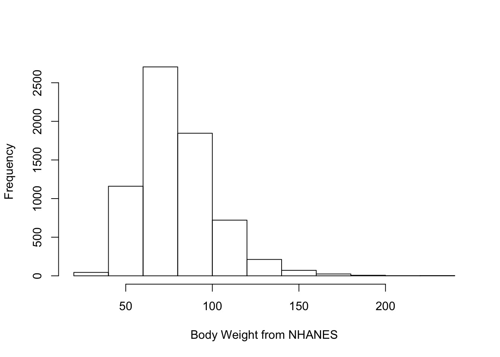
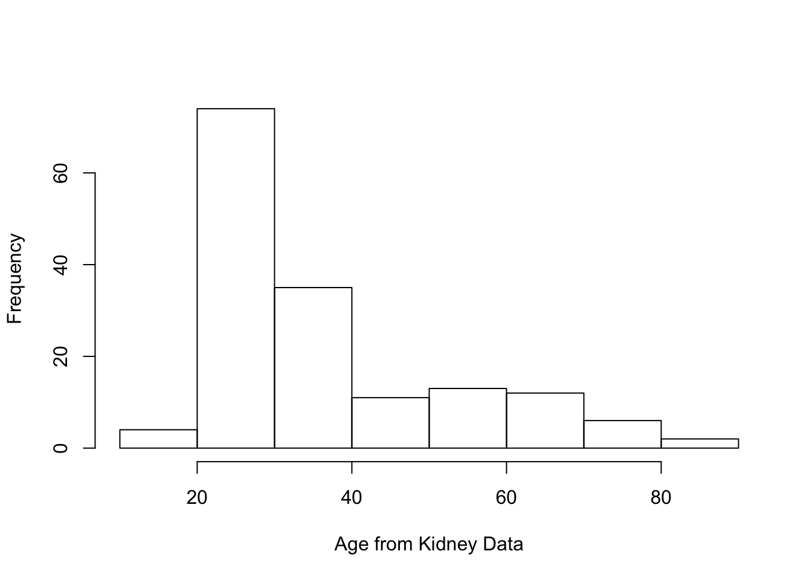

# Density Estimation {#density-estimation}

## Introduction

* In this section, we focus on methods for estimating a **probability density function** (pdf) $f(x)$.

* For a continuous random variable $X$, areas under the probability density function are probabilities
\begin{equation}
P(a < X < b) = \int_{a}^{b} f(x) dx \nonumber
\end{equation}
and $f(x)$ is related to the cumulative distribution function via $f(x) = F'(x)$.

* With parametric approaches to density estimation, you only need to estimate several parameters as
these parameters completely determine the form of $f(x)$.

* For example, with a Gaussian distribution you only need to find $\mu$ and $\sigma^{2}$ to 
determine the form of $f(x)$.

* In a nonparametric approach to estimating, we will assume that our observations $X_{1}, \ldots, X_{n}$
are an independent sample from a distribution having pdf $f(x)$, but otherwise we will
make few assumptions about the particular form of $f(x)$.

## Histograms


### Definition

* While histograms are often thought of as maily a visualization tool,
a histogram can also be thought of as an estimate of the density $f(x)$. 

* To construct a histogram, you first need to define a series
of "bins": $B_{1}, \ldots, B_{D_{n}}$. 

* Each bin is a left-closed interval. The bins are usually
assumed to have the form $B_{k} = [x_{0} + (k-1)h_{n}, x_{0} + kh_{n})$:
\begin{eqnarray}
B_{1} &=& [x_{0}, x_{0} + h_{n}) \nonumber \\
B_{2} &=& [x_{0} + h_{n}, x_{0} + 2h_{n}) \nonumber \\
&\vdots& \nonumber \\
B_{D_{n}} &=& [x_{0} + (D-1)h, x_{0} + D_{n}h_{n}) \nonumber 
\end{eqnarray}

* $x_{0}$ - the origin
* $h_{n}$ - bin width
* $D_{n}$ - number of bins

* Histograms are based on the counts $n_{k}$ of observations that fall into each bin:
\begin{eqnarray}
n_{k} &=& \# \text{ of observations falling into the $k^{th}$ bin }  \nonumber \\
&=& \sum_{i=1}^{n} I( x_{0} + (k-1)h_{n} \leq X_{i} < x_{0} + kh_{n}  )
\end{eqnarray}

* From the counts $n_{k}$, the histogram estimate of the density at a point $x$ in 
the $k^{th}$ bin (that is if $x_{0} + (k-1)h_{n} \leq x < x_{0} + kh_{n}$), is defined as
\begin{equation}
\hat{f}_{h_{n}}^{H}(x) = \frac{n_{k}}{nh_{n}}  \nonumber
\end{equation}

* **Note:** Histogram plots often show the actual bin counts $n_{k}$ rather than 
the values of $\hat{f}_{h_{n}}^{H}(x)$.


---


* To see the motivation for the histogram estimate, notice that if we choose a 
relatively small value $h_{n} > 0$ 
\begin{equation}
P(x < X_{i} < x + h_{n}) = \int_{x}^{x + h_{n}} f(x) dx \approx h_{n}f(x)
\end{equation}

* So, for a point $x \in B_{k}$, the expected value of $\hat{f}_{h_{n}}^{H}(x)$ is
\begin{eqnarray}
E\{ \hat{f}_{h_{n}}^{H}(x) \} &=& \frac{1}{n h_{n}} \sum_{i=1}^{n} P( x_{0} + (k-1)h_{n} \leq X_{i} < x_{0} + kh_{n}  ) \nonumber \\
&=& \frac{1}{h_{n}} P( x_{0} + (k-1)h_{n} \leq X_{i} < x_{0} + kh_{n}  )  \nonumber \\
&\approx& f(x) \nonumber
\end{eqnarray}


### Histograms in R

In **R**, use histograms are computed using the `hist` function 

```r
hist(x, breaks, probability, plot, ...)
```

* The **breaks** argument
    + Default is "Sturges". This is a method for finding the binwidth.
    + Can be a name giving the name of an algorithm for computing binwidth
    (e.g., "Scott" and "FD").
    + Can also be a single number. This gives the number of bins used.
    + Could also be a ..

* The **probability** argument

* The **plot** argument

**Note:** The default for R, is to use right-closed intervals $(a, b]$. 
This can be changed using the **right** argument of the **hist** function.


```r
bodywt.hist <- hist(nhgh$wt, main="", xlab="Body Weight from NHANES")
```




```r
bodywt.hist2 <- hist(nhgh$wt, main="Hist of BW on Probability Scale", 
                     xlab="Body Weight from NHANES", probability=TRUE)
```




In addition to generating a histogram plot, the histogram function 
also returns useful stuff.

```r
names(bodywt.hist)
```

```
## [1] "breaks"   "counts"   "density"  "mids"     "xname"    "equidist"
```
* **breaks** 
   +
* **counts** 
* **mids** 
* **density**


```r
bodywt.hist$breaks
```

```
##  [1]  20  40  60  80 100 120 140 160 180 200 220 240
```

```r
bodywt.hist$counts
```

```
##  [1]   44 1160 2705 1846  721  212   71   24    7    2    3
```


```r
binwidth <- bodywt.hist$breaks[2] - bodywt.hist$breaks[1]
bodywt.hist$density
```

```
##  [1] 3.237675e-04 8.535688e-03 1.990434e-02 1.358352e-02 5.305372e-03
##  [6] 1.559971e-03 5.224430e-04 1.766004e-04 5.150846e-05 1.471670e-05
## [11] 2.207506e-05
```

```r
bodywt.hist$counts/(length(nhgh$wt)*binwidth)
```

```
##  [1] 3.237675e-04 8.535688e-03 1.990434e-02 1.358352e-02 5.305372e-03
##  [6] 1.559971e-03 5.224430e-04 1.766004e-04 5.150846e-05 1.471670e-05
## [11] 2.207506e-05
```

### Performance of the Histogram Estimate

#### Bias/Variance Decomposition

* It is common to evaluate the performance of a density estimator
through its **mean-squared error** (MSE).

* In general, MSE is a function of bias and variance
\begin{equation}
\textrm{MSE} = \textrm{Bias}^2 + \textrm{Variance}
\end{equation}

* We will first look at the mean-squared error of $\hat{f}_{h_{n}}^{H}( x )$ at a single point $x$
\begin{eqnarray}
\textrm{MSE}\{ \hat{f}_{h_{n}}^{H}(x) \} 
&=& E\Big( \{ \hat{f}_{h_{n}}^{H}(x) - f(x) \}^{2}  \Big) \nonumber \\
&=& \underbrace{\Big( E\{ \hat{f}_{h_{n}}^{H}(x) \} - f(x)  \Big)^{2} }_{\textrm{Bias Squared}} + \underbrace{\textrm{Var}\{ \hat{f}_{h_{n}}^{H}(x) \}}_{\textrm{Variance}} \nonumber
\end{eqnarray}

* In general, as the bin width $h_{n}$ increases, the histogram estimate
has less variation but becomes more biased.


#### Bias and Variance of the Histogram Estimate

* Recall that, for a histogram estimate, we have $D_{n}$ bins where the $k^{th}$ bin
takes the form 
\begin{equation}
B_{k} = [x_{0} + (k-1)h_{n}, x_{0} + kh_{n}) \nonumber
\end{equation}

* For a point $x \in B_{k}$, that "belongs" to the $k^{th}$ bin, the histogram density estimate is
\begin{equation}
\hat{f}(x) = \frac{n_{k}}{nh_{n}}, \quad \textrm{ where } n_{k} = \textrm{ number of observations falling into bin } B_{k}
\end{equation}

* To better examine what happens as $n$ changes, we will define the function $A_{h_{n}}(x)$ as the function 
which returns the index of the interval to which $x$ belongs.

* For example, if we had three bins $B_{1} = [0, 1/3)$, $B_{2} = [1/3, 2/3)$, $B_{3} = [2/3, 1)$ and $x = 1/2$,
then $A_{h_{n}}( x ) = 2$. 

* So, we can also write the histogram density estimate as
\begin{equation}
\hat{f}_{h_{n}}^{H}(x) = \frac{n_{A_{h_{n}}(x)}}{nh_{n}}
\end{equation}

---

* Note that $n_{A_{h_{n}}(x)}$ is a binomial random variable with $n$ trials 
and success probability $p_{h_{n}}(x)$ (why?) 
\begin{equation}
n_{A_{h_{n}}(x)} \sim \textrm{Binomial}\{ n, p_{h_{n}}(x) \} \nonumber
\end{equation}

* The success probability $p_{h_{n}}(x)$ is defined as
\begin{equation}
p_{h_{n}}(x) = P\Big\{ X_{i} \textrm{ falls into bin } A_{h_{n}}(x) \Big\} 
= \int_{x_{0} + (A_{h_{n}}(x) - 1)h_{n}}^{x_{0} + A_{h_{n}}(x)h_{n} } f(t) dt.
\end{equation}

---

* Using what is known about the Binomial distribution (i.e., $E( n_{A_{h_{n}}(x)} ) = np_{h_{n}}(x)$ and 
$\textrm{Var}( n_{A_{h_{n}}(x)} ) = np_{h_{n}}(x)\{1 - p_{h_{n}}(x) \}$), we
can express the bias and variance of $\hat{f}_{h_{n}}^{H}(x)$ as
\begin{eqnarray}
\textrm{Bias}\{ \hat{f}(x) \} &=& E\{ \hat{f}(x) \} - f(x) \nonumber \\
&=& \frac{1}{nh_{n}}E( n_{A_{h_{n}}(x)} ) - f(x) \nonumber \\
&=& \frac{ p_{h_{n}}(x) }{ h_{n} } - f(x) \nonumber
\end{eqnarray}
and
\begin{eqnarray}
\textrm{Var}\{ \hat{f}(x) \}
= \frac{1}{n^{2}h_{n}^{2}}\textrm{Var}( n_{A_{h_{n}}(x)} )
= \frac{ p_{h_{n}}(x)\{1 - p_{h_{n}}(x) \} }{ nh_{n}^{2} }
\end{eqnarray}

* Using the approximation $f(t) \approx f(x) + f'(x)(t - x)$ for $t$ close to $x$, we have that
\begin{equation}
\frac{ p_{h_{n}}(x) }{ h_{n} } = \frac{1}{h_{n}}\int_{x_{0} + (A_{h_{n}}(x) - 1)h_{n}}^{x_{0} + A_{h_{n}}(x)h_{n} } f(t) dt
\approx f(x) + f'(x)\{ x - x_{0} - (A_{h_{n}}(x) - 1)h_{n} \}
\end{equation}

* So, the bias of the histogram density estimate $\hat{f}(x)$ is
\begin{equation}
\textrm{Bias}\{ \hat{f}_{h_{n}}^{H}(x) \} 
\approx f'(x)\{ x - (x_{0} + (A_{h_{n}}(x) - 1)h_{n}) \}
\end{equation}

* [[ Double-check this bias formula and check with Scott ]]

* Choosing a very small bin width will result in a small bias because the left endpoint of the
bin $x_{0} + (A_{h_{n}}(x) - 1)h_{n}$ will always be very close to $x$.

--- 

* Now, turning to the variance of the histogram estimate
\begin{equation}
\textrm{Var}\{ \hat{f}_{h_{n}}^{H}(x) \} = \frac{p_{h_{n}}(x) }{nh_{n}^{2}}\{1 - p_{h_{n}}(x)\}
\approx \frac{f(x) + f'(x)\{ x - x_{0} - (A_{h_{n}}(x) - 1)h_{n} \}}{nh_{n}}\{1 - p_{h_{n}}(x)\}
\approx \frac{f(x)}{n h_{n} }
\end{equation}

* For a more detailed description of the above approximation see @scott1979.

* Note that large bin widths will reduce variance.


#### Pointwise Mean Squared Error
* Recalling (), the approximate mean-squared error of the histogram density estimate
at a particular point $x$ is given by
\begin{eqnarray}
\textrm{MSE}\{ \hat{f}_{h_{n}}^{H}(x) \} 
&=& E\Big( \{ \hat{f}_{h_{n}}^{H}(x) - f(x) \}^{2}  \Big) \nonumber \\
&=& \Big( \textrm{Bias}\{ \hat{f}_{h_{n}}^{H}(x) \} \Big)^{2} + \textrm{Var}\{ \hat{f}_{h_{n}}^{H}(x) \} \nonumber \\
&\approx&  [f'(x)]^{2}\{ x - (x_{0} + (A_{h_{n}}(x) - 1)h_{n}) \}^{2} + \frac{f(x)}{n h_{n} }
\end{eqnarray}

* For any approach to bin width selection, we should have $h_{n} \longrightarrow 0$ and 
$nh_{n} \longrightarrow \infty$.

* This MSE approximation depends on a particular choice of $x$.

* Difficult to use () as a criterion for selecting the bandwidth
because this could vary depending on your choice of $x$.

#### Integrated Mean Squared Error and Optimal Histogram Bin Width
* Using mean integrated squared error (MISE) allows us to find an optimal bin width
that does not depend on a particular choice of $x$.

* The MISE is defined as
\begin{eqnarray}
MISE\{ \hat{f}_{h_{n}}^{H}(x) \} 
&=& E\Big\{ \int_{-\infty}^{\infty} \{ \hat{f}_{h_{n}}^{H}(x) - f(x) \}^{2}dx   \Big\} \nonumber \\
&=& \int_{-\infty}^{\infty} \textrm{MSE}\{ \hat{f}_{h_{n}}^{H}(x) \} dx 
\end{eqnarray}
Using our previously derived approximation for the MSE, we have
\begin{eqnarray}
MISE\{ \hat{f}_{h_{n}}^{H}(x) \} &\approx&
\int x [f'(x)]^{2} - x_{0}\int [f'(x)]^{2} dx + (A_{h_{n}}(x) - 1)h_{n}) \}^{2} + \frac{1}{n h_{n} } \int f(x) dx \nonumber \\
&=& 
\end{eqnarray}


---

* To select the optimal bin width, we minimize the MISE as a function of $h_{n}$.

* Minimizing (), as a function of $h_{n}$ yields the following formula for the optimal bin width
\begin{equation}
h_{n}^{opt} = \Big( \frac{6}{n \int_{-\infty}^{\infty} [f'(x)]^{2} dx}  \Big)^{1/3} = C n^{-1/3} \nonumber 
\end{equation}

* Notice that $h_{n}^{opt} \longrightarrow 0$ and $nh_{n}^{opt} \longrightarrow \infty$ as $n \longrightarrow \infty$.

* Notice also that the optimal bin width depends on the unknown quantity $\int_{-\infty}^{\infty} [f'(x)]^{2} dx$.

### Choosing the Histogram Bin Width

* We will mention three rules for selecting the bin width of a histogram.
   + Scott rule: (based on the optimal bin width formula)
   + Friedman and Diaconis rule (also based on the optimal bin width formula)
   + Sturges rule: (based on ...)

---

* Both Scott and the FD rule are based on the optimal bin width formula ().

* The main problem with this formula is the presence of $\int_{-\infty}^{\infty} [f'(x)]^{2} dx$.
* **Solution:** See what this quantity looks like if we assume that $f(x)$ corresponds 
to a $N(\mu, \sigma^{2})$ density.

* With this assumption,
\begin{equation}
h_{n}^{opt} = 3.5 \sigma n^{-1/3}
\end{equation}


* Scott rule: use $\hat{\sigma} = 2$

## A "Naive", Box-type Density Estimate

* A related estimator $\hat{f}_{h_{n}}^{B}$ of the density $f(x)$ uses a 
"sliding bin" at each point $x$ to calculate the estimate of $f(x)$.

* Specifically, the estimate $\hat{f}_{h_{n}}^{B}(x)$ at the point $x$ is defined as
\begin{equation}
\hat{f}_{h_{n}}^{B}(x) = \frac{1}{2nh_{n}} \Big[ \# \text{ of observations falling in the interval } (x - h_{n}, x + h_{n}) \Big] \nonumber
\end{equation}

* In other words, for each $x$ we are forming a bin with width $2h_{n}$ around $x$, and counting
the number of observations that fall in this bin.

* This is also an intuitive estimator because 
\begin{equation}
E \{ \hat{f}_{h_{n}}^{B}(x) \}
= \frac{1}{2h_{n}} P(x - h_{n} < X_{i}  < x + h_{n}) 
\approx f(x)  \nonumber 
\end{equation}

---

* We can also express $\hat{f}_{h_{n}}^{B}(x)$ in the following way:
\begin{equation}
\hat{f}_{h_{n}}^{B}(x)
= \frac{1}{n} \sum_{i=1}^{n} \frac{1}{h_{n}} w\Big( \frac{X_{i} - x}{h_{n}} \Big),  \nonumber
\end{equation}
where $w(t)$ is defined as the following "box function"
\begin{equation}
w(t) = 
\begin{cases}
\frac{1}{2} & \textrm{ if } |t| < 1 \nonumber \\
0 & \textrm{ otherwise } \nonumber
\end{cases}
\end{equation}


* While the estimator $\hat{f}_{h_{n}}^{B}$ does seem reasonable, it always
results in density estimates which are "not smooth."

---

* **Exercise 8.?**. Write an **R** function which computes the $\hat{f}_{h_{n}}^{B}(x)$
at a collection of specified points.

---


## Kernel Density Estimation

* Kernel density estimates are a generalization of the box-type density estimate $\hat{f}_{h_{n}}^{B}(x)$.

* Specifically, with kernel density estimation, we are going to replace the "box function" in ()
with a function which is much smoother. 

### Kernels, Bandwidth, and Smooth Density Estimation

### Bias and Variance of Kernel Density Estimates

### Bandwidth Selection


## Kernel Density Estimation in Practice

### Density Estimation in R


### Cross-Validation for Bandwidth Selection


