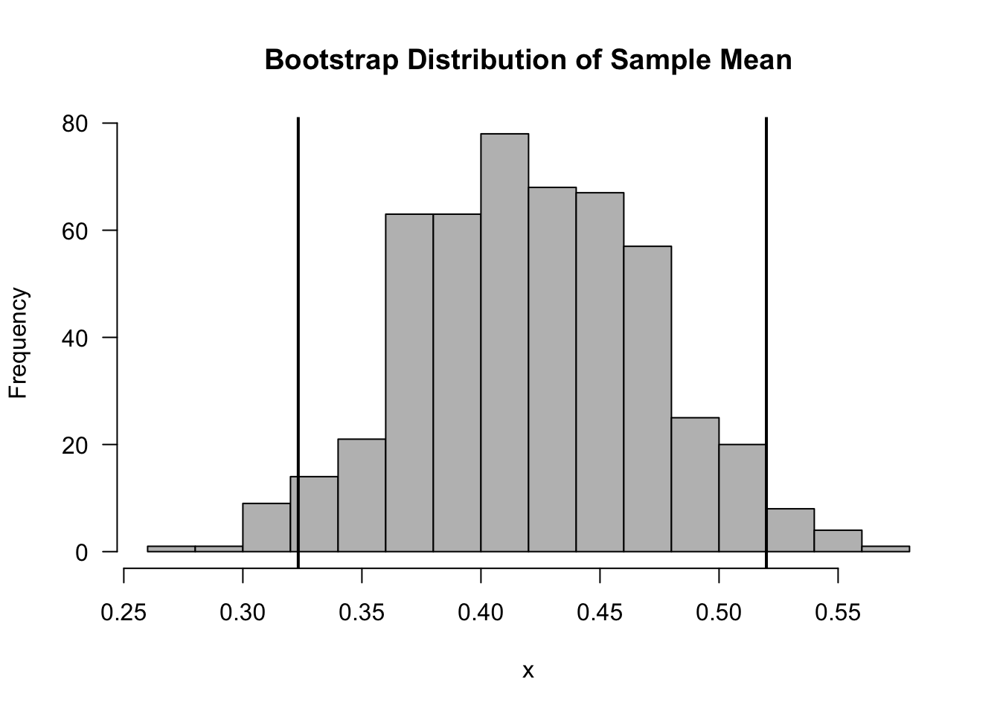

# (PART) Uncertainty Measures {-} 

# The Bootstrap {#bootstrap-main}

## Introduction

* The jackknife and the bootstrap are nonparametric procedures that are mainly used for finding standard errors
and constructing confidence intervals.

**Why use the bootstrap?**

1. To find better standard errors and/or confidence intervals when standard approximations do not work very well.
1. To find standard errors and/or confidence intervals when you have no idea how to compute reasonable standard errors.

## Description of the Bootstrap

* Suppose we have a statistic $T_{n}$ that is an estimate of some quantity of interest $\theta$.

* For example:
    + $T_{n}$ - sample mean, $\theta = E(X_{1})$.
    + $T_{n}$ - sample correlation, $\theta = \textrm{Corr}(X_{1}, Y_{1})$.
    + $T_{n}$ - sample median, $\theta = F^{-1}(1/2)$; that is, the true median. 

* Typically, $T_{n}$ can be represented as a function of our sample $X_{1}, \ldots, X_{n}$
\begin{equation}
T_{n} = h\Big( X_{1}, \ldots, X_{n}   \Big)  \nonumber
\end{equation}

* Suppose we want to estimate the standard deviation of $T_{n}$. The **standard error** 
is the standard deviation of $T_{n}$.

* The bootstrap will estimate the variance of $T_{n}$ by repeatedly subsampling from 
the original data and computing the value of the statistic $T_{n}$ on each subsample. 

* More generally, we can use the bootstrap not just to find the variance of $T_{n}$
but to characterize the distribution of $T_{n}$.

---

* In our description of the bootstrap, we will assume that we have the following ingredients:
    + $\mathbf{X} = (X_{1}, \ldots, X_{n})$ where $X_{1}, \ldots, X_{n}$ are i.i.d. observations.
    + The statistic $T_{n}$ of interest. $T_{n} = h(X_{1}, \ldots, X_{n})$.
    + $T_{n}$ is an estimate of $\theta$.
    + $R$ - the number of bootstrap replications.

* The bootstrap works in the following way:
* For $r = 1, \ldots, R$:
    + Draw a sample of size $n$ $(X_{1}^{*}, \ldots, X_{n}^{*})$ by sampling with replacement from $\mathbf{X}$.
    + Compute $T_{n,r}^{*} = h(X_{1}^{*}, \ldots, X_{n}^{*})$. 

* We will refer to each sample $(X_{1}^{*}, \ldots, X_{n}^{*})$ as a **bootstrap sample**.

* We will refer to $T_{n}^{r}$ as a **bootstrap replication**.

* The bootstrap estimate for the standard error of $T_{n}$ is
\begin{equation}
se_{boot} = \Bigg[ \frac{1}{R-1} \sum_{r=1}^{R} \Big( T_{n,r}^{*} - \frac{1}{R} \sum_{r=1}^{R} T_{n,r}^{*} \Big)^{2} \Bigg]^{1/2} \nonumber
\end{equation}

---


### Example: Confidence Intervals for the Rate Parameter of an Exponential Distribution

* Suppose we have i.i.d. data $X_{1}, \ldots, X_{n}$ from an Exponential distribution with rate parameter $1/\lambda$.
That is, the pdf of $X_{i}$ is
\begin{equation}
f(x)
= \begin{cases}
\frac{1}{\lambda}e^{-x/\lambda} & \text{  if  }  x > 0 \nonumber \\
0  & \text{ otherwise }
\end{cases}
\end{equation}

* This means that 
\begin{equation}
E( X_{i} )  = \lambda \quad \textrm{ and } \quad \textrm{Var}( X_{i} ) = \lambda^{2} \nonumber
\end{equation}

* If using the usual Normal approximation for constructing a confidence interval for $\lambda$, you would
rely on the following asymptotic result:
\begin{equation}
\frac{\sqrt{n}(\bar{X} - \lambda)}{ \bar{X} }  \longrightarrow \textrm{Normal}(0, 1) \nonumber
\end{equation}

* In other words, for large $n$, $\bar{X}$ has an approximately Normal distribution with mean $\lambda$
and standard deviation $\bar{X}/\sqrt{n}$.


* The standard error in this case is $\bar{X}/\sqrt{n}$, and a $95\%$ confidence interval for $\lambda$ is 
\begin{equation}
\Bigg[ \bar{X} - 1.96 \times \frac{\bar{X}}{\sqrt{n}}, \bar{X} + 1.96 \times \frac{\bar{X}}{\sqrt{n}} \Bigg] \nonumber
\end{equation}

---

* Let's do a small simulation to see how the Normal approximation confidence interval compares with
bootstrap-based confidence intervals.

* We will compare the Normal-approximation confidence interval with both the standard-error-based bootstrap
confidence interval and the quantile-based bootstrap confidence interval. 


```r
xx <- rexp(50, rate=2) ## data
R <- 500   ## number of bootstrap replications
boot.mean <- rep(0, R)
for(k in 1:R) {
   boot.samp <- sample(1:50, size=50, replace=TRUE)
   xx.boot <- xx[boot.samp]   ## this is the bootstrap sample
   boot.mean[k] <- mean(xx.boot)  ## compute mean of bootstrap sample
}
```


```r
par.ci <- c(mean(xx) - 1.96*mean(xx)/sqrt(50), mean(xx) + 1.96*mean(xx)/sqrt(50))
boot.ci.sd <- c(mean(xx) - 1.96*sd(boot.mean), mean(xx) + 1.96*sd(boot.mean))
boot.ci.quant <- quantile(boot.mean, probs=c(.025, .975))
```

* The normal-approximation confidence interval is

```r
round(par.ci, 2)
```

```
## [1] 0.31 0.54
```
* The standard-error based boostrap confidence interval is

```r
round(boot.ci.sd, 2)
```

```
## [1] 0.32 0.52
```
* The quantile-based bootstrap confidence interval

```r
round(boot.ci.quant, 2)
```

```
##  2.5% 97.5% 
##  0.32  0.52
```



## Why is the Bootstrap Procedure Reasonable?


