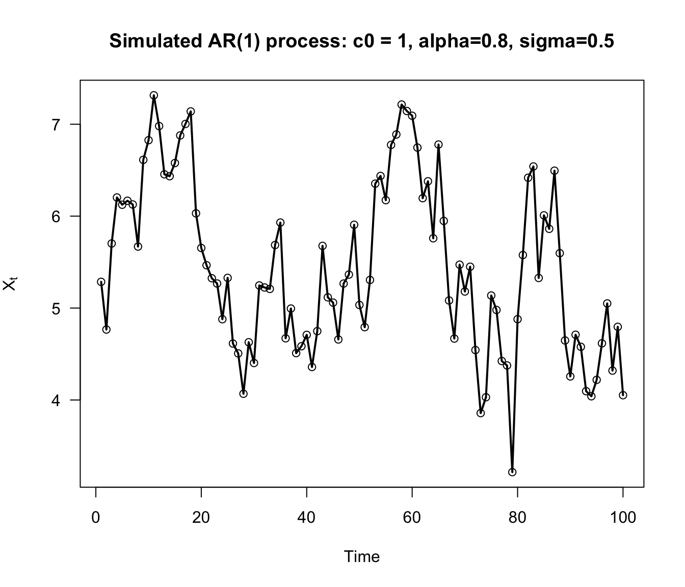
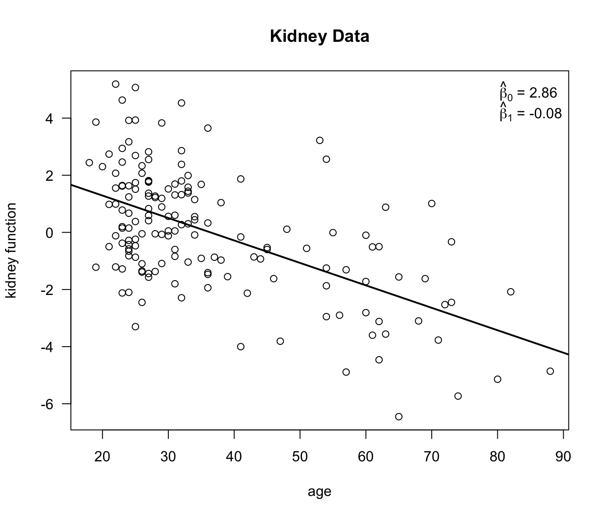

# Bootstrap Examples and the Jackknife {#ci}
 

## The Parametric Bootstrap for an AR(1) model

* Consider the time series $X_{1}, X_{2}, \ldots, X_{m}$. Here,
$X_{t}$ denotes an observation made at time $t$.

* An autoregressive model of order 1 (usually called an AR(1) model) for this time series is
\begin{eqnarray}
X_{1} &=& \frac{c_{0}}{1 - \alpha} + \varepsilon_{1} \nonumber \\
X_{t} &=& c_{0} + \alpha X_{t-1} + \varepsilon_{t}, \qquad t=2,\ldots,m. \nonumber
\end{eqnarray}

* It is usually assumed that $|\alpha| < 1$.

* In the AR(1) model, it is assumed that 
    + $E(\varepsilon_{t}) = 0$
    + $\textrm{Var}(\varepsilon_{t}) = \sigma^{2}$,
    + $\varepsilon_{2}, \ldots, \varepsilon_{m}$ are i.i.d.
    + $\varepsilon_{t}$ and $X_{t-1}$ are independent.

* In addition to these assumptions, we will assume that
\begin{equation}
\varepsilon_{t} \sim \textrm{Normal}(0, \sigma^{2})  \nonumber 
\end{equation}

* The AR(1) model implies that 
\begin{equation}
\textrm{Corr}(X_{t}, X_{t-1}) = \alpha  \nonumber 
\end{equation}
and, more generally, that
\begin{equation}
\textrm{Corr}(X_{t}, X_{t-p}) = \alpha^{p}  \nonumber
\end{equation}


---

* For known values of $c_{0}, \alpha$, and $\sigma^{2}$, we can simulate
an AR(1) time series with the following `R` code:

```r
SimulateParAR1 <- function(m, c0, alpha, sig.sq) {
     xx <- numeric(m)
     xx[1] <- c0/(1 - alpha) + rnorm(1, sd=sqrt(sig.sq))
     for(t in 2:m) { 
         xx[t] <- c0 + alpha*xx[t-1] + rnorm(1, sd=sqrt(sig.sq))
     }
     return(xx)
}
```



 
* In `R`, estimates of $c_{0}, \alpha,$ and $\sigma^{2}$ can be found by using the `ar` function. For example,

```r
x <- SimulateParAR1(1000, 1, 0.8, sig.sq=.25)
ar1.fit <- ar(x, aic=FALSE, order.max = 1, method="mle")

c0.est <- ar1.fit$x.mean*(1 - ar1.fit$ar)
alpha.est <- ar1.fit$ar
sigsq.est <- ar1.fit$var.pred
```

---

* Suppose we want to construct confidence intervals for $\alpha$ and $\sigma$ using a bootstrap method.

* Using the direct, nonparametric bootstrap described in the previous chapter will not work
because our observations are not independent. There are "block bootstraps" that
are designed to work for time series, but we will not discuss those here (see e.g., @buhlmann2002 or Chapter 8 of @davison1997 for 
more details).

* With the parametric bootstrap, we only have to use the following steps to generate bootstrap replications
$\hat{\alpha}_{r}^{*}$ and $\hat{\sigma}_{r}^{2,*}$ for estimates of $\alpha$ and $\hat{\sigma}^{2}$.
 
* For $r = 1, \ldots, R$:
    + Simulate a time series $X_{1}^{*}, \ldots, X_{m}^{*}$ from an AR(1) model with parameters $(\hat{c}_{0}, \hat{\alpha}, \hat{\sigma}^{2})$.
    + Compute $\hat{\alpha}_{r}^{*} = \hat{\alpha}(X_{1}^{*}, \ldots, X_{m}^{*})$.
    + Compute $\hat{\sigma}_{r}^{2,*} = \hat{\sigma}^{2}(X_{1}^{*}, \ldots, X_{m}^{*})$

---

* To see how this parametric bootstrap works, we will use the `nhtemp` dataset that is available in `R`.


* The `nhtemp` dataset contains the mean annual temperature in New Haven, Connecticut from the years 1912-1971

```r
head(nhtemp)
```

```
## [1] 49.9 52.3 49.4 51.1 49.4 47.9
```

* The estimated autocorrelation parameter $\alpha$ is about $0.31$ for this data

```r
ar1.temp <- ar(nhtemp, aic=FALSE, order.max = 1)
c0.hat <- ar1.temp$x.mean*(1 - ar1.temp$ar)
alpha.hat <- ar1.temp$ar
sigsq.hat <- ar1.temp$var.pred
alpha.hat
```

```
## [1] 0.3148269
```

* Now, that we have estimated all the parameter of the AR(1) model, we can run our parametric bootstrap for $\hat{\alpha}$ and $\hat{\sigma}$:

```r
R <- 500
alpha.boot <- numeric(R)
sigsq.boot <- numeric(R)
for(r in 1:R) {
  x <- SimulateParAR1(60, c0=c0.hat, alpha=alpha.hat, sig.sq=sigsq.hat)
  ar1.fit <- ar(x, aic=FALSE, order.max = 1)
  
  alpha.boot[r] <- ar1.fit$ar
  sigsq.boot[r] <- ar1.fit$var.pred
}
```

* Normal bootstrap standard error confidence intervals for $\alpha$ and $\sigma^{2}$ are

```r
round(c(alpha.hat - 1.96*sd(alpha.boot), alpha.hat + 1.96*sd(alpha.boot)), 3)
```

```
## [1] 0.067 0.563
```

```r
round(c(sigsq.hat - 1.96*sd(sigsq.boot), sigsq.hat + 1.96*sd(sigsq.boot)), 3)
```

```
## [1] 0.923 2.013
```

* We can compare our confidence interval for $\alpha$ with the confidence interval
obtained from using a large-sample approximation:

```r
asymp.se <- sqrt(ar1.temp$asy.var.coef)
round(c(alpha.hat - 1.96*asymp.se, alpha.hat + 1.96*asymp.se), 3)
```

```
## [1] 0.071 0.559
```


## Using the Bootstrap in Regression

* In linear regression with a single, univariate covariate, we work with the following model
\begin{equation}
Y_{i} = \beta_{0} + \beta_{1}x_{i} + \varepsilon_{i}, \qquad i = 1, \ldots, n.  \nonumber 
\end{equation}
    + $Y_{i}$ - the responses
    + $x_{i}$ - the covariates
    + $\beta_{0}, \beta_{1}$ - the regression coefficients
    + $\varepsilon_{i}$ - the residuals
    
* Typically, confidence intervals for the regression coefficients $\beta_{0}$ and $\beta_{1}$
are constructed under the assumption that $\varepsilon_{i} \sim \textrm{Normal}(0, \sigma^{2})$.

* The bootstrap allows us to compute confidence intervals for $(\beta_{0}, \beta_{1})$ without
relying on this normality assumption.

* How to compute bootstrap confidence intervals for $\beta_{0}$ and $\beta_{1}$?

---

* The least-squares estimates of $\beta_{0}$ and $\beta_{1}$ are
\begin{equation}
\hat{\beta}_{0} = \bar{y} - \hat{\beta}_{1}\bar{x} \qquad \qquad \hat{\beta}_{1} = \frac{\sum_{i=1}^{n}(x_{i} - \bar{x})(y_{i} - \bar{y})}{S_{xx}}  \nonumber
\end{equation}
where $S_{xx} = \sum_{i=1}^{n}( x_{i} - \bar{x})^{2}$.

* Assuming the covariates are fixed design points, the variance of $\hat{\beta}_{0}$ and $\hat{\beta}_{1}$ are
\begin{equation}
\textrm{Var}(\hat{\beta}_{0}) = \sigma^{2}\Big(\frac{\tfrac{1}{n}\sum_{i=1}^{n} x_{i}^{2}}{S_{xx}} \Big) \qquad \textrm{Var}(\hat{\beta}_{1}) = \frac{\sigma^{2}}{S_{xx}} 
(\#eq:stderr-regression-formulas)
\end{equation}


### Parametric Bootstrap for Regression

* With a parametric bootstrap, we will simulate outcomes $Y_{i}$ from the model
\begin{equation}
Y_{i} = \hat{\beta}_{0} + \hat{\beta}_{1}x_{i} + \varepsilon_{i},  \nonumber
\end{equation}
     + $\hat{\beta}_{0}$ and $\hat{\beta}_{1}$ are the least-squares estimates of $\beta_{0}$ and $\beta_{1}$,
     + $\varepsilon_{1}, \ldots, \varepsilon_{n}$ are i.i.d. random variables with mean zero and variance $\hat{\sigma}^{2}$.

* It is most common to assume that $\varepsilon_{i} \sim \textrm{Normal}(0, \hat{\sigma}^{2})$, 
where $\hat{\sigma}^{2}$ is an estimate of the residual variance.

* However, we could easily use an alternative parametric model for $\varepsilon_{i}$ if we thought
it was appropriate.

---

* A t-distribution with a small number of degrees of freedom can be useful
when the residuals are thought to follow a distribution with "heavier tails".

* If we assume $\varepsilon_{i} \sim \sigma \times t_{3}$, then $\textrm{Var}(\varepsilon_{i}) = 3\sigma^{2}$.

* So, with a $t_{3}$ residual distribution we want to simulate from the model
\begin{equation}
Y_{i} = \hat{\beta}_{0} + \hat{\beta}_{1}x_{i} + \frac{\hat{\sigma}}{\sqrt{3}}u_{i},  \qquad u_{i} \sim t_{3}, \nonumber
\end{equation}
where $\hat{\sigma}^{2}$ is the following estimate of the residual variance:
\begin{equation}
\hat{\sigma}^{2} = \frac{1}{n-2}\sum_{i=1}^{n} (Y_{i} - \hat{\beta}_{0} - \hat{\beta}_{1})^{2} \nonumber
\end{equation}


---

* To show how this parametric-t bootstrap works in practice we will look
at the kidney function data. 

* We will look at a linear regression where the measure of kidney function is 
the outcome and age is the covariate.


```r
kidney <- read.table("https://web.stanford.edu/~hastie/CASI_files/DATA/kidney.txt", 
                     header=TRUE)
```



* Bootstrap replications of $\hat{\beta}_{0}$ and $\hat{\beta}_{1}$ can
be computed using the following `R` code:

```r
## First find the parameter estimates
lm.kidney <- lm(tot ~ age, data=kidney)
beta0.hat <- lm.kidney$coef[1]
beta1.hat <- lm.kidney$coef[2]
sigsq.hat <- sum(lm.kidney$residuals^2)/(157 - 2)

## Using these estimates, run a parametric bootstrap to generate
## bootstrap replications of beta0.hat and beta1.hat
R <- 500
beta0.boot <- numeric(R)
beta1.boot <- numeric(R)
se.beta0.boot <- numeric(R)
se.beta1.boot <- numeric(R)
for(r in 1:R) {
  ysim <- beta0.hat + beta1.hat*kidney$age + sqrt(sigsq.hat/3)*rt(157, df=3)
  lm.boot <- lm(ysim ~ kidney$age)
  
  beta0.boot[r] <- lm.boot$coef[1]
  beta1.boot[r] <- lm.boot$coef[2]
  
  ## This code can be used to find the standard errors from this bootstrap sample
  sig.hatr <- summary(lm.boot)$sigma
  se.beta0.boot[r] <- sig.hatr*sqrt(summary(lm.boot)$cov.unscaled[1,1])
  se.beta1.boot[r] <- sig.hatr*sqrt(summary(lm.boot)$cov.unscaled[2,2])
}
```

---

* Because we have the formulas for the standard errors of $\beta_{0}$ and $\beta_{1}$,
we can use studentized bootstrap confidence intervals without using the double bootstrap approach.

* Estimates of the standard error for the $r^{th}$ bootstrap replication are
\begin{eqnarray}
\hat{se}_{r}(\beta_{0}) &=& \hat{\sigma}_{r}\sqrt{\frac{\tfrac{1}{n}\sum_{i=1}^{n} x_{i}^{2}}{S_{xx}}} \nonumber \\
\hat{se}_{r}(\beta_{1}) &=& \hat{\sigma}_{r}/\sqrt{S_{xx}}
\end{eqnarray}

* These standard error estimates come from applying the formulas in \@ref(eq:stderr-regression-formulas) to the $r^{th}$ bootstrap sample.

* Recall from Chapter 9 that the studentized confidence intervals are found by using the following formula.
\begin{equation}
\Big[ T_{n} - se_{boot} \times \hat{K}_{R}^{-1}(1 - \alpha/2), T_{n} - se_{boot} \times \hat{K}_{R}^{-1}(\alpha/2) \Big] \nonumber
\end{equation}

---


* `R` code to compute the studentized confidence intervals is given below:

```r
## First get estimates of the standard error of our estimates
## I use the formulas for the regression standard errors, but
## we could have used a bootstrap estimate.
se.est0 <- summary(lm.kidney)$sigma*sqrt(summary(lm.boot)$cov.unscaled[1,1])
se.est1 <- summary(lm.kidney)$sigma*sqrt(summary(lm.boot)$cov.unscaled[2,2])

stu.quants0 <- quantile( (beta0.boot - beta0.hat)/se.beta0.boot, probs=c(0.025, 0.975))
stu.quants1 <- quantile( (beta1.boot - beta1.hat)/se.beta1.boot, probs=c(0.025, 0.975))
```


* The studentized bootstrap confidence intervals are then

```r
## Confidence interval for beta0
c(beta0.hat - stu.quants0[2]*se.est0, beta0.hat - stu.quants0[1]*se.est0)
```

```
## (Intercept) (Intercept) 
##        2.17        3.55
```

```r
## Confidence interval for beta1
c(beta1.hat - stu.quants1[2]*se.est1, beta1.hat - stu.quants1[1]*se.est1)
```

```
##     age     age 
## -0.0952 -0.0618
```

* Compare these studentized bootstrap confidence intervals with the confidence 
intervals computed under the normality assumption for the residuals:

```r
confint(lm.kidney)
```

```
##               2.5 %  97.5 %
## (Intercept)  2.1497  3.5703
## age         -0.0965 -0.0607
```

---

* **Exercise 10.1** Using the parametric bootstrap, compute studentized bootstrap confidence for $\beta_{0}$ and $\beta_{1}$ 
in the kidney data example. This time, assume that $\varepsilon_{i} \sim \textrm{Normal}(0, \hat{\sigma}^{2})$.

---

### Nonparametric Bootstrap for Regression
  
* If we think of the $x_{i}$ as fixed values, the $Y_{i}$ in a linear regression are not i.i.d.
because the means are not the same.

* This suggests that we cannot use the usual nonparametric bootstrap to construct confidence 
intervals for $\beta_{0}$ and $\beta_{1}$.

* However, if we also view the $x_{i}$ as random, we can view the **pairs** of
observations $(Y_{1}, x_{1}), \ldots, (Y_{n}, x_{n})$ as i.i.d. observations
from a bivariate distribution.

* In this case, you can also think of $\hat{\beta}_{1}$ as an 
estimate of the following quantity
\begin{equation}
\rho_{YX}\frac{\sigma_{y}}{\sigma_{x}} \nonumber
\end{equation}
where $\rho_{YX} = \textrm{Corr}(Y_{i}, x_{i})$.

* In the case when $(Y_{i}, x_{i})$ are bivariate normal, the conditional expectation
of $Y_{i}$ given $x_{i}$ has the linear regression structure:
\begin{equation}
E(Y_{i}| x_{i}) = \beta_{0} + \beta_{1}x_{i}, \nonumber
\end{equation}
where $\beta_{0} = \mu_{y} - \rho_{YX}\frac{\sigma_{y}\mu_{x}}{\sigma_{x}}$
and $\beta_{1} = \rho_{YX}\frac{\sigma_{y}}{\sigma_{x}}$.

* So, even if the linear model is not exactly true, our estimate and 
confidence interval still has a clear interpretation.

* If the linear model assumption is true, the true standard error of $\hat{\beta}_{0}$ and $\hat{\beta}_{1}$
will be slightly different than the formulas shown in \@ref(eq:stderr-regression-formulas). Nevertheless, 
\@ref(eq:stderr-regression-formulas) can be thought of as consistent estimates of the true standard error.

---

* If we are thinking of the observations $(Y_{1}, x_{1}), \ldots, (Y_{n}, x_{n})$ 
as i.i.d. pairs, we can use the nonparametric bootstrap by just subsampling pairs
of observations.

* So, to generate bootstrap replications $\hat{\beta}_{0,r}^{*}$, $\hat{\beta}_{1, r}^{*}$ for $\hat{\beta}_{0}$
and $\hat{\beta}_{1}$, we just use the following procedure
* For $r = 1, \ldots, R$:
    + Draw a sample of size $n$: $\big((Y_{1}^{*}, x_{1}^{*}), \ldots, (Y_{n}^{*}, x_{n}^{*}) \big)$ by sampling with replacement from the original data.
    + Compute $\hat{\beta}_{0,r}^{*}$ and $\hat{\beta}_{1,r}^{*}$ from this bootstrap sample.

* `R` code for generating these bootstrap replications for the `kidney` data is below:

```r
R <- 500
beta0.boot.np <- numeric(R)
beta1.boot.np <- numeric(R)
se.beta0.boot.np <- numeric(R)
se.beta1.boot.np <- numeric(R)
for(r in 1:R) {
  subsamp.ind <- sample(1:157, size=157, replace=TRUE)
  kidney.tmp <- kidney[subsamp.ind,]
  lm.boot <- lm(tot ~ age, data=kidney.tmp)
  
  beta0.boot.np[r] <- lm.boot$coef[1]
  beta1.boot.np[r] <- lm.boot$coef[2]
  
  ## This code can be used to find the standard errors from this bootstrap sample
  sig.hatr <- summary(lm.boot)$sigma
  se.beta0.boot.np[r] <- sig.hatr*sqrt(summary(lm.boot)$cov.unscaled[1,1])
  se.beta1.boot.np[r] <- sig.hatr*sqrt(summary(lm.boot)$cov.unscaled[2,2])
}
```

* To find the studentized confidence intervals for this nonparametric bootstrap, we can use the following code:

```r
se.est0 <- summary(lm.kidney)$sigma*sqrt(summary(lm.boot)$cov.unscaled[1,1])
se.est1 <- summary(lm.kidney)$sigma*sqrt(summary(lm.boot)$cov.unscaled[2,2])

stu.quants0.np <- quantile( (beta0.boot.np - beta0.hat)/se.beta0.boot.np, 
                            probs=c(0.025, 0.975))
stu.quants1.np <- quantile( (beta1.boot.np - beta1.hat)/se.beta1.boot.np, 
                            probs=c(0.025, 0.975))
```


* The studentized bootstrap confidence intervals for $\beta_{0}$ and $\beta_{1}$ are then

```r
## Confidence interval for beta0
c(beta0.hat - stu.quants0.np[2]*se.est0, beta0.hat - stu.quants0.np[1]*se.est0)
```

```
## (Intercept) (Intercept) 
##        2.13        3.59
```

```r
## Confidence interval for beta1
c(beta1.hat - stu.quants1.np[2]*se.est1, beta1.hat - stu.quants1.np[1]*se.est1)
```

```
##     age     age 
## -0.0954 -0.0598
```
  
---  
 
* **Exercise 10.2** Another way of using the bootstrap in a regression context
is to resample the residuals from the fitted regression model. Speficially,
we first fit the linear regression model and compute residuals $\hat{e}_{1}, \ldots, \hat{e}_{n}$
via
\begin{equation}
\hat{e}_{i} = Y_{i} - \hat{\beta}_{0} - \hat{\beta}_{1}x_{i} \nonumber
\end{equation}
One then generates a bootstrap sample 
by first subsampling $(\hat{e}_{1}^{*}, \ldots, \hat{e}_{n}^{*})$ from the 
vector of "original" residuals $(\hat{e}_{1}, \ldots, \hat{e}_{n})$ and then
setting $Y_{i}^{*} = \hat{\beta}_{0} + \hat{\beta}_{1}x_{i} + \hat{e}_{i}^{*}$.
You then compute the bootstrap replications $\hat{\beta}_{0,r}^{*}$ and $\hat{\beta}_{1,r}^{*}$
by fitting a linear regression with data: $(Y_{1}^{*}, x_{1}), \ldots, (Y_{n}^{*}, x_{n})$. 

Using the kidney data, try using this procedure to construct $95\%$ bootstrap confidence intervals
for $\beta_{0}$ and $\beta_{1}$.
  
---

**Regression with more than 1 covariate**

* If we have more than one covariate in our model, for example,
\begin{equation}
Y_{i} = \beta_{0} + \beta_{1}x_{i1} + \ldots + \beta_{p}x_{ip} + \varepsilon_{i}, \nonumber
\end{equation}
the bootstrap works essentially the same as for the case with a single covariate.

* For the parametric bootstrap with a Normal residual distribution, you would just simulate
$Y_{i}^{*} \sim \textrm{Normal}(\hat{\beta}_{0} + \hat{\beta}_{1}x_{i1} + \ldots + \hat{\beta}_{p}x_{ip}, \hat{\sigma}^{2})$.

* For the nonparametric bootstrap, you would subsample pairs $(Y_{1}^{*}, x_{1}^{*}), \ldots, (Y_{n}^{*}, x_{n}^{*})$ as described before,
and compute your regression coefficients $\hat{\beta}_{0,r}^{*}, \hat{\beta}_{1,r}^{*}, \ldots, \hat{\beta}_{p,r}^{*}$ from this
bootstrap sample.


## Pointwise Confidence Intervals for a Density Function

* Recall that a kernel density estimate of an unknown probability density $f(x)$ has
the form
\begin{equation}
\hat{f}_{h_{n}}(x) = \frac{1}{n h_{n}}\sum_{i=1}^{n} K\Big( \frac{x - X_{i}}{h_{n}} \Big) \nonumber
\end{equation}

* We cannot naively apply the Central Limit Theorem, because $h_{n}$ is changing as $n \longrightarrow \infty$.

* Nevertheless, you can show (see, e.g., @tsybakov2008) that 
\begin{equation}
\sqrt{nh_{n}}\Big( \hat{f}_{h_{n}}(x) - E\{ \hat{f}_{h_{n}}(x) \} \Big) \longrightarrow \textrm{Normal}\big( 0, \kappa_{2}(K) f(x) \big) \nonumber
\end{equation}
provided that $h_{n} \longrightarrow 0$ and $nh_{n} \longrightarrow \infty$. Here, $\kappa_{2}(K) = \int_{-\infty}^{\infty} K^{2}(u) du$.

---

* This suggests that a standard error estimate for $\hat{f}_{h_{n}}(x)$ is $\sqrt{\kappa_{2}(K)\hat{f}_{h_{n}}(x)/nh_{n}}$
and a $95\%$ confidence interval for $E\{ \hat{f}_{h_{n}}(x) \}$ is
\begin{equation}
\Bigg[ \hat{f}_{h_{n}}(x) - 1.96 \times \sqrt{\frac{\kappa_{2}(K) \hat{f}_{h_{n}}(x) }{nh_{n}}},
\hat{f}_{h_{n}}(x) + 1.96 \times \sqrt{\frac{\kappa_{2}(K) \hat{f}_{h_{n}}(x)}{nh_{n}}} \Bigg] \nonumber
\end{equation}

* Notice that this is a confidence interval for $E\{ \hat{f}_{h_{n}}(x) \}$ rather than $f(x)$.

* So, you can roughly think of this as a confidence interval for a smoothed version of $f(x)$ at $x$:
\begin{equation}
E\{ \hat{f}_{h_{n}}(x) \} = \frac{1}{h_{n}}\int_{-\infty}^{\infty} K\Big( \frac{x - t}{h_{n}} \Big) f(t) dt \nonumber
\end{equation}

* Notice also that this is a pointwise confidence interval. It is not a confidence band.

* Methods for computing "bias-corrected" confidence intervals for $f(x)$ are 
discussed, for example, in @chen2017tutorial.

---

* To get a bootstrap estimate of the standard deviation of $\hat{f}_{h_{n}}(x)$, we can use the usual steps. 

* For $r=1, \ldots, R$:
    + Draw a sample of size $n$: $(X_{1}^{*}, \ldots, X_{n}^{*})$ by sampling with replacement from $\mathbf{X}$.
    + Compute $T_{n,r}^{*} = \tfrac{1}{nh_{n}}\sum_{i=1}^{n} K(\tfrac{x - X_{i}^{*}}{ h_{n} } )$. 

Then, compute the estimated standard error:
\begin{equation}
\hat{se}_{boot} = \Big[ \frac{1}{R-1} \sum_{r=1}^{R} \Big( T_{n,r}^{*} - \frac{1}{R} \sum_{r=1}^{R} T_{n,r}^{*} )^{2} \Big]^{1/2}
\end{equation}

* `R` code to compute these standard error estimates for the `sysBP` variable from the `framingham` dataset is given below

```r
framingham <- read.csv("~/Documents/STAT685Notes/Data/framingham.csv")
R <- 500
BootMat <- matrix(0, nrow=R, ncol=4)
for(r in 1:R) {
    xx.boot <- sample(framingham$sysBP, size=length(framingham$sysBP), replace=TRUE)
    kk.boot <- density(xx.boot)
    tmp <- approxfun(kk.boot$x, kk.boot$y)
    BootMat[r,] <- c(tmp(100), tmp(125), tmp(150), tmp(175))
}
bb <- apply(BootMat, 2, sd)
```

<div class="figure">

<p class="caption">(\#fig:unnamed-chunk-21)Bootstrap confidence intervals for the density function at the points x=100, 125, 150, 175</p>
</div>


##  When can the Bootstrap Fail?

* While the bootstrap is very automatic and could be used to construct confidence intervals
in nearly any situation, these bootstrap confidence intervals may fail to give
the correct coverage in some situations.

* A few situations in which the bootstrap can fail include:
    + If we are interested in estimating a parameter $\theta$ and the support $\{ x: f_{\theta}(x) > 0\}$ of the density function depends on $\theta$.
    + If there are parameter constraints and the true value of the parameter lies on the boundary of the parameter space. For example, we estimate $\theta$ subject to the constraint that $\theta \geq 0$, and the true value of $\theta$ is zero. 
    + If $T_{n} = g(\bar{X})$ and $g'(\mu) = 0$ where $\mu = E(X_{1})$.
    + No finite mean. If $E(|X_{1}|)$ is not finite, then the bootstrap may not work well.


### Example: The Shifted Exponential Distribution

* Let us consider observations $X_{1}, \ldots, X_{n}$ that follow the shifted exponential distribution whose 
density function is 
\begin{equation}
f(x)
= \begin{cases}
\lambda e^{-\lambda(x - \eta)} & \textrm{ if } x \geq \eta \nonumber \\
0 & \textrm{otherwise}  \nonumber
\end{cases}
\end{equation}
where $\lambda > 0$ and $\eta > 0$.

* The maximum likelihood estimates of $\lambda$ and $\eta$ are
\begin{equation}
\hat{\lambda} = \frac{1}{\bar{X}} - X_{(1)} \qquad \hat{\eta} = X_{(1)}  \nonumber
\end{equation}
where $X_{(1)} = \min\{ X_{1}, \ldots, X_{n} \}$ is the smallest observation. 

* Notice that this is an example where the support of the density function depends 
on the parameter $\eta$. 

* Suppose we use the bootstrap to construct confidence intervals for $\lambda$ and $\eta$.
What will happen?

---

* Let us consider an example where we have i.i.d. data $X_{1}, \ldots, X_{n}$ that follow
a shifted Exponential distribution with $\lambda = 1/3$ and $\eta = 2$.

* The following code can estimate the coverage proportion of a bootstrap 
confidence interval for $\eta$:

```r
n <- 200
R <- 500
eta.true <- 2

nreps <- 500
Cover.bootsd.ci <- numeric(nreps)
for(k in 1:nreps)  {
  ## Step 1: Generate the Data and compute the estimate of eta
  xx <- 2 + rexp(n, rate=1/3) 
  eta.hat <- min(xx)
  
  ## Step 2: Find bootstrap confidence intervals using R bootstrap replications
  eta.boot <- numeric(R)
  for(r in 1:R)   {
    boot.xx <- sample(xx, size=n, replace = TRUE)
    eta.boot[r] <- min(boot.xx)
  }
  boot.ci.sd <- c(eta.hat - 1.96*sd(eta.boot), eta.hat + 1.96*sd(eta.boot))
  
  ## Step 3: Record if the true parameter is covered or not:
  Cover.bootsd.ci[k] <- ifelse(boot.ci.sd[1] < eta.true & boot.ci.sd[2] >= eta.true, 
                               1, 0)
}
```

* The estimated coverage for this bootstrap confidence interval is

```r
mean(Cover.bootsd.ci)
```

```
## [1] 0.79
```


## The Jackknife

* The jackknife is also a nonparametric method for estimating standard errors.

* Like the bootstrap, the jackknife also uses the idea of looking at
multiple subsets of the data.

* Also like the bootstrap, the jackknife is completely automatic in the sense
that we only need to be able to compute our statistic of interest, and
we do not need to do any formal calculations to find the standard error.

* While the jackknife was actually developed before the bootstrap, it is
used much less than the bootstrap is in applications - at least 
in the context of finding confidence intervals.

---

* We will define $\mathbf{X}_{-i}$ to be the vector of observations
that has the $i^{th}$ observation deleted:
\begin{equation}
\mathbf{X}_{(-i)} = (X_{1}, \ldots, X_{i-1}, X_{i+1}, \ldots, X_{n})  \nonumber
\end{equation}

* Define $T_{n,(-i)}$ to be the value of the statistic $T_{n}$ when using 
data which has the $i^{th}$ observation removed
\begin{equation}
T_{n, (-i)} = h(X_{1}, \ldots, X_{i-1}, X_{i+1}, \ldots, X_{n})  \nonumber
\end{equation}

* The jackknife estimate of the standard error of $T_{n}$ is
\begin{equation}
\hat{se}_{jack} = \Big[ \frac{n-1}{n} \sum_{i=1}^{n} ( T_{n, (-i)} - \bar{T}_{n, jack} )^{2}  \Big]^{1/2}, \nonumber 
\end{equation}
where $\bar{T}_{n,jack} = \tfrac{1}{n} \sum_{i=1}^{n} T_{n, (-i)}$. 

---

* An advantage of the jackknife is that, like the bootstrap, it does not
make any particular parametric assumptions about the distribution of the data.

* However, the jackknife is more dependent on a smoothness assumption (that is smoothness
across slightly perturbed datasets) than the bootstrap. An example of this is the 
sample median where, if we delete one observation, the sample median has
a different definition due to the sample size being even vs. odd.


