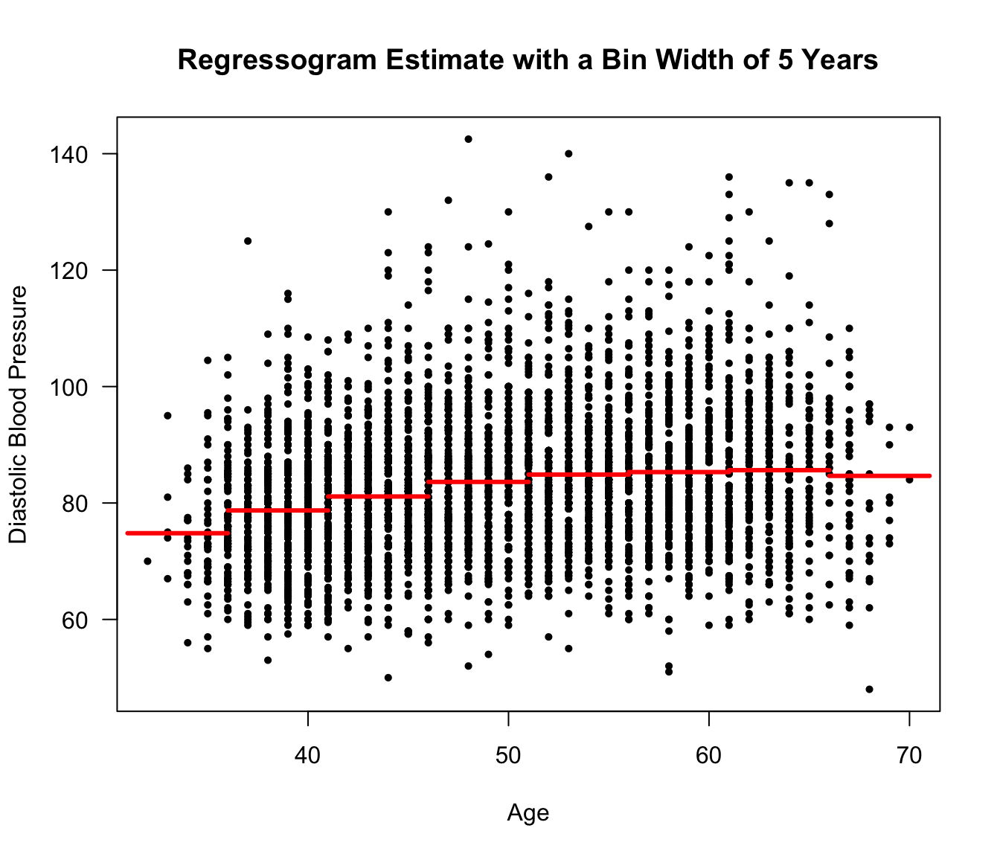

# (PART) Nonparametric Regression: Part I {-}

# Kernel Regression and Local Regression
 
## Introduction

* In regression we are interested in characterizing, in some way, the relationship
between a collection of responses $Y_{1},\ldots,Y_{n}$ and covariate vectors
$(\mathbf{x}_{1}, \ldots, \mathbf{x}_{n})$.

* Linear regression is one way of approaching this problem. This assumes
the expectation of $Y_{i}$ can be expressed as a linear combination
of the covariates:
\begin{equation}
E(Y_{i}| \mathbf{x}_{i}) = \beta_{0} + \sum_{j=1}^{p} x_{ij}\beta_{j}  \nonumber
\end{equation}

* More generally, we can consider the following model
\begin{equation}
Y_{i} = m( \mathbf{x}_{i} ) + \varepsilon_{i}  \nonumber
\end{equation}
    + $m(\mathbf{x}_{i})$ - the "mean function" or "regression function"
    + $\mathbf{x}_{i} = (x_{i1}, \ldots, x_{ip})$ - the $i^{th}$ covariate vector
    
* The residuals $\varepsilon_{1}, \ldots, \varepsilon_{n}$ are assumed to 
be i.i.d. and have mean zero. 

---

* In a nonparametric approach, we will try to estimate $m(\mathbf{x})$ without
making any strong assumptions about the form of $m( \mathbf{x} )$. 

* The regression function $m(\mathbf{x})$ can be thought of as the function which returns 
the expectation of $Y_{i}$ given that $\mathbf{x}_{i} = \mathbf{x}$
\begin{equation}
m(\mathbf{x} ) = E(Y_{i}|\mathbf{x}_{i}=\mathbf{x}) 
\end{equation}

* Let
    + $f_{Y|X}(y|\mathbf{x})$ denote the conditional density of $Y_{i}$ given $\mathbf{x}_{i}$.
    + $f_{Y,X}(y, \mathbf{x})$ denote the joint density of $(Y_{i}, \mathbf{x}_{i})$
    + $f_{X}(\mathbf{x})$ denote the density of $\mathbf{x}_{i}$
    
* We can express the regression function as
\begin{equation}
m(\mathbf{x}) = \int_{-\infty}^{\infty} y f_{Y|X}(y|\mathbf{x}) dy = \frac{\int y f_{Y,X}(y, \mathbf{x}) dy}{ f_{X}(\mathbf{x})  }  \nonumber
\end{equation}

## Kernel Regression

* In this section, we will assume that the covariates are univariate. 
That is, $p=1$ and $\mathbf{x}_{i} = x_{i}$ where $x_{i}$ is a real number.

### The Regressogram

* The regressogram is an estimate of the mean function $m(x)$ which is 
has many similarities in its construction to the histogram.

* Similar to how we constructed the histogram, let us think about an estimate $m(x)$
that will be constant within each of a series of bins $B_{1}, \ldots, B_{D_{n}}$
\begin{eqnarray}
B_{1} &=& [ x_{0}, x_{0} + h_{n})  \nonumber \\
B_{2} &=& [x_{0} + h_{n}, x_{0} + 2h_{n})  \nonumber \\
&\vdots&  \nonumber \\
B_{D_{n}} &=& [x_{0} + (D_{n} - 1)h_{n}, x_{0} + D_{n}h_{n})  \nonumber
\end{eqnarray}

* Suppose we want to estimate $m(x)$, where $x$ belongs to the $k^{th}$ bin.
A direct estimate of this is the average of the $Y_{i}'s$ among those
$x_{i}'s$ which fall into the $k^{th}$ bin.

* Specifically, if $x \in B_{k}$, then we estimate $m(x)$ with
\begin{equation}
\hat{m}_{h_{n}}^{R}(x) =  \frac{ \sum_{i=1}^{n} Y_{i} I\big( x_{i} \in B_{k} \big) }{ \sum_{i=1}^{n} I\big( x_{i} \in B_{k} \big) } 
= \frac{1}{n_{k,h_{n}}} \sum_{i=1}^{n} Y_{i} I\big( x_{i} \in B_{k} \big), \nonumber
\end{equation}
where $n_{k,h_{n}}$ is the number of $x_{i}$ that fall into the $k^{th}$ bin when using bin width $h_{n}$.

---

* The estimate $\hat{m}_{h_{n}}^{R}(x)$ of the regression function is called the **regressogram**.

* The intuition for this estimate is: if $x \in B_{k}$,
then taking an average of the reponses for $x_{i}$ in a small bin containing $x$ 
should give us a reasonable approximation for the expectation of $Y_{i}$ given that $x_{i} = x$.

* Another way of looking at the regressogram is to note that for $x \in B_{k}$
\begin{eqnarray}
E\Big\{ \frac{1}{n} \sum_{i=1}^{n} Y_{i} I\big( x_{i} \in B_{k} \big) \Big\}
&=& E\Big\{  Y_{1} I\big( x_{1} \in B_{k} \big) \Big\}  \nonumber \\
&=& \int_{-\infty}^{\infty} \int_{x_{0} + (k-1)h_{n}}^{x_{0} + kh_{n}} y f_{Y,X}(y, t) dt dy  \nonumber \\
&\approx& h_{n} \int_{-\infty}^{\infty} y f_{Y,X}(y, x) dy
(\#eq:regressogram-numerator)
\end{eqnarray}
and, similarly, 
\begin{eqnarray}
E\Big\{ \frac{1}{n} \sum_{i=1}^{n}  I\big( x_{i} \in B_{k} \big) \Big\}
&=& E\Big\{  I\big( x_{1} \in B_{k} \big) \Big\}  \nonumber \\
&=& \int_{x_{0} + (k-1)h_{n}}^{x_{0} + kh_{n}}  f_{X}(t) dt  \nonumber \\
&\approx& h_{n} f_{X}(x) 
(\#eq:regressogram-denominator)
\end{eqnarray}

* Equations \@ref(eq:regressogram-numerator) and \@ref(eq:regressogram-denominator) suggest that $\hat{m}_{h_{n}}^{R}(x)$
should be a reasonable estimate of the ratio 
\begin{equation}
\int_{-\infty}^{\infty} y f_{Y,X}(y, x) dy \big/ f_{X}(x) \nonumber 
\end{equation}

---

<div class="figure">

<p class="caption">(\#fig:unnamed-chunk-1)Framingham Data. Regressogram estimate for a regression model with diastolic blood pressure as the response and age as the covariate. Ages from 31-71 were separated into bins of width 5 years.</p>
</div>


---

* **Exercise 11.1** Let 
\begin{equation}
\hat{\mathbf{m}} = \big( \hat{m}_{h_{n}}^{R}(x_{1}), \ldots, \hat{m}_{h_{n}}^{R}(x_{n}) \big)  \nonumber
\end{equation}
denote the vector of "fitted values" from a regressogram estimate that has $D_{n}$ bins. 
If $\mathbf{Y} = (Y_{1}, \ldots, Y_{n})$, show that you can express $\hat{\mathbf{m}}$ as 
\begin{equation}
\hat{\mathbf{m}} = \mathbf{A}\mathbf{Y}, \nonumber
\end{equation}
for an appropriately chosen $n \times n$ matrix $\mathbf{A}$.
What is the value of $\textrm{tr}(\mathbf{A})$?

---


### The Local Average Estimator

* The regressogram can be thought of as a regression analogue of the histogram.

* The local average estimator can be thought of as a regression analogue of the
"box-type" density estimator that we described in Chapter 8.

---

* For each point $x$, we are going to use a regression function estimate which
has a bin "centered" at $x$.

* Specifically, for each $x$, we will form a bin of width $2h_{n}$ around
$x$ and compute the mean of the $Y_{i}$ among those observations where the $x_{i}$ fall
into this bin. 

* In other words, we are computing an average of the $Y_{i}$ in a small region
around $x$. 

* The local average estimator $\hat{m}_{h_{n}}^{loc}(x)$ at $x$ is defined as:
\begin{eqnarray}
\hat{m}_{h_{n}}^{loc}(x) &=&
\frac{ \sum_{i}^{n} Y_{i}I\big( x - h_{n} < x_{i} < x + h_{n} \big) }{ \sum_{i}^{n} I\big( x - h_{n} < x_{i} < x + h_{n} \big) } \nonumber \\
&=& \frac{1}{n_{h_{n}}(x)} \sum_{i}^{n} Y_{i}I\big( x - h_{n} < x_{i} < x + h_{n} \big) \nonumber 
\end{eqnarray}
where $n_{h_{n}}(x) = \sum_{i}^{n} I\big( x - h_{n} < x_{i} < x + h_{n} \big)$.

* The local average estimator does not need to have a 
constant value within each of a few pre-specified bins.

---

* We can also express the local average estimator in the following way:
\begin{equation}
\hat{m}_{h_{n}}^{loc}(x)
= \frac{\sum_{i=1}^{n} Y_{i} w\Big( \frac{x - X_{i}}{h_{n}} \Big)}{\sum_{i=1}^{n} w\Big( \frac{x - X_{i}}{h_{n}} \Big)}, 
(\#eq:local-average-estimator)
\end{equation}
where $w(t)$ is the "box" function defined as
\begin{equation}
w(t) = 
\begin{cases}
\frac{1}{2} & \textrm{ if } |t| < 1 \nonumber \\
0 & \textrm{ otherwise}  \nonumber
\end{cases}
\end{equation}

* While a local average estimate will not be a "step function" like the regressogram, the local average
estimate will typically be non-smooth and have a jagged appearance.

---

* Like kernel density estimation, there is a bias/variance tradeoff to the choice of $h_{n}$.

* Smaller values of $h_{n}$ usually imply higher variance because you will be taking an
average over a relatively small number of observations.

* Larger values of $h_{n}$ usually imply higher bias because 
you will be esitmating $m(x)$ by averaging over a wide range
of $x_{i}$ values, and $m(x)$ could vary substantially over this range of $x_{i}$ values.

* Our experience in Chapter 8 suggests that we can get a smoother estimate of 
the regression if we simply replace the "box function" $w(t)$ in \@ref(eq:local-average-estimator) with a
smoother kernel function $K(t)$.

---

* `R` code for computing a local average estimate $\hat{m}_{2}^{loc}(x)$ at the 
points $x = 31, 32, 33, ...., 71$ is given below

```r
xseq <- seq(31, 71, by=1)
hn <- 2
nx <- length(xseq)
m.hat.loc <- numeric(nx)
for(k in 1:nx) {
    in.bin <- framingham$age > xseq[k] - hn & framingham$age < xseq[k] + hn
    m.hat.loc[k] <- mean(framingham$diaBP[in.bin])
}

plot(framingham$age, framingham$diaBP, las=1, ylab="Diastolic Blood Pressure", 
     xlab="Age", main="Local Average Estimate with hn=2", type="n")
points(framingham$age, framingham$diaBP, pch=16, cex=0.7)
lines(xseq, m.hat.loc, lwd=3, col="red")
```


---

* Let's also look at a local average estimate of the regression function for the bone mineral density dataset.

* The responses in this dataset are relative changes in the bone mineral density of adolescents.

* Specifically, reponses $Y_{i}$ and covariates $x_{i}$ are defined as
\begin{eqnarray}
Y_{i} &=& \frac{\textrm{Mineral Density at Visit 2}_{i} - \textrm{Mineral Density at Visit 1}_{i}}{\tfrac{1}{2}(\textrm{Mineral Density at Visit 2}_{i} + \textrm{Mineral Density at Visit 1}_{i})}  \nonumber \\
x_{i} &=& \frac{1}{2}(\textrm{Age at Visit 2}_{i} + \textrm{Age at Visit 1}_{i})  \nonumber
\end{eqnarray}


```r
tmp <- read.table("https://web.stanford.edu/~hastie/ElemStatLearn/datasets/bone.data", 
                  header=TRUE)
bonedat <- tmp[!duplicated(tmp$idnum),]  ## only keep the first observation of a person
```


```r
xseq <- seq(9.4, 25.2, by=.1)
hn <- 1
nx <- length(xseq)
m.hat.loc <- numeric(nx)
for(k in 1:nx) {
    in.bin <- bonedat$age > xseq[k] - hn & bonedat$age < xseq[k] + hn
    m.hat.loc[k] <- mean(bonedat$spnbmd[in.bin])
}

plot(bonedat$age, bonedat$spnbmd, las=1, ylab="Relative Change in Bone MD", 
     xlab="Age", main="Bone Data: Local Average Estimate with hn=1", type="n")
points(bonedat$age, bonedat$spnbmd, pch=16, cex=0.7)
lines(xseq, m.hat.loc, lwd=3, col="red")
abline(0, 0)
```


### k-Nearest Neighbor (k-NN) Regression

* k-nearest neighbor regression is fairly similar to the local average estimator
of the regression function.

* With k-NN, we still estimate the regression function at a particular point
by taking a type of local average around this point.

* However, k-NN takes the average over the k "nearest observation" to $x$
rather than taking an average over all the observations which fall into
a bin centered at $x$.

---

* The k-NN estimator of the regression function $\hat{m}_{k}^{kNN}(x)$ is defined as
\begin{equation}
\hat{m}_{k}^{kNN}(x) = \frac{1}{k}\sum_{i=1}^{n} y_{i} I\big( x \in N_{k}(x) \big) \nonumber
\end{equation}

* Here, $N_{k}(x)$ is defined as the set of the k $x_{i}'s$ which are
closest to $x$. That is, $N_{k}(x)$ is the set of the k "nearest neighbors"
to $x$. 

* Mathematically, if we define 
\begin{equation}
d_{i}(x) = |x_{i} - x| \nonumber
\end{equation}
and order them so that $d_{(1)}(x) \leq d_{(2)}(x) \leq \ldots \leq d_{(n)}(x)$.
Then, the k nearest neighbors of $x$ would be those 
observations which correspond to the $d_{(1)}(x)$ through $d_{(k)}(x)$.

---

* Like the local average estimator, increasing the value of $k$
will increase the bias of the k-NN regression function estimate while 
decreasing the value of $k$ will increase the variance of the k-NN regression function estimate.

---

* **Exercise 8.2** Suppose $n=6$ and that we have the following covariate values and responses
\begin{eqnarray}
(x_{1}, x_{2}, x_{3}, x_{4}, x_{5}, x_{6}) &=& (1/7, 2/7, 3/7, 4/7, 5/7, 6/7)  \nonumber \\
(Y_{1}, Y_{2}, Y_{3}, Y_{4}, Y_{5}, Y_{6}) &=& (1.4, 0.7, 1.1, 1.3, 0.9, 1.7)  \nonumber
\end{eqnarray}
    + Compute the local average estimate of the regression function at $x = 0.25$ and $x=0.75$ assuming that $h_{n} = 1/2$. 
    + Compute the k nearest neighbors estimate of the regression function at $x = 0.25$ and $x = 0.75$ assuming that $k = 2$.
    
---

### The Nadaraya-Watson Estimator

* The Nadaraya-Watson estimator $\hat{m}_{h_{n}}^{NW}$ of the regression function with bandwidth $h_{n}$ is defined as
\begin{equation}
\hat{m}_{h_{n}}^{NW}(x) = \frac{ \sum_{i=1}^{n} Y_{i}K\Big( \frac{x - x_{i}}{ h_{n} }\Big) }{ \sum_{i=1}^{n} K\Big( \frac{x - x_{i}}{ h_{n} }\Big)  } \nonumber
\end{equation}

* The Nadaraya-Watson estimator has the same basic form as the local average estimator. We have just replaced the "box" function
$w(t)$ with the kernel function $K(t)$.

* You can think of $\hat{m}_{h_{n}}^{NW}(x)$ as a weighted average of the $Y_{i}$. 
That is, 
\begin{equation}
\hat{m}_{h_{n}}^{NW}(x) = \sum_{i=1}^{n} a_{i}(x) Y_{i} \nonumber
\end{equation}

* The bandwidth $h_{n}$ can also be referred to as the "smoothing parameter" since its value affects how smooth
the fitted regression curve appears.

* The weights $a_{1}(x), \ldots, a_{n}(x)$, in this case, are defined as 
\begin{equation}
a_{i}(x) = \frac{ K(\tfrac{x - x_{i}}{h_{n}})}{ \sum_{i=1}^{n} K(\tfrac{x - x_{i}}{ h_{n}}) } \nonumber
\end{equation}
So, we are using weights which are larger the closer you are to $x$. 

---

* For the Nadaraya-Watson estimator
\begin{equation}
E\Big[ \frac{1}{n}\sum_{i=1}^{n} \{ \hat{m}_{h_{n}}^{NW}(x_{i}) - m(x_{i}) \}^{2}     \Big] \nonumber
\end{equation}

## Local Linear Regression

## Selecting the Bandwidth/Smoothing Parameter

* Let $\mathbf{Y} = (Y_{1}, \ldots, Y_{n})$ and let $\hat{\mathbf{m}} = (\hat{m}(x_{1}), \ldots, \hat{m}(x_{n}))$ denote
the vector of "fitted values" from a vector of estimates of the regression function at $x_{1}, \ldots, x_{n}$.

* You can represent the fitted values for each of the nonparametric estimators discussed thus far as
\begin{equation}
\hat{\mathbf{m}} = \mathbf{A}\mathbf{Y} \nonumber
\end{equation}
for an appropriately chosen $n \times n$ matrix $\mathbf{A}$.


---

* For the local average estimator, we have $\hat{\mathbf{m}} = \mathbf{A}\mathbf{Y}$ where $\mathbf{A}$ is defined 
as
\begin{equation}
\mathbf{A}
= \begin{bmatrix} \frac{1}{n_{h_{n}}(x_{1})}I(x_{1} - h_{n} < x_{1} < x_{1} + h_{n}) & \ldots &  \frac{1}{n_{h_{n}}(x_{1})}I(x_{1} - h_{n} < x_{n} < x_{1} + h_{n}) \\
\frac{1}{n_{h_{n}}(x_{2})}I(x_{2} - h_{n} < x_{1} < x_{2} + h_{n}) & \ldots &  \frac{1}{n_{h_{n}}(x_{2})}I(x_{2} - h_{n} < x_{n} < x_{2} + h_{n}) \\
\vdots & \ddots & \vdots \\
\frac{1}{n_{h_{n}}(x_{n})}I(x_{n} - h_{n} < x_{1} < x_{n} + h_{n}) & \ldots &  \frac{1}{n_{h_{n}}(x_{n})}I(x_{n} - h_{n} < x_{n} < x_{n} + h_{n})
\end{bmatrix}
\end{equation}
where $n_{h_{n}}(x) = \sum_{i=1}^{n}I(x - h_{n} < x_{i} < x + h_{n})$.

* In other words, the $(i,j)$ element of $\mathbf{A}$ is $a_{i}(x_{j})$ where
\begin{equation}
a_{i}(x_{j}) = \frac{1}{n_{h_{n}}(x_{i})}I(x_{i} - h_{n} < x_{j} < x_{i} + h_{n})  \nonumber 
\end{equation}


---

* For the Nadaraya-Watson estimator, the $\mathbf{A}$ matrix is
\begin{equation}
\mathbf{A}
= \begin{bmatrix} \frac{1}{K_{h_{n}}(x_{1}, \cdot)  }K(0) &  \frac{1}{K_{h_{n}}(x_{1}, \cdot)  }K(\tfrac{x_{2} - x_{1}}{h_{n}}) & \ldots &  \frac{1}{K_{h_{n}}(x_{1}, \cdot)  }K(\tfrac{x_{n} - x_{1}}{h_{n}}) \\
\frac{1}{K_{h_{n}}(x_{2}, \cdot)  }K(\tfrac{x_{1} - x_{2}}{h_{n}}) &  \frac{1}{K_{h_{n}}(x_{2}, \cdot)  }K(0) & \ldots &  \frac{1}{K_{h_{n}}(x_{2}, \cdot)  }K(\tfrac{x_{n} - x_{2}}{h_{n}}) \\
\vdots & \vdots & \ddots & \vdots \\
\frac{1}{K_{h_{n}}(x_{n}, \cdot)  }K(\tfrac{x_{1}-x_{n}}{h_{n}}) &  \frac{1}{K_{h_{n}}(x_{n}, \cdot)  }K(\tfrac{x_{2} - x_{n}}{h_{n}}) & \ldots &  \frac{1}{K_{h_{n}}(x_{n}, \cdot)  }K(0)
\end{bmatrix} \nonumber
\end{equation}
where 
\begin{equation}
K_{h_{n}}(x_{i}, \cdot) = \sum_{j=1}^{n}K\Big( \frac{x_{i} - x_{j}}{h_{n}}  \Big) \nonumber
\end{equation}

---

* For the local linear regression estimator, 


---

* **Theorem:** If a random vector $\mathbf{Z}$ has mean vector $\mathbf{\mu}$ and covariance matrix $\mathbf{\Sigma}$,
then
\begin{equation}
E\{ \mathbf{Z}^{T}\mathbf{Z} \} = E\{ \sum_{i=1}^{n} Z_{i}^{2} \} = \mathbf{\mu}^{T}\mathbf{\mu} + \textrm{tr}( \mathbf{\Sigma} ) \nonumber
\end{equation}

* Notice that the vector $\mathbf{m} - \mathbf{A}\mathbf{Y}$ has 
\begin{equation}
E( \mathbf{m} - \mathbf{A}\mathbf{Y} ) = (\mathbf{I} - \mathbf{A})\mathbf{m}  \qquad \qquad \textrm{Var}(\mathbf{m} - \mathbf{A}\mathbf{Y}) = \sigma^{2}\mathbf{A}\mathbf{A}^{T}
\end{equation}

* Also, the vector $\mathbf{Y} - \mathbf{A}\mathbf{Y} = (\mathbf{I} - \mathbf{A})\mathbf{Y}$ has
\begin{equation}
E\{ (\mathbf{I} - \mathbf{A})\mathbf{Y} \} = (\mathbf{I} - \mathbf{A})\mathbf{m}  \qquad \qquad \textrm{Var}\{ (\mathbf{I} - \mathbf{A})\mathbf{Y}) = \sigma^{2} (\mathbf{I} - \mathbf{A})(\mathbf{I} - \mathbf{A})^{T}\nonumber
\end{equation}

---

* So, if we apply the above Theorem to these vectors, we can notice that
\begin{equation}
E\{ ( \mathbf{m} - \mathbf{A}\mathbf{Y} )^{T}(\mathbf{m} - \mathbf{A}\mathbf{Y}) \} = [ (\mathbf{I} - \mathbf{A})\mathbf{m}]^{T}[(\mathbf{I} - \mathbf{A})\mathbf{m}] + \sigma^{2}\textrm{tr}(\mathbf{A}\mathbf{A}^{T})  \nonumber
\end{equation}


## Additional Reading

* Additional reading which covers the material discussed in this chapter includes:
    + Chapter 4 from @hardle2012
    + Chapter 5 from @wasserman2006
