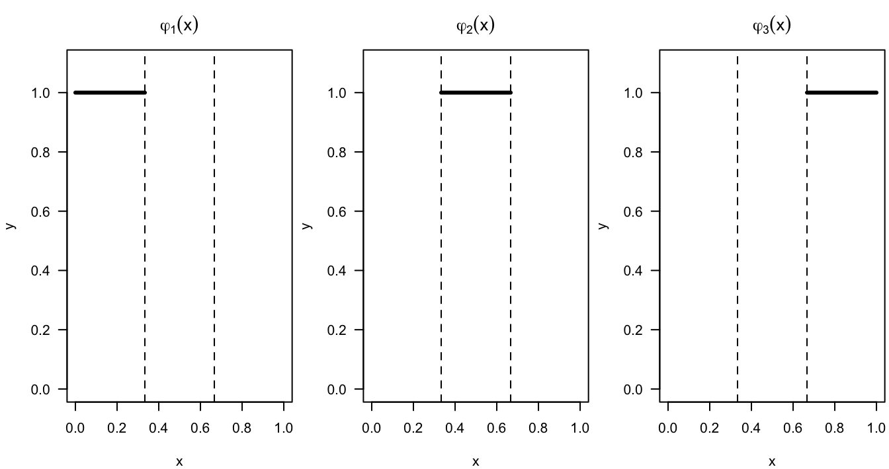

# Splines and Penalized Regression {#inference-for-regression}

## Introduction

* In this chapter, we will focus on using basis functions for estimating 
the regression function.

* That is, we will look at regression function estimates of the form
\begin{equation}
\hat{m}(x) = \hat{\beta}_{0}\varphi_{0}(x) + \sum_{j=1}^{p} \hat{\beta}_{j}\varphi_{j}(x)  \nonumber
\end{equation}
where $\varphi_{0}(x), \varphi_{1}(x), \ldots, \varphi_{p}(x)$ will be referred to as basis functions.

* We will usually either ignore $\varphi_{0}(x)$ or assume that $\varphi_{0}(x) = 1$.

* If you use a relatively large number of appropriately chosen basis functions,
you can represent even quite complicated functions with some linear
combination of the basis functions.

---

**Examples**

---

### Regressogram (Piecewise Constant Estimate)

* Let's consider the regressogram again. The regressogram estimate could be written as
\begin{equation}
\hat{m}_{h_{n}}^{R}(x) = \sum_{k=1}^{D_{n}} a_{k, h_{n}}\varphi_{k}(x) = \sum_{k=1}^{D_{n}} a_{k,h_{n}} I\big( x \in B_{k} \big)
\end{equation}
where the coefficents $a_{k, h_{n}}$ are given by
\begin{equation}
a_{k, h_{n}} = \frac{1}{ n_{k,h_{n}} } \sum_{i=1}^{n} Y_{i}I\big( x_{i} \in B_{k} \big)  \nonumber
\end{equation}

* We can think of the regressogram as a basis function estimate with the basis functions 
\begin{equation}
\varphi_{1}(x) = I\big( x \in B_{1} \big), \ldots, \varphi_{D_{n}}(x) = I\big( x \in B_{D_{n}} \big) \nonumber
\end{equation}

* The regressogram estimate will be a piecewise constant function that is constant within each of the bins.

(\#fig:unnamed-chunk-1)Basis functions for a regressogram with the following 3 bins: [0,1/3), [1/3, 2/3), [2/3, 1)

### Piecewise Linear Estimates

* Instead of a piecewise constant estimate of $m(x)$, we could use an estimate which is piecewise linear 
by using the following $2p$ basis functions
\begin{eqnarray}
\varphi_{1}(x) &=& I(x \in B_{1}) \nonumber \\
&\vdots&  \nonumber \\
\varphi_{p}(x) &=& I(x \in B_{p}) \nonumber \\
\varphi_{p+1}(x) &=& x I(x \in B_{1})  \nonumber \\
&\vdots& \nonumber \\
\varphi_{2p}(x) &=& x I(x \in B_{p}) \nonumber
\end{eqnarray}
if we now let $p = D_{n}$ denote the number of "bins".

* The figure below shows an example of a regression function that is piecewise linear with 3 different bins. 

* While a piecewise linear model is perhaps a more flexible method than the regressogram,
the piecwise linear model will still have big jumps at the bin boundaries and have an overall
unpleasant appearance.

(\#fig:unnamed-chunk-2)Example of a regression function estimate that is piecewise linear within 3 bins.

### Piecewise Cubic Estimates 

* If we wanted to allow for more flexible forms of the regression function estimate within
each bin we could fit a higher order polynomial model within each bin. 

* That is, the regression function estimate within the $k^{th}$ bin will have the form
\begin{equation}
\hat{m}(x)I(x \in B_{k}) = \hat{\beta}_{0k} + \hat{\beta}_{1k}x + \hat{\beta}_{2k}x^{2} + \hat{\beta}_{3k}x^{3} \nonumber 
\end{equation}

* To fit a piecewise cubic model with $p$ bins, we would need the following $4p$ basis functions
\begin{eqnarray}
\varphi_{1}(x) &=& I(x \in B_{1}),  \ldots,  \varphi_{p}(x) = I(x \in B_{p}) \nonumber \\
\varphi_{p+1}(x) &=& xI(x \in B_{1}),  \ldots, \varphi_{2p}(x) = xI(x \in B_{p}) \nonumber \\
\varphi_{2p+1}(x) &=& x^{2}I(x \in B_{1}),  \ldots,  \varphi_{3p}(x) = x^{2}I(x \in B_{p}) \nonumber \\
\varphi_{3p+1}(x) &=& x^{3}I(x \in B_{1}), \ldots, \varphi_{4p}(x) = x^{3}I(x \in B_{p}) \nonumber \\
\end{eqnarray}

(\#fig:unnamed-chunk-3)Example of a regression function estimate that is piecewise cubic within 3 bins.

## Piecewise Linear Estimates with Continuity (Linear Splines)

* $u_{j}$ will be referred to as knots

\begin{eqnarray}
\varphi_{0}(x) &=& 1  \nonumber \\
\varphi_{1}(x) &=& x  \nonumber \\
\varphi_{2}(x) &=& (x - u_{1})_{+} \nonumber \\
\varphi_{3}(x) &=& (x - u_{2})_{+} \nonumber \\
&\vdots& \nonumber \\
\varphi_{p}(x) &=& (x - u_{p-1})_{+} \nonumber
\end{eqnarray}

### Piecewise Cubic Estimates with constraints 1

## Cubic Splines and Spline Basis Functions

* The B-spline functions are a basis for cubic splines. Are they also a basis 
for the set of natural cubic splines?

## Smoothing Splines/Penalized Regression

