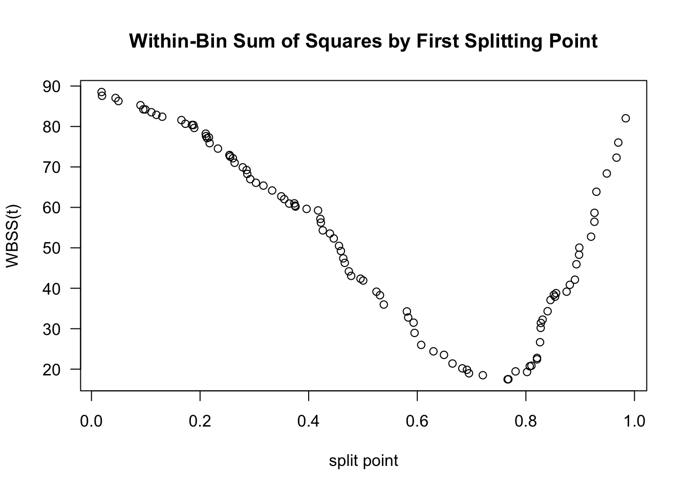

# (PART) Nonparametric Regression: Part II {-} 

# Regression Trees and CART {#decision-tree}

## Introduction

* Let's think about the regressogram estimate again. 

* The regressogram estimate of the regression function is a piecewise constant function that is constant within each of $p$ "bins"
\begin{equation}
\hat{m}_{h_{n}}^{R}(x) = \frac{1}{a}\sum_{i=1}^{n} Y_{i} I(x_{i} \in B_{k}), \qquad \textrm{ if } x \in B_{k} \nonumber
\end{equation}

* Figure \@ref(fig:cart-motivate) shows an example of a regressogram estimate with 3 bins. 

<div class="figure">

<p class="caption">(\#fig:cart-motivate)Regressogram estimate with the 3 bins: [0,1/3), [1/3, 2/3), [2/3, 1).</p>
</div>

---

* Suppose we were forced to combined two adjacent bins to estimate the regression function. For the data shown in \@ref(fig:cart-motivate), 
which two bins should we combine if we were forced to do so? The only options here are to combine bins 1 and 2 or to combine bins 2 and 3.

* I would say we should combine bins 1 and 2. Look at Figures \@ref(fig:cart-motivate2) and \@ref(fig:cart-motivate3) for a comparison of these two choices.

* The responses $Y_{i}$ change much more over the range of the third bin than they do over the first and second bins. Hence, an 
intercept model for the first two bins is not all that bad. 

* In contrast, an intercept model for the last two bins is a terrible model. 

---

<div class="figure">

<p class="caption">(\#fig:cart-motivate2)Regressogram estimate with the 2 bins: [0,1/3), [1/3, 1).</p>
</div>

<div class="figure">

<p class="caption">(\#fig:cart-motivate3)Regressogram estimate with the 2 bins: [0,2/3), [2/3, 1).</p>
</div>

* The intuition for why the choice of bins $[0,2/3), [2/3, 1)$ is better than the choice of bins $[0,1/3), [1/3, 1)$ can 
be formalized by considering the within-bin variation of $Y_{i}$.

* For two bins $B_{1}$ and $B_{2}$, the within-bin sum of squares (WBSS) of $Y_{i}$ is
\begin{equation}
\textrm{WBSS} = \sum_{k=1}^{2} \sum_{i=1} (Y_{i} - \bar{Y}_{k})^{2}I(x_{i} \in B_{k}) \nonumber
\end{equation}
where $\bar{Y}_{k} = \frac{1}{n_{k}}\sum_{i=1}^{n} Y_{i}$ denotes the mean of the responses within the $k^{th}$ bin.

* You want to choose the bins in order to minimize the within-bin sum of squares. The reason for this is that: if the within-bin
sum of squares is low, an intercept model for each bin will fit the data very well.

---

* For the data shown in Figures \@ref(fig:cart-motivate) - \@ref(fig:cart-motivate3), the WBSS when using the bins $[0, 1/3), [1/3, 1)$
is

```r
sum( (yy[xx < 1/3] - mean(yy[xx < 1/3]))^2 ) + 
  sum( (yy[xx >= 1/3] - mean(yy[xx >= 1/3]))^2 ) 
```

```
## [1] 62.72984
```

* The WBSS when using the bins $[0,2/3), [2/3, 1)$ is

```r
sum( (yy[xx < 2/3] - mean(yy[xx < 2/3]))^2 ) + 
  sum( (yy[xx >= 2/3] - mean(yy[xx >= 2/3]))^2 ) 
```

```
## [1] 20.19249
```


## Regression Trees with a Single Covariate

* For a single covariate, regression trees estimate the regression function by a piecewise constant
function that is constant within each of several bins. We will focus on the well-known 
CART (Classification and Regression Trees) method for using regression trees.

* More generally, with multivariate covariates CART will fit a regression function that is constant
within each of many multi-dimensional "rectangles".

* The main difference between CART and the regressogram is that the placements
and widths of the bins in CART are chosen in a more selective manner than the regressogram.

* Specifically, rather than just using a collection of bins of fixed width, CART chooses where to place the bin boundaries by considering
the resulting within-bin sum of squares.

---

* CART constructs the bins through sequential binary splits of the x axis. 

* In the first step, CART will divide the covariates into two bins $B_{1}$ and $B_{2}$. These bins will
have the form $B_{1} = (-\infty, t_{1})$ and $B_{2} = [t_{1}, \infty)$.

* At the next step, CART will create $4$ bins by further dividing each of these two bins into two more bins. So, 
we will have four bins $B_{11}, B_{12}, B_{21}, B_{22}$. 

* Bins $B_{11}$ and $B_{12}$ will have the form $B_{11} = (-\infty, t_{11})$ and $B_{12} = [t_{11}, t_{1})$,
and bins $B_{21}$ and $B_{22}$ will have the form $B_{21} = [t_{1}, t_{21})$ and $B_{22} = [t_{21}, \infty)$.

* You can repeat this process to get smaller and smaller bins. Usually, this process will stop once
a threshold for the minimum number of observations in a bin has been reached.


---

* This sequential process for constructing bins is typically depicted with a binary decision tree.

* Figure \@ref(fig:dectree-basic) shows the decision tree representation of a CART regression function estimate with $4$ bins.

<div class="figure">

<p class="caption">(\#fig:dectree-basic)Binary decision tree representing a regression function estimate with 4 bins where it is assumed that all the covariates are between $0$ and $1$. The 4 bins here are [0, 0.6), [0.6, 0.74), [0.74, 0.89), [0.89, 1).</p>
</div>

* Figure \@ref(fig:fourbin-example) shows the regression function estimate which corresponds to the decision tree shown in Figure \@ref(fig:dectree-basic).

<div class="figure">

<p class="caption">(\#fig:fourbin-example)Regression function estimate that corresponds to the decision tree shown in the previous figure.</p>
</div>


### Determining the Split Points

* The first two bins are determined by the "split point" $t_{1}$. To find this split point, CART looks 
at the within-bin sum of squares induced by a splitting point $t$.
\begin{eqnarray}
\textrm{WBSS}(t) &=& \sum_{k=1}^{2} \sum_{i=1}^{n} (Y_{i} - \bar{Y}_{k})^{2}I(x_{i} \in B_{k}) \nonumber \\
&=&  \sum_{i=1}^{n} (Y_{i} - \bar{Y}_{1})^{2}I(x_{i} < t) + \sum_{i=1}^{n} (Y_{i} - \bar{Y}_{2})^{2}I(x_{i} \geq t) \nonumber
\end{eqnarray}

* The first split point $t_{1}$ is the value of $t$ which minimizes this within-bin sum of squares criterion. That is,
\begin{equation}
t_{1} = \textrm{argmin}_{t} \textrm{ WBSS}(t) = \textrm{argmin}_{t \in \{x_{1}, \ldots, x_{n}  \}} \textrm{ WBSS}(t) \nonumber
\end{equation}

* To find $t_{1}$, we only have to take the minimum over the set of covariates since the value of $\textrm{WBSS}(t)$ only changes 
at each $x_{i}$.

* Figure \@ref(fig:wbss-example) shows a plot of $\textrm{WBSS}(t)$ vs. $t$ for the data shown in Figures \@ref(fig:cart-motivate) - \@ref(fig:cart-motivate3).

* Figure \@ref(fig:wbss-example) suggests that the value of $t_{1}$ will be around $0.75$.

<div class="figure">

<p class="caption">(\#fig:wbss-example)Plot of WBSS(t) vs. t for the data shown in the above figures.</p>
</div>

---

* The splitting point "partitions" the data into two datasets. The indices of these datasets are defined as 
\begin{eqnarray}
\mathcal{D}_{1} &=& \big\{ (Y_{i}, x_{i}): x_{i} < t_{1} \big\} \nonumber \\
\mathcal{D}_{2} &=& \big\{ (Y_{i}, x_{i}): x_{i} \geq t_{1} \big\} \nonumber
\end{eqnarray}

* After finding $t_{1}$, we can find the next two splitting points $t_{11}$ and $t_{21}$ by using the exact same procedure
we used to find $t_{1}$.

* That is, $t_{11}$ and $t_{21}$ are given by
\begin{eqnarray}
t_{11} &=& \textrm{argmin}_{t} \textrm{ WBSS}_{1}(t)  \nonumber \\
t_{21} &=& \textrm{argmin}_{t} \textrm{ WBSS}_{2}(t)  \nonumber
\end{eqnarray}
where $\textrm{WBSS}_{a}(t)$ is the within-bin sum of squares for dataset $\mathcal{D}_{a}$:
\begin{equation}
\textrm{WBSS}_{a}(t) =  \sum_{i \in \mathcal{D}_{a}} (Y_{i} - \bar{Y}_{1a})^{2}I(x_{i} < t) + \sum_{i \in \mathcal{D}_{a}} (Y_{i} - \bar{Y}_{2a})^{2}I(x_{i} \geq t) \nonumber
\end{equation}

---

* The splitting points $t_{11}$ and $t_{21}$ will further partition the dataset into $4$ datasets. Additional splitting points
$t_{12}, t_{22}, t_{32}, t_{42}$ which further partition the dataset, can be found by minimizing the within-bin sum of squares
for each of these $4$ datasets.

* This algorithm for constructing smaller and smaller bins is often referred to as recursive partitioning.


## Regression Trees With Multiple Covariates

* When we have multivariate covariates where $\mathbf{x}_{i} = (x_{i1}, \ldots, x_{ip})$,
CART will partition the covariate space into multivariate "rectangles".

* An example of a CART-type regression function estimate for the case of two covariates is shown in
Figure \@ref(fig:twod-cart-example)

<div class="figure">

<p class="caption">(\#fig:twod-cart-example)An example of a CART-type estimate of a regression function that has two covariates.</p>
</div>

---

* One advantage of CART is that it can easily handle covariates of different types, for example, both continuous and binary covariates.

* You can see an example of this by looking at the `bone` data. This dataset has both sex and age as covariates.

* A CART regression tree for the bone data using both age and sex is shown in Figure \@ref(fig:bone-dectree).

<div class="figure">

<p class="caption">(\#fig:bone-dectree)Regression tree for the bone data. This fitted regression tree has 6 bins.</p>
</div>

---

* Figure \@ref(fig:bone-fittedregfn) plots the regression function estimate which corresponds to the decision tree shown in Figure \@ref(fig:bone-dectree).
Notice that the regression function estimate for men vs. women only differs for ages $< 12$.

<div class="figure">

<p class="caption">(\#fig:bone-fittedregfn)Plot of regression function estimate that corresponds to the decision tree in the previous figure.</p>
</div>


