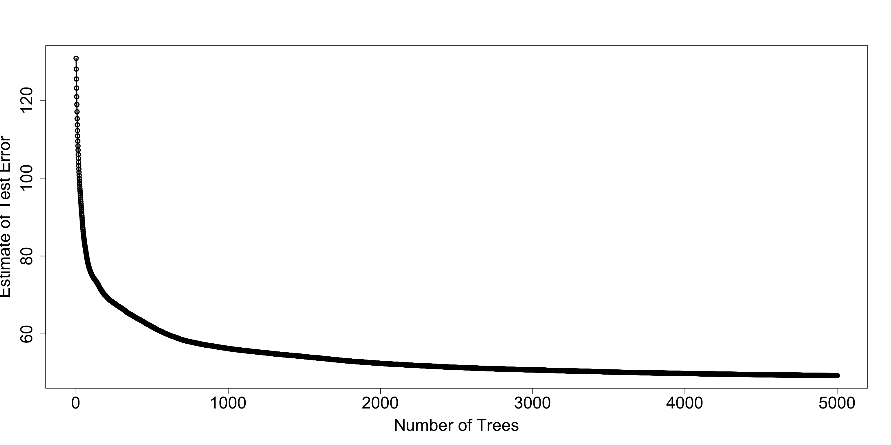

# Tree Ensemble Methods for Prediction {#ensemble}
 

## Motivation

* A major issue with single-decision tree models is that they can have **high variance**.
    + At least among decision trees that are allowed to be flexible enough to have modest bias.
    
* Small perturbations in the data can often have substantial impacts on the final estimated tree.

* This can occur, for example, because a small perturbation can impact the first variable chosen to split on. 
    + This early split further influences splitting variables and splitting points chosen further down the tree.
    
* For single-decision trees, you can have substantial changes in the fitted values when moving from
one region to another.

* You can often have small number of observations in some terminal nodes.

---

* Using **ensembles of trees** has been found 

* Two well-known tree ensemble methods:
    + **Random Forests**
    + **Gradient Boosting** with Trees

## Gradient Boosting with Regression Trees

* Boosting is an ensemble method that takes a **sequential appraoch** to building an ensemble of trees.

* Uses a somewhat similar idea to **forward selection** in linear regression.

* Each tree is typically a "shallow tree" (weak learner).
    + Each tree, by itself, often **does not** have strong performance.
    + Each tree: high bias, but low variance.
    + Aggregating all trees leads to stronger performance.

- Idea: Start with a **single tree**
    -   Add more trees one at a time.
    -   Each new tree tries to improve on the previous ones.

---

* **Goal:** We want to estimate a regression function $f_{M}(\mathbf{x})$ that can be expressed as the sum of M trees: 
\begin{equation}
    f_{M}(\mathbf{x}) = \sum_{m=1}^{M} T(\mathbf{x}; \Theta_{m}) 
    = \sum_{m=1}^{M} \sum_{h=1}^{H} \mu_{hm} I( \mathbf{x} \in A_{hm} ). \nonumber 
\end{equation}

* To describe this procedure, let $T(\mathbf{x}; \Theta_{m})$ denote the "fitted value" for the input covariate vector $\mathbf{x}$ when using a tree with parameters $\Theta_{m}$.

* Parameters of the $m^{th}$ tree: $\Theta_{m} = \{ A_{hm}, \mu_{hm} \}_{h=1}^{H}$, where
    + $H$ disjoint \`\`terminal regions'' $A_{1m}, \ldots, A_{Hm}$
    + $\mu_{hm}$ output assigned to region $A_{hm}$, i.e., $T(\mathbf{x}; \Theta_{m}) = \mu_{hm}$ whenever $\mathbf{x} \in A_{hm}$.

## Estimating the Tree in each Iteration

* Strategy: estimate parameters $\Theta_{1}, \ldots, \Theta_{M}$ in a **forward, stagewise manner**.

* First, estimate $\widehat{\Theta}_{1}$ by targeting the **loss function** $L(\mathbf{y}, T(\mathbf{X}; \Theta_{1}))$

* For example, the squared-error loss would be 
\begin{equation}
L(\mathbf{y}, T(\mathbf{X}; \Theta_{1})) = \sum_{i=1}^{n} \Big( y_{i} - T(\mathbf{x}_{i}; \Theta_{1}))
\end{equation}

* Remaining tree parameters are estimated by looking at 
\begin{equation}
    L_{I}\Big( \mathbf{Y}, \sum_{k=1}^{m-1} T(\mathbf{X}; \widehat{\Theta}_{k})  + T(\mathbf{X}; \Theta_{m}) \Big).
    \label{eq:direct_boost_loss}
\end{equation}

* $m^{th}$ iteration of boosting: estimate $\Theta_{m}$

---

* Estimation of $\Theta_{m}$ is performed in **two stages**

* **Stage 1**: Calculate **terminal regions** $A_{hm}$ by fitting the (generalized) residuals $r_{i,m-1}$ \begin{equation}
    r_{i,m-1} = -\Big[ \frac{\partial L(y_{i}, f(\mathbf{x}_{i}) }{ \partial f(\mathbf{x}_{i})} \Big]_{f = f_{m-1}}
    \end{equation}

* Fit a regression tree using the residuals $r_{1,m-1}, \ldots, r_{n,m-1}$ as outcomes.

* The number of terminal regions is often fixed to a small number or chosen to have a maximum number of terminal regions (such as 6).

---

* **Stage 2**: Estimate terminal values $\mu_{hm}$ within each region $A_{hm}$, by minimizing:
\begin{equation}
    \mu_{hm} = \arg\min_{\alpha} \sum_{x_{i} \in A_{hm}} L\Big(y_{i}, f_{m-1}(\mathbf{x_{i}}) + \alpha \Big)
\end{equation}

### Adding Trees and Learning Rate

* Updating the boosting model by using **shrinkage** is common in most implementations of boosting.

* Obtain $f_{m}(\mathbf{x})$ from $f_{m-1}(\mathbf{x})$ with \begin{equation}
    f_{m}(\mathbf{x}) = f_{m-1}(\mathbf{x}) + \eta T(\mathbf{x}, \widehat{\Theta}_{m}),
    \label{eq:shrink_boost_update}
    \end{equation}

* The shrinkage term $\eta \in (0, 1)$ is often referred to as the **\`\`learning rate''**

-   Choosing a relatively small value of $\gamma$ typically leads to improved out-of-sample predictive performance.
    + Usually, $\eta \leq 0.3$.

---

* Boosting often requires tuning of the hyperparameters.

* Main hyperparameters that require tuning:
    + Learning rate $\eta$.
    + Number of trees $M$.

### Choice of Loss Function

* An advantage of gradient boosting is that it can work for a general loss function (as long as the loss is differentiable with respect to $f$).

* Because of this, gradient boosting can be applied to many types of data.

* **Binary outcomes**: 
\begin{equation}
    L(\mathbf{y}, f) = \sum_{i=1}^{n}L(y_{i}, f(\mathbf{x}_{i})) = -\sum_{i=1}^{n}y_{i}\log( f(\mathbf{x}_{i})) - \sum_{i=1}^{n}(1 - y_{i})\log(1 - f(\mathbf{x}_{i}))
\end{equation}

## XGBoost

* `xgboost` is a particular version of gradient boosting that is one of the more popular boosting procedures.


``` r
library(xgboost)
```

### XGBoost Example:

* To try `xgboost`, let's use the `Bikeshare` data again


* Use the function `xgb.DMatrix` to store in the standard `xgboost` format


``` r
X <- model.matrix(bikers ~ . - casual - registered, data=Bikeshare)
dtrain <- xgb.DMatrix(data = X, label = Bikeshare$bikers)
```

* Setup the **loss function** and tuning parameters


``` r
params <- list(
  objective = "reg:squarederror", 
  eta = 0.05,                   
  max_depth = 2                
)
```

* Use these tuning parameters to evaluate cross-validation loss for up to 5000 trees

``` r
cv_results <- xgb.cv(params = params,
  data = dtrain,
  nrounds = 5000,               # Set an artificially high ceiling
  nfold = 5,
  early_stopping_rounds = 20,   # Stop if validation loss doesn't improve for 20 trees
  print_every_n = 50,           # Print progress every 50 trees
  verbose = TRUE)
```

```
## Multiple eval metrics are present. Will use test_rmse for early stopping.
## Will train until test_rmse hasn't improved in 20 rounds.
## 
## [1]	train-rmse:130.776794±0.801606	test-rmse:130.791918±3.291658 
## [51]	train-rmse:84.624277±0.504391	test-rmse:84.965195±3.075515 
## [101]	train-rmse:75.047705±0.546247	test-rmse:75.505861±2.584350 
## [151]	train-rmse:71.552634±0.362999	test-rmse:72.312648±2.447728 
## [201]	train-rmse:68.871197±0.253203	test-rmse:69.774344±2.317260 
## [251]	train-rmse:66.930699±0.326046	test-rmse:67.961983±2.153615 
## [301]	train-rmse:65.568299±0.459114	test-rmse:66.709516±2.062300 
## [351]	train-rmse:64.305953±0.457874	test-rmse:65.541717±2.023497 
## [401]	train-rmse:62.983083±0.692051	test-rmse:64.311252±2.181385 
## [451]	train-rmse:61.868388±0.966974	test-rmse:63.260207±2.273447 
## [501]	train-rmse:60.396180±0.957762	test-rmse:61.882720±1.852193 
## [551]	train-rmse:59.356833±1.038485	test-rmse:60.903241±1.738191 
## [601]	train-rmse:58.523879±1.031333	test-rmse:60.146507±1.770298 
## [651]	train-rmse:57.787627±1.015451	test-rmse:59.481131±1.737502 
## [701]	train-rmse:57.205954±1.002474	test-rmse:58.992081±1.677231 
## [751]	train-rmse:56.571647±0.985398	test-rmse:58.415858±1.478085 
## [801]	train-rmse:56.130466±0.993127	test-rmse:58.024288±1.442700 
## [851]	train-rmse:55.701597±0.966242	test-rmse:57.643195±1.380510 
## [901]	train-rmse:55.243426±0.951062	test-rmse:57.220175±1.244062 
## [951]	train-rmse:54.872165±0.962139	test-rmse:56.898897±1.230114 
## [1001]	train-rmse:54.516536±0.988469	test-rmse:56.588139±1.222255 
## [1051]	train-rmse:54.199993±1.001309	test-rmse:56.317880±1.159354 
## [1101]	train-rmse:53.887182±1.011428	test-rmse:56.069381±1.123591 
## [1151]	train-rmse:53.595201±0.971158	test-rmse:55.816308±1.095921 
## [1201]	train-rmse:53.319131±0.928808	test-rmse:55.596594±1.095539 
## [1251]	train-rmse:53.037682±0.888648	test-rmse:55.357546±1.055476 
## [1301]	train-rmse:52.764027±0.846814	test-rmse:55.119925±1.036486 
## [1351]	train-rmse:52.497295±0.783004	test-rmse:54.874913±1.022909 
## [1401]	train-rmse:52.235829±0.731477	test-rmse:54.633700±1.026106 
## [1451]	train-rmse:52.006259±0.685511	test-rmse:54.442129±1.028418 
## [1501]	train-rmse:51.763732±0.663885	test-rmse:54.236160±1.024710 
## [1551]	train-rmse:51.555805±0.624837	test-rmse:54.079126±1.042789 
## [1601]	train-rmse:51.366759±0.609704	test-rmse:53.948706±1.021626 
## [1651]	train-rmse:51.163830±0.627499	test-rmse:53.799404±1.016926 
## [1701]	train-rmse:50.960149±0.616567	test-rmse:53.630958±1.010486 
## [1751]	train-rmse:50.785216±0.612016	test-rmse:53.498171±1.005276 
## [1801]	train-rmse:50.608421±0.645605	test-rmse:53.376242±1.002564 
## [1851]	train-rmse:50.455523±0.648286	test-rmse:53.272185±0.985864 
## [1901]	train-rmse:50.293756±0.644501	test-rmse:53.138845±0.987681 
## [1951]	train-rmse:50.110079±0.685667	test-rmse:52.995138±0.974337 
## [2001]	train-rmse:49.945255±0.714332	test-rmse:52.874619±1.000562 
## [2051]	train-rmse:49.788561±0.716371	test-rmse:52.757317±1.036974 
## [2101]	train-rmse:49.643801±0.733193	test-rmse:52.654666±1.028989 
## [2151]	train-rmse:49.519496±0.743663	test-rmse:52.568702±1.024714 
## [2201]	train-rmse:49.382643±0.749164	test-rmse:52.477629±1.014609 
## [2251]	train-rmse:49.252820±0.742727	test-rmse:52.386277±1.008347 
## [2301]	train-rmse:49.130083±0.736807	test-rmse:52.295053±0.984536 
## [2351]	train-rmse:48.990684±0.732882	test-rmse:52.205058±0.971733 
## [2401]	train-rmse:48.876118±0.741627	test-rmse:52.118021±0.959563 
## [2451]	train-rmse:48.741633±0.730701	test-rmse:52.024839±0.979279 
## [2501]	train-rmse:48.616692±0.737161	test-rmse:51.940561±0.939018 
## [2551]	train-rmse:48.501016±0.737864	test-rmse:51.853961±0.915363 
## [2601]	train-rmse:48.400480±0.741221	test-rmse:51.774790±0.896397 
## [2651]	train-rmse:48.297948±0.753588	test-rmse:51.714364±0.879920 
## [2701]	train-rmse:48.205415±0.765653	test-rmse:51.641610±0.862371 
## [2751]	train-rmse:48.102847±0.785337	test-rmse:51.557801±0.840028 
## [2801]	train-rmse:48.019908±0.796983	test-rmse:51.515179±0.823372 
## [2851]	train-rmse:47.936355±0.804537	test-rmse:51.467013±0.826751 
## [2901]	train-rmse:47.854708±0.805463	test-rmse:51.426655±0.828899 
## [2951]	train-rmse:47.763829±0.815580	test-rmse:51.373882±0.826693 
## [3001]	train-rmse:47.690902±0.823291	test-rmse:51.326356±0.820499 
## [3051]	train-rmse:47.606181±0.832915	test-rmse:51.274713±0.817489 
## [3101]	train-rmse:47.526774±0.836680	test-rmse:51.223521±0.794680 
## [3151]	train-rmse:47.434993±0.853305	test-rmse:51.157631±0.771205 
## [3201]	train-rmse:47.352765±0.862745	test-rmse:51.097157±0.758714 
## [3251]	train-rmse:47.272258±0.878775	test-rmse:51.038346±0.758663 
## [3301]	train-rmse:47.200090±0.885317	test-rmse:50.996162±0.762310 
## [3351]	train-rmse:47.104383±0.894615	test-rmse:50.945383±0.737117 
## [3401]	train-rmse:47.003297±0.908320	test-rmse:50.875862±0.730347 
## [3451]	train-rmse:46.939026±0.908090	test-rmse:50.842411±0.727629 
## [3501]	train-rmse:46.871771±0.911357	test-rmse:50.809326±0.707695 
## [3551]	train-rmse:46.796305±0.914611	test-rmse:50.762860±0.723103 
## [3601]	train-rmse:46.711761±0.909575	test-rmse:50.709411±0.746402 
## [3651]	train-rmse:46.650538±0.911333	test-rmse:50.671272±0.736912 
## [3701]	train-rmse:46.586312±0.907404	test-rmse:50.634935±0.740192 
## [3751]	train-rmse:46.528494±0.907809	test-rmse:50.609215±0.741756 
## [3801]	train-rmse:46.470013±0.906092	test-rmse:50.577148±0.743398 
## [3851]	train-rmse:46.400252±0.910281	test-rmse:50.537394±0.723158 
## [3901]	train-rmse:46.341594±0.910613	test-rmse:50.511625±0.726821 
## [3951]	train-rmse:46.256526±0.904792	test-rmse:50.454122±0.718734 
## [4001]	train-rmse:46.185723±0.915815	test-rmse:50.398566±0.718863 
## [4051]	train-rmse:46.111450±0.907804	test-rmse:50.355452±0.755904 
## [4101]	train-rmse:46.038042±0.912837	test-rmse:50.299117±0.757805 
## [4151]	train-rmse:45.968473±0.910571	test-rmse:50.247186±0.779728 
## [4201]	train-rmse:45.908612±0.907225	test-rmse:50.218177±0.792207 
## [4251]	train-rmse:45.847383±0.907407	test-rmse:50.170885±0.787508 
## [4301]	train-rmse:45.760412±0.905172	test-rmse:50.104297±0.826765 
## [4351]	train-rmse:45.684404±0.905166	test-rmse:50.059251±0.841183 
## [4401]	train-rmse:45.631282±0.904208	test-rmse:50.026723±0.842439 
## [4451]	train-rmse:45.574952±0.911927	test-rmse:49.997378±0.855385 
## [4501]	train-rmse:45.517194±0.917664	test-rmse:49.973885±0.845951 
## [4551]	train-rmse:45.461931±0.915565	test-rmse:49.942747±0.859376 
## [4601]	train-rmse:45.404490±0.919955	test-rmse:49.906338±0.855098 
## [4651]	train-rmse:45.315119±0.933780	test-rmse:49.853887±0.854748 
## [4701]	train-rmse:45.254457±0.941598	test-rmse:49.810121±0.884140 
## [4751]	train-rmse:45.192675±0.942694	test-rmse:49.783145±0.897218 
## [4801]	train-rmse:45.137916±0.937917	test-rmse:49.761529±0.884606 
## [4851]	train-rmse:45.075770±0.943855	test-rmse:49.720355±0.885635 
## [4901]	train-rmse:45.017997±0.950908	test-rmse:49.690259±0.882816 
## [4951]	train-rmse:44.961478±0.931308	test-rmse:49.662359±0.875946 
## [5000]	train-rmse:44.908801±0.932593	test-rmse:49.626988±0.887682
```

``` r
## Get best number of trees
best_ntrees <- cv_results$niter
print(best_ntrees)
```

```
## [1] 5000
```

* The `evaluation_log`, gives you the cross-validation estimate of test error.


``` r
cv_est <- cv_results$evaluation_log
print(head(cv_est))
```

```
##     iter train_rmse_mean train_rmse_std test_rmse_mean test_rmse_std
##    <int>           <num>          <num>          <num>         <num>
## 1:     1        130.7768      0.8016058       130.7919      3.291658
## 2:     2        128.0000      0.8001020       128.0269      3.334600
## 3:     3        125.4379      0.7976341       125.4746      3.387911
## 4:     4        123.0650      0.7966624       123.1294      3.414260
## 5:     5        120.8717      0.7967345       120.9217      3.465585
## 6:     6        118.8374      0.7945133       118.9115      3.502677
```

* Let's plot the estimate of test error versus the number of trees


``` r
plot(cv_est$iter, cv_est$test_rmse_mean, xlab="Number of Trees",
     ylab="Estimate of Test Error", lwd=2, cex.lab=1.8, cex.axis=1.8)
lines(cv_est$iter, cv_est$test_rmse_mean, lwd=2)
```



* `xgboost` **final model:**

``` r
fmodel <- xgb.train(
  params = params,
  data = dtrain,
  nrounds = best_ntrees, ## Use best number of trees found.
  verbose = FALSE 
)
```

* For variable importance, you can use the `xgb.importance` function:

* Focus first on the `Gain` measure


``` r
importance_matrix <- xgb.importance(model = fmodel)
print(importance_matrix)
```
